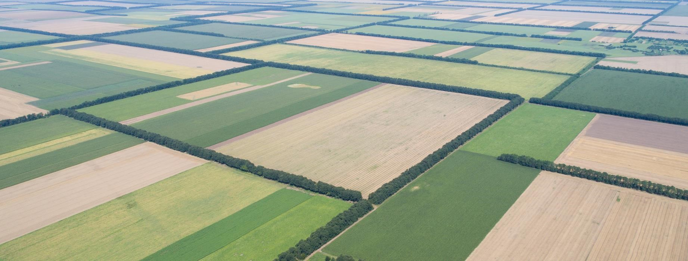

# CAR1459 - 4th Reporting Period

<figure><figcaption></figcaption></figure>

<figure><figcaption>
Locations of fields included in the 4th reporting period of CAR1459
</figcaption></figure>

The 4th reporting period of CAR1459 included data up through the harvest of cash crops in 2023.

<table data-header-hidden><thead><tr><th></th><th data-type="number"></th></tr></thead><tbody><tr><td>Fields</td><td>20249</td></tr><tr><td>Growers</td><td>1086</td></tr><tr><td>Acres</td><td>1518320</td></tr><tr><td>Credits</td><td>632986</td></tr></tbody></table>

## Key Documents

<table data-view="cards"><thead><tr><th></th><th data-hidden data-card-target data-type="content-ref"></th></tr></thead><tbody><tr><td>Monitoring Plan v4.3</td><td><a href="key-project-documents/monitoring-plan-v4.3.md">monitoring-plan-v4.3.md</a></td></tr><tr><td>Monitoring Report v4.3</td><td><a href="key-project-documents/monitoring-report-v4.2.md">monitoring-report-v4.2.md</a></td></tr><tr><td>Supporting Documents</td><td><a href="https://app.gitbook.com/s/tLsjLdteVm8ChxiMJxjK/supporting-documents">SUPPORTING DOCUMENTS</a></td></tr></tbody></table>

