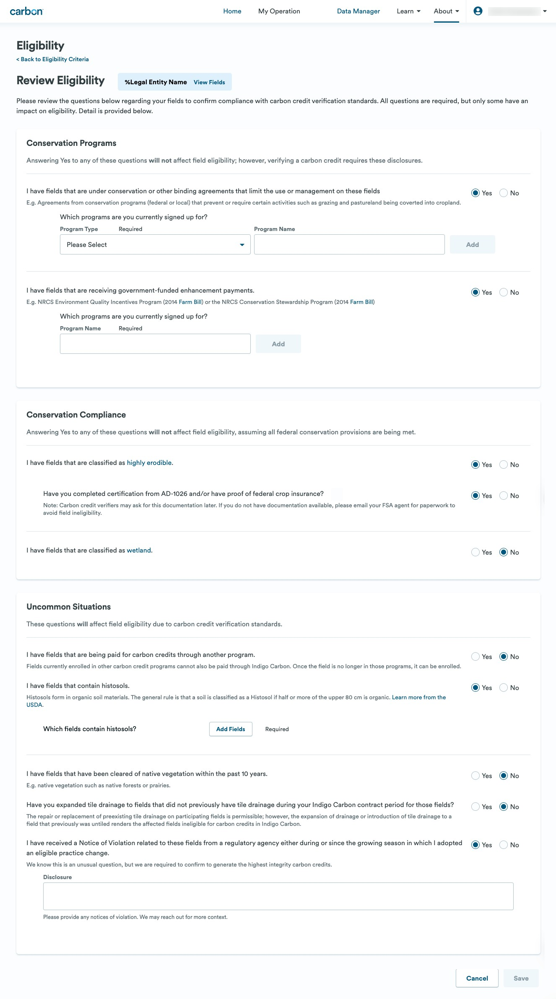
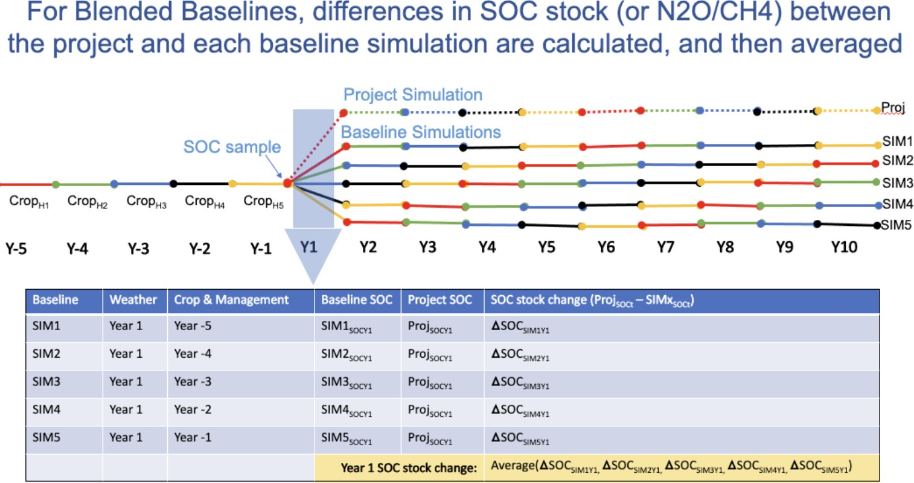
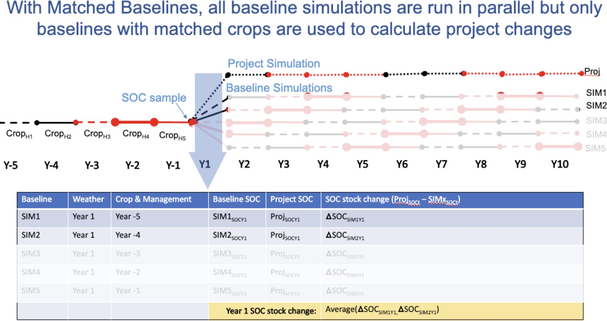
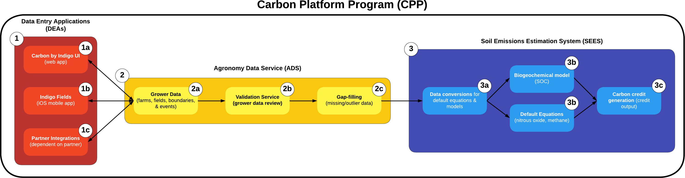
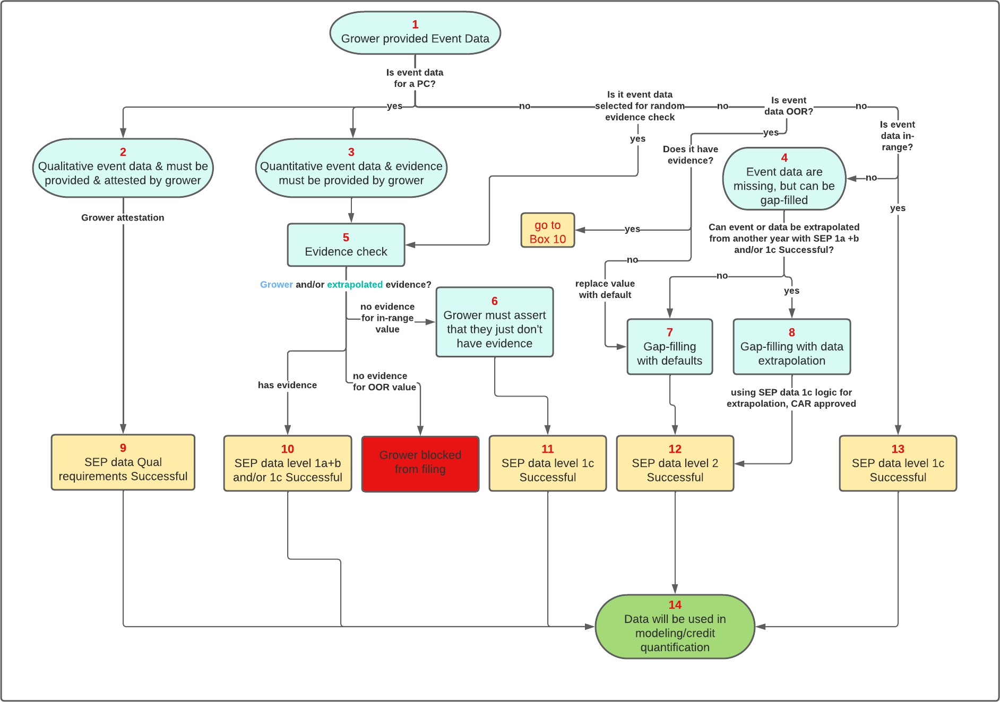
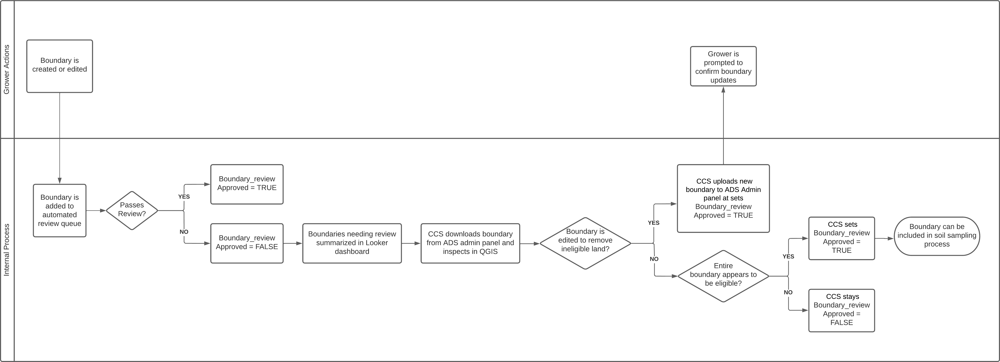
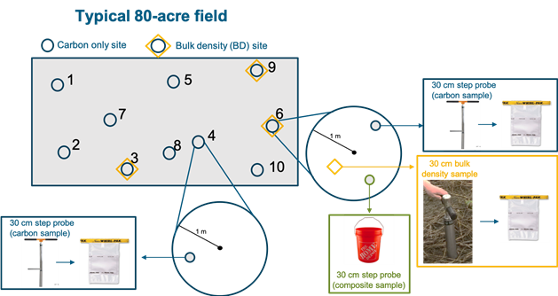
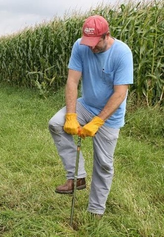
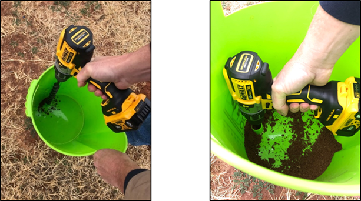
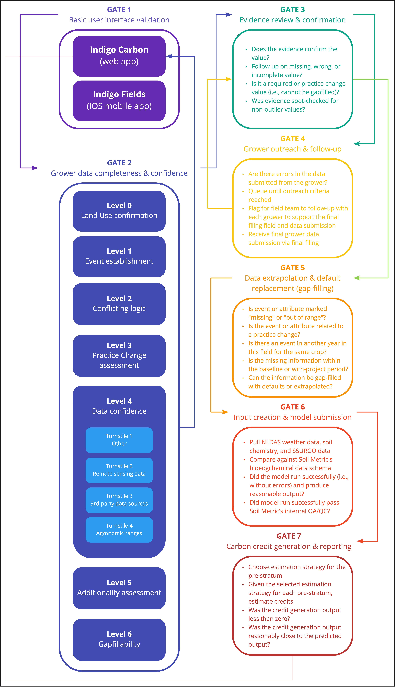

# Monitoring Plan v4.3

.png>)

**Project Name** Indigo U.S. Project No. 1

<table><thead><tr><th width="253"></th><th></th></tr></thead><tbody><tr><td><strong>Project ID</strong></td><td>CAR1459</td></tr><tr><td><strong>Document Version</strong></td><td>v4.3 (the 4th verification period)</td></tr><tr><td><strong>Document Date</strong> </td><td>December 10th, 2024</td></tr><tr><td> <strong>Crediting Program</strong></td><td> Climate Action Reserve</td></tr><tr><td><strong>Protocol Version</strong></td><td>Soil Enrichment Protocol, Version 1.1</td></tr><tr><td><strong>Prepared By</strong> </td><td>Indigo Ag. Inc. (on behalf of Indigo Carbon PBC)</td></tr><tr><td><strong>Contact</strong></td><td>
Indigo Ag. Inc.

500 Rutherford Ave.

Boston, MA 02129

+1 (844) 828-0240
</td></tr></tbody></table>

## 1. Project Details

The Soil Enrichment Protocol, Version 1.1 was developed by the Climate Action Reserve with an aim to account for, report, and verify greenhouse gas (GHG) emission reductions associated with projects that reduce emissions and enhance soil carbon sequestration on agricultural lands through the adoption of sustainable agricultural land management activities. The high rigor of this protocol is intended to foster the reduction of greenhouse gas (GHG) emissions through credible, market-based solutions. Indigo has designed a soil enrichment project with a complete, consistent, transparent, accurate, and conservative quantification of GHG emission reductions. The following sections describe Indigo’s soil enrichment project details and outline key participants and the ownership structure of this Project.

### 1.1 Relevant Standards 

This Project has been developed according to the following standards:

* Climate Action Reserve Offset Program Manual (CAR, 2021)
* Climate Action Reserve Soil Enrichment Protocol, Version 1.1 (CAR, 2022)
* SEP Requirements and Guidance for Model Calibration, Validation, Uncertainty, and Verification for Soil Enrichment Projects v1.1a(CAR, 2020a)
* SEP Parameters v1.0a (CAR, 2020b)
* SEP Additionality Tool v1.0a (CAR, 2020c)

### 1.2 Summary Description of the Project 

The Indigo U.S. Project No. 1 (hereafter the “Project”) is a GHG reduction project, and it represents the first project listed under the Soil Enrichment Protocol, developed and adopted by the Climate Action Reserve. The primary goal of this Project is to promote a range of agricultural management practice changes targeted at increasing soil organic carbon (SOC) storage and reducing net emissions of CO2, CH4, and N2O from grower operations throughout the continental United States.

This overarching goal is being achieved by supporting farmers to implement climate-smart agricultural land management practices through an integrated system of agricultural extension and outreach, agronomic support, digital data collection tools, rigorous data validation, biogeochemical modeling, and transparent reporting. These

practices may include changes to fertilizer use, tillage, crop rotations, cover cropping and grazing. Overall, these practice changes will reduce emissions and enhance soil carbon sequestration from agricultural production, increase farm resilience to extreme weather and climate change, and promote increased soil microbiological diversity. The Project is specifically addressing the need for a high-integrity and cost-efficient monitoring system to enable individual growers to access the carbon market at scale.

Carbon by Indigo (hereafter, “Carbon”) is the all-encompassing program at Indigo that enables credit generation. It includes various teams responsible for activities relating to credit generation in any capacity across Strategy, Science, Technology, Commercial, and Operations functions. Within the Carbon program are tools to execute credit generating projects under the SEP v1.1, which collectively are termed the Carbon program platform (or ”CPP”). For this Project, the CPP includes data entry applications, an agronomy data service and an emissions estimations system; these tools create the infrastructure to accurately and conservatively generate carbon credits under the Soil Enrichment Protocol, Version 1.1 via grower education and outreach, data collection, soil sampling, QA/QC, modeling, and quantification. Each reporting period, the estimation of GHG emission reductions of the Project is conducted in part by running a biogeochemical model at a random sample of points at which we collect physical soil samples. Management data are collected for every field in the project, for both the historical and project periods. The relevant default equations from the SEP v1.1 are used where the impacts from a particular SSR are not quantified using a biogeochemical model. In addition to the Project results, leakage, uncertainty, and buffer pool contributions are also accounted for and reported for each period.

As this is an aggregated Project, as defined by the SEP v1.1, it includes multiple growers with multiple enrolled fields. The project design assumes that over time additional eligible fields and Field Managers (also referred to as ”growers”) will be enrolled in the program and added to the Project subsequent to the initial listing. Each grower is formally contracted with Indigo for each field they have enrolled in the Project. While management data are gathered on every single field, different components of the quantification occur at different levels within the project: model runs occur at sample points, default equations occur at zone level (field or sub-field), model results inform stratum-level results, then all results flow up to project-level quantification of outcomes, uncertainty, leakage, and buffer pool contributions. For the purposes of grower payments and tracking reversal obligations the project level results are allocated back to the zone level (field or sub-field) according to their individual management data.

This document serves to describe the Project in detail and demonstrate its conformance with the SEP v1.1, thus informing the verification process by outlining a clear plan for Project implementation. As of the most recent reporting period, the Project includes 1,086 enrolled growers who carry out agricultural management on 1,518,320 acres in 20,249 fields. The Project has 24,089 fields that are being monitored for permanence. The total emissions reduced by Indigo’s CAR1459 from the project start date through to the end of the current reporting period are 929,648 tCO2e (with 971,366 tCO2e and -41,718 tCO2e contributing to the total reductions for reversible and non-reversible emissions, respectively). Table 1.1 summarizes the results of the Project during each reporting period since Project initiation, with more detail to be found in the Monitoring Report v4.3 and data submission package.

Table 1.1: Project summary results for all reporting periods

<table data-header-hidden data-full-width="true"><thead><tr><th></th><th></th><th></th><th></th><th></th><th></th><th></th><th></th></tr></thead><tbody><tr><td></td><td><strong>Growers</strong></td><td><strong>Fields</strong></td><td>
<strong>Area</strong>

(acres)
</td><td><strong>Credits Generated</strong> (tCO2e)</td><td><strong>Buffer Pool Contribution</strong> (tCO2e)</td><td><strong>Start Date</strong></td><td><strong>End Date</strong></td></tr><tr><td>1st RP</td><td>175</td><td>1<em>,</em>184</td><td>100<em>,</em>372</td><td>22<em>,</em>225</td><td>3<em>,</em>291</td><td>Mar 30, 2018</td><td>Dec 31, 2020</td></tr><tr><td>2nd RP</td><td>427</td><td>5<em>,</em>083</td><td>423<em>,</em>740</td><td>111<em>,</em>389</td><td>18<em>,</em>678</td><td>May 08, 2018</td><td>Dec 31, 2021</td></tr><tr><td>3rd RP</td><td>972</td><td>15<em>,</em>766</td><td>1<em>,</em>289<em>,</em>361</td><td>163<em>,</em>048</td><td>26<em>,</em>875</td><td>Apr 18, 2018</td><td>Dec 31, 2022</td></tr><tr><td>4th RP</td><td>1<em>,</em>086</td><td>20<em>,</em>249</td><td>1<em>,</em>518<em>,</em>320</td><td>632<em>,</em>986</td><td>91<em>,</em>998</td><td>Jun 12, 2018</td><td>Dec 31, 2023</td></tr><tr><td>TOTAL</td><td></td><td></td><td></td><td>929,648</td><td>140,842</td><td></td><td></td></tr></tbody></table>

A Monitoring Plan and Monitoring Report will be submitted each verification period to describe the processes used to promote and quantify a range of agricultural land management practices targeted at increasing soil organic carbon (SOC) storage and reducing net emissions of CO2, CH4, and N2O. As this is an aggregated Project, the credit results will be displayed in aggregate, and no personally identifiable grower information will be found in the Monitoring Plan v4.3 or Monitoring Report v4.3. The versions of both the Monitoring Plan and Monitoring Report have been updated to align with the verification periods.1

Table 1.2: Summary overview of project details in the 4th reporting period for the CAR1459

<table data-header-hidden data-full-width="true"><thead><tr><th width="174"></th><th></th></tr></thead><tbody><tr><td>Location</td><td>United States</td></tr><tr><td>Land use</td><td>Cropland</td></tr><tr><td>Project activities</td><td>Changes to fertilizer use, tillage practices, grazing practices, crop rotations and diversity and use of cover crops.</td></tr><tr><td>Aggregation</td><td>All fields aggregated together into a single project for quantification, issuance, and permanence management.</td></tr><tr><td>Grower contracts</td><td>5 year length; commitment to eligible practice adoption; guaranteed at least 75% of credit sales revenue; payments are vested over 5 years; no penalty for exit.</td></tr><tr><td>Additionality</td><td>New practice requirements.</td></tr><tr><td>Baselines</td><td>Dynamic modeling of BAU management at field level using current weather; based on collection of 3-5 years of management data prior to practice change.</td></tr><tr><td>Sample design</td><td>A stratified design, with one stratum using a Poisson random sample and the others using a two-stage design with probability-proportional-to-area selection of fields and simple random sample within fields.</td></tr><tr><td>Soil sampling</td><td>Physical samples to 30 cm depth; samples for carbon concentration as well as samples for bulk density, pH, and texture. Remeasurement at least every 5 years.</td></tr><tr><td>Management data</td><td>Collected for every field every year using an intuitive software platform, direct grower support, and digital integrations.</td></tr><tr><td>Data validation and QA/QC</td><td>Automated validation service with logic following the requirements of SEP v1.1 Section 6.1, incorporating remote sensing, published datasets, and agronomic expertise. Human review of submitted evidence and documentation.</td></tr><tr><td>Quantification</td><td>Hybrid combination of soil sampling, biogeochemical modeling, and default protocol equations.</td></tr><tr><td>Modeling</td><td>Modeling of SOC impacts using DayCent-CR at soil sample points. Approved model validation report is available on CAR website (see IndigoCarbon US-1 2023 0046).</td></tr><tr><td>Permanence</td><td>Buffer pool contribution of 14.5% for unavoidable reversals. Remote monitoring of management events on fields following their crediting period. Project Implementation Agreement between Indigo and CAR.</td></tr><tr><td>Leakage</td><td>Monitoring for potential leakage related to long term yield decline and/or displacement of livestock by project activities.</td></tr><tr><td>Uncertainty</td><td>Comprehensive accounting for uncertainty from sample error, measurement error, and model prediction error. Credits are deducted based on the uncertainty assessment such that there is a 70% probability that the total credits issued will be less than the true quantity of emission reductions and removals.</td></tr></tbody></table>

1In the first reporting period of the CAR1459, Indigo updated the document version throughout one verification period. Since then, Indigo has chosen to update document versions to reflect the verification period and any document change will be reflected in the tenth decimal place. Please note that this will cause duplicate document versions between the first few reporting periods of the Project.

### 1.3 Project Developer 

Indigo Ag. Inc. offers a comprehensive suite of sustainability solutions that benefit farmers, agribusinesses and corporations alike. Our integrated business platform enables participants to adopt and profit from sustainability opportunities. Working with Indigo, farmers can now maximize their profit from new and existing sustainability practices on each field, every year of their rotation, while simultaneously improving soil quality. Founded in 2013, Indigo is unlocking the power of agriculture to create a better place to live. With corporate headquarters in Boston, Massachusetts and operations across 14 countries, the company is delivering on its mission of harnessing nature to help farmers sustainably feed the planet. Indigo contact information for the project developers is noted in Table 1.3 with details of involved entities in Table 1.4.

Table 1.3: Project developer contact information

| **Organization name** | Indigo                                                    | Indigo                                          |
| --------------------- | --------------------------------------------------------- | ----------------------------------------------- |
| **Contact name**      | Max DuBuisson                                             | Ryan Pape                                       |
| **Title**             | VP Impact & Integrity                                     | Manager, Sustainability MRV                     |
| **Address**           | Indigo Ag. Inc.                                           | Indigo Ag. Inc.                                 |
|                       | 500 Rutherford Ave.                                       | 500 Rutherford Ave.                             |
|                       | Boston, Massachusetts 02129                               | Boston, Massachusetts 02129                     |
| **Telephone**         | (844) 828-0240                                            | (844) 828-0240                                  |
| **Email**             | [mdubuisson@indigoag.com](mailto:mdubuisson@indigoag.com) | [rpape@indigoag.com](mailto:rpape@indigoag.com) |

### 1.4 Other Entities Involved in the Project 

Table 1.4: Summary of entities involved in soil sample collection and testing

?

Table 1.5: Summary of entities involved in grower enrollment and support

<table data-full-width="true"><thead><tr><th>Entity Name</th><th>States Covered</th><th>Contact Information</th></tr></thead><tbody><tr><td>AcreValue</td><td>Nationwide</td><td><a href="http://www.acrevalue.com/">www.acrevalue.com/</a></td></tr><tr><td>Ag View FS</td><td>IL</td><td><a href="http://www.agviewfs.com/">www.agviewfs.com/</a></td></tr><tr><td>AgVantage FS</td><td>IA, MN</td><td><a href="http://www.agvantagefs.com/">www.agvantagefs.com/</a></td></tr><tr><td>Capital Strategies</td><td>AR</td><td><a href="http://www.capitalstrategies.net/">www.capitalstrategies.net/</a></td></tr><tr><td>Champion Seed</td><td>IA, NE, SD, ND, MN, MO, KS,IL, IN, KY, WI</td><td><a href="http://www.plantchampion.com/">www.plantchampion.com/</a></td></tr><tr><td>Compeer</td><td>MN, WI, IL</td><td><a href="http://www.compeer.com/">www.compeer.com/</a></td></tr><tr><td>Corteva</td><td>Nationwide</td><td><a href="http://www.corteva.com/">www.corteva.com/</a></td></tr><tr><td>Covenant Insurance</td><td>KY</td><td><a href="http://www.facebook.com/Covenantinsuranceky/">www.facebook.com/Covenantinsuranceky/</a></td></tr><tr><td>Dowdy Crop Innovations</td><td>Nationwide</td><td>totalacre.com/</td></tr><tr><td>Effingham Equity</td><td>IL</td><td><a href="http://www.theequity.com/">www.theequity.com/</a></td></tr><tr><td>Firebolt Ag</td><td>KS, NE</td><td><a href="http://www.fireboltag.com/">www.fireboltag.com/</a></td></tr><tr><td>First Choice Insurance</td><td>NC</td><td>firstchoiceinsurancepartners.com/</td></tr><tr><td>Farm Services of Southeast AR</td><td>AR</td><td><a href="http://www.facebook.com/pages/Farm">www.facebook.com/pages/Farm</a></td></tr><tr><td>Indigo</td><td>Nationwide</td><td><a href="http://www.indigoag.com/">www.indigoag.com/</a></td></tr><tr><td>KZL Performance LLC</td><td>IN</td><td><a href="http://www.facebook.com/KZLPerformanceLLCAg/">www.facebook.com/KZLPerformanceLLCAg/</a></td></tr><tr><td>Landus</td><td>IA, MN</td><td><a href="http://www.landus.ag/">www.landus.ag/</a></td></tr><tr><td>MFA</td><td>MO, IA, KS, AR</td><td>mfa-inc.com/</td></tr><tr><td>Mid-South Farmers Co-op</td><td>TN</td><td><a href="http://www.midsouthcoop.com/">www.midsouthcoop.com/</a></td></tr><tr><td>MM Service Co</td><td>IL</td><td><a href="http://www.mmservice.com/">www.mmservice.com/</a></td></tr><tr><td>New Century FS</td><td>IA</td><td><a href="http://www.newcenturyfs.com/">www.newcenturyfs.com/</a></td></tr><tr><td>Southern FS</td><td>IL</td><td><a href="http://www.southernfs.com/">www.southernfs.com/</a></td></tr><tr><td>Southern States FS</td><td>KY, NC, SC, VA</td><td>southernstates.com/</td></tr><tr><td>Steward Link</td><td>MS, AK</td><td><a href="http://www.stewardlink.com/">www.stewardlink.com/</a></td></tr><tr><td>Titan Pro</td><td>SD, MN, IA, IL</td><td><a href="http://www.titanprosci.com/">www.titanprosci.com/</a></td></tr><tr><td>Verdova</td><td>Nationwide</td><td><a href="http://www.verdova.com/">www.verdova.com/</a></td></tr><tr><td>West Central Ag</td><td>MN</td><td><a href="http://www.westcentralag.com/">www.westcentralag.com/</a></td></tr><tr><td>West Central FS</td><td>IL, IA</td><td><a href="http://www.westcentralfs.com/">www.westcentralfs.com/</a></td></tr></tbody></table>

### 1.5 Project Ownership 

The Project involves several parties playing different roles, as noted in Table 1.6. This section outlines key participants and the ownership structures allowed for soil enrichment projects. There are two legal entities involved in the project development: Indigo Ag. Inc. and Indigo Carbon PBC, a wholly-owned subsidiary of Indigo Ag. Inc. Indigo Carbon PBC holds title to the GHG emission reduction rights on the project area and is referred to throughout this document simply as ”Indigo.”

Following Section 2.3.2 of the SEP v1.1, the Project Owner must attest to ownership of the GHG emission reductions.

To satisfy this requirement, Indigo will submit a signed “Attestation of Title” form each time the Project is verified. The completed Attestation of Title is available in IndigoCarbon US-1 2023 0027. Indigo also has clear and explicit contracts with every Field Manager in the Project conveying title to the GHG reduction rights related to the relevant field(s); this contractual obligation is detailed in the grower contract template (IndigoCarbon US-1 2023 0009). Although early contracts were with Indigo Ag. Inc., all carbon rights from Indigo Ag. Inc. were assigned to Indigo Carbon PBC (IndigoCarbon US-1 2023 0011). Except in situations where the Field Manager is also the landowner, the entity with title to the physical property containing one or more fields in the project area, do not necessarily have direct participation in a Soil Enrichment Project. However upon request, Indigo can identify the land title holder for any given field as required by the SEP v1.1.

Table 1.6: Summary of project ownership categories included within the project

<table data-full-width="true"><thead><tr><th width="203">Category</th><th>Definition</th><th>Entity</th></tr></thead><tbody><tr><td><strong>Field Manager</strong></td><td>Entity with management control over agricultural management activities for one or more fields within the project area.</td><td>The Project includes 1,086 eligible, enrolled growers within the scope of the verification for this period</td></tr><tr><td><strong>Project Developer</strong></td><td>Entity who manages the monitoring, reporting, and verification, including interaction with the online registry.</td><td>Indigo Ag</td></tr><tr><td><strong>Project Owner</strong></td><td>Entity with legal ownership of the GHG reduction rights for the entire project area</td><td>Indigo Ag</td></tr><tr><td><strong>Project Aggregator</strong></td><td>Project Owner whose project contains multiple Field Managers.</td><td>Indigo Ag</td></tr></tbody></table>

## 2. Environmental Safeguards and Non-GHG Impacts of the Project Activities

Adoption of improved agricultural land management practices can deliver real, additional, measurable, and verifiable climate benefits. These practices also have the ability to foster long term innovation and create economic, social, and environmental benefits. To comprehensively assess and report the overall impacts of soil enrichment practices, projects should consider potential co-benefits arising from project activities and ensure no negative impacts. The following sections aim to highlight ways in which the Project reported on environmental safeguards and results of significant co-benefits.

This section addresses three major topics:

* 2.1 No Net Harm
* 2.2 Local Stakeholder Consultations
* 2.3 Sustainable Development Impacts of Project Activities

### 2.1 No Net Harm 

The approach to farming in the project scenario is intended to restore the health of the soil over time, through continuous and adaptive practice change, thereby rebuilding soil carbon losses and reducing excess emissions that result from conventional agricultural practices. These eligible practices should result in an overall improvement relative to historical management practices, and thus the project activity is unlikely to result in significant negative non-GHG impact. Beyond the expected net positive impacts of the project activities, there are several criteria within the SEP v1.1 that help ensure no net harm from the Project:

* No clearing of native ecosystems within 10 years of the field start date
* Lands classified as wetlands or highly erodible land (HEL) must meet Federal conservation provisions
* Project area must remain in material compliance with applicable regulations
* Livestock manure may not be managed in liquid form on the project area
* Project must monitor and account for leakage due to yield decline and/or livestock displacement in order to avoid creating environmental harm outside of the project area

Eligibility criteria encompassed in the Carbon by Indigo user interface (for data collection) allows each grower to confirm that no net harm has occurred.2

Per Section 2.4 of the SEP v1.1, Indigo attests that the project is in material compliance with all applicable laws, including environmental regulations, during the verification period as described in Section 3.10 Regulatory Compliance. Indigo has also disclosed any and all instances of non-compliance of the project with any law to the Reserve and the verification body (material or otherwise). To protect against potential negative environmental impacts, and as per Sections 7.3, 7.4, and 7.5 of the SEP v1.1, the project is committed to monitoring project effects and leakage to ensure that GHG emissions reductions occurring over time are real and verifiable.

It is also the intent of this project to report on the environmental and social co-benefits, such as reductions in air pollutants, improvements in water quality, enhancement of economic well-being and others, that align with the United Nations’ Sustainable Development Goals. Plans for goal reporting and associated metrics will be developed and added to this monitoring plan as they become available.

### 2.2 Local Stakeholders Consultations 

Local stakeholder consultations have been integral to the project development of Carbon by Indigo since the program’s beginning. Prior to the first year of data collection in the project, Indigo conducted a pilot round of data collection with a subset of growers. Through this pilot, Indigo received valuable feedback that led to the improvement of the project’s approach to data collection.

Indigo ensures that all growers receive free, prior, and informed consent on all aspects of the Carbon program, as well as robust education and information on carbon farming strategies. Dissemination of these information streams occurs primarily through agribusiness partners who have longstanding relationships with growers and support those growers directly with participation in the Project. Grower interaction vary between partners but can include a combination of local and regional events, in-person meetings, phone calls, webinars, virtual meetings, SMS texts, correspondence through direct mail and/or email, and through the Carbon by Indigo user interface (referred to as the ”Carbon by Indigo UI”). Indigo strives to support the growers directly while working in parallel to supply them with the tools to independently use this self-service online platform for the Carbon program.

In the early years of the project, Indigo field staff also supported growers through the Indigo Acres Program, Indigo’s former paid agronomic service offering, which utilized Indigo Fields as the data collection tool for field agronomists working closely with growers to submit the appropriate field data and supporting evidence. The Indigo Acres Program and Indigo Fields have been discontinued for the purposes of agronomic data support as of October and December of 2020, respectively, but to accurately describe Indigo’s initial collaborations with growers and how the team supported the early-adopters in the Carbon program, both will referenced throughout Section 2.2 Local Stakeholders Consultations.

#### 2.2.1 Free, prior and informed consent 

The Indigo staff are proactive in communicating that farming carbon is personal and that each grower must make choices that fit their unique context. Any practice that is ultimately approved to be a part of the recommendation engine must pass a series of tests, including the overall likelihood of the practice having a positive climate and agronomic impact.

Indigo is careful not to make any guarantees about the results a grower will experience in the Carbon program. Rather, Indigo is clear in its marketing materials and its routine communication to growers that we only pay growers for outcomes, not practices. As part of enrollment in Indigo Acres, Indigo agronomists would inform growers of the risks and rewards associated with their agronomic recommendations. Our software tools that support agronomic recommendations helped to facilitate these conversations.

2For a demonstration of this process and information collected, see this video: [https://soapbox.wistia.com/videos/XhRcJi71aT](https://soapbox.wistia.com/videos/XhRcJi71aT).

In addition to the details mentioned above, Indigo makes it clear that a subset of growers in the Carbon program will be audited by a third party (also referred to as “verification”) to confirm the accuracy and integrity of the data and methods used to generate carbon credits in the Project; the explicit consent to this audit is in the grower contract (IndigoCarbon US-1 2023 0009). Prior to verification, growers who are randomly selected will be notified of upcoming verification visits and what they may be asked to provide (e.g., verifier access to farms for soil sampling, interviews, equipment specifications checks, etc.).

Our team seeks to maintain full transparency of the Carbon program with the growers, ensuring that expectations are understood and continuously met with the support of the Indigo staff.

Indigo has established key partnerships with external entities who have existing relationships with growers managing farmland in the US. In this model, the partner is the direct point of contact with the grower, rather than Indigo. These partnerships are intended to introduce more growers to carbon farming and provide a simple path to credit generation through the Carbon program. Any external entity that partners with Indigo is provided with all necessary information to ensure their growers have a comprehensive understanding of the Carbon program; including the data and sampling requirements, along with verification expectations. The pipeline of activities for growers included in the Project from external entities are the same as pre-existing Indigo growers.: This means that from contracting to credit generation, the process followed for all growers is the same.

For example, Corteva growers have a software experience that begins within the Corteva ecosystem, streamlining the process and user experience, but the management data ultimately must be entered into Carbon by Indigo UI. Data may be entered directly or pulled electronically from Corteva’s own data platform, Granular. Regardless of how the data are entered into the Carbon by Indigo UI, they are all passed through the same data validation experience and are held to the same standards.

#### 2.2.2 Stakeholder consultations and feedback mechanisms 

In the spring of 2020, Indigo conducted an initial data collection pilot with a subset of enrolled growers. 24 growers were randomly selected to act as a representative sample of the project area. The pilot consisted of a pre-call, in which the grower was informed of the data required for each management practice and how they might best prepare for the upcoming in-person visit. Soon after, the grower was visited by Indigo staff to collect both historical and current practice data, such as tillage events, planting and harvest dates, crop selection, grazing activities, etc. In addition to data collection, these visits were a means to further educate growers on the Carbon by Indigo UI, the management choices they could potentially make to qualify for additionality, and address barriers that the grower might have to overcome to be successful in the Carbon program.

Starting in July 2020, full data collection began with all enrolled growers. This process followed similar steps to the pilot phase, in which Indigo staff initially reached out to growers over the phone to qualify the grower as ready for data collection and then worked to collect the data through the respective data entry applications (DEAs) which used a combination of the internal-facing Indigo Fields and external-facing Carbon by Indigo UI applications. Growers were then reminded that the data collected could be used as inputs into the soil emissions estimation system (SEES) to help quantify their fields’ performance in the subsequent crop seasons. More information on data collection can be found in Section 6.1 Data and Parameters Used.

As a result of the data collection pilot held in the spring of 2020, Indigo made adjustments in grower data collection to components that were not able to be provided accurately from the growers in the pilot. Indigo agronomists collected direct input from growers and shared that back with Indigo leadership and technical teams.

This feedback has shaped the development of the software tools that support the agronomic recommendations of our agronomists. These recommendations include tools to optimize farm profitability, select cover crop blends, and create fertility plans.

Outside of formal pilot programs, growers have access to Indigo’s Carbon Customer Success team through the customer support tool Intercom. This provides growers with of-the-moment access to Indigo’s hub of knowledge and expert guidance, while also providing space for growers to provide their feedback and thoughts on how their interactions and experience with the Carbon program could be improved.

#### 2.2.3 Grower outreach and education 

The focus of the initial phase of grower outreach was to support newly-enrolled growers and to inform prospective growers of the opportunity in regenerative agriculture. Indigo staff held in-person meetings with local stakeholders on a monthly cadence. These meetings were designed to inform prospective growers of the project details and answer any questions or concerns brought forward. Seminars were also held for enrolled growers to inform them of next steps and developments with the Carbon program. Namely, growers were provided with information about how to begin sequestering soil carbon through their operations by adopting agricultural management practices that are additional in their geographic regions and result in reduced greenhouse gas emissions and enhanced soil carbon storage.

Prior to the first verification, Indigo staff sent welcome packets via direct mail to newly-enrolled growers. The welcome packet contained a copy of the grower contract (IndigoCarbon US-1 2023 0009) and the terms and conditions for the Carbon program, a welcome letter that offered additional program information, a one-pager that explained the potential farmer economics surrounding regenerative practice adoption, and additional marketing collateral for other Indigo products.3 The Indigo staff transitioned to segmented welcome emails to enrolled growers with targeted information to support their progression through the Carbon program. In some instances, growers were reminded to upload their field boundaries to Carbon by Indigo user interface, and in other instances growers were informed of immediate next steps (e.g., selecting a new regenerative practice to plan and implement).

For select growers enrolled in Indigo Acres, a team of agronomists met in person on a periodic basis to deliver Carbon program information and provide agronomic recommendations. Agronomists facilitated these interactions using marketing collateral and various software tools.

By the summer of 2022, Indigo’s grower outreach strategy had evolved. Indigo staff started calling growers within a few days of their enrollment to see if they had any questions about the program and to provide program and product orientation. These Indigo staff members established themselves as a primary point of contact at Indigo for any assistance growers needed. At this time, Indigo began training and guiding partners to provide the same caliber of support to their growers throughout the enrollment process. Now, much of this same outreach occurs through partner-provided customer support services, based on guidance, information, and training supplied by Indigo.

#### 2.2.4 Continuous knowledge sharing in Carbon by Indigo 

Indigo uses email, on-farm agronomists’ visits, and notifications through the Carbon by Indigo UI to communicate with growers about the program. These mechanisms keep stakeholders informed of data submission instructions and requirements, soil sampling results, advice for the upcoming management change(s), and support for future decision-making needs. The Carbon by Indigo UI provides growers with the latest Carbon program information and ensures that they are on-track to meet all Project deadlines. If the grower has not been active in their account for a certain period of time, Indigo staff will reach out to the best of their ability to ensure this information has been received. Growers that cannot be reached will stay enrolled in the program under an ‘opted-out’ status and will continue to be sent communications.

Indigo is committed to knowledge-sharing with the growers as much as possible as the Carbon program continues to grow. For example, soil sampling summary reports are provided to the growers who have been selected for sampling within the randomization protocol every season; that includes soil testing results at the farm level with details on soil carbon, bulk density, pH, and texture. Indigo also issues an end-of-season report that details the grower’s credit generation results at the field level and payment plan at the farm level. These reports provide a way for growers to stay informed about the outcomes of their participation in the Carbon program, to entice them to engage with the Indigo team more frequently (or their respective partner company), and to incentivize them to continue adopting new regenerative agriculture practices.

3The terms and conditions for the Carbon program are linked in IndigoCarbon US-1 2023 0009 and can be found here: https:

[//www.indigoag.com/IndigoCarbonTerms.](http://www.indigoag.com/IndigoCarbonTerms)

### 2.3 Sustainable Development Impacts of Project Activities 

The United Nations 2030 Agenda for Sustainable development and the adoption of the 17 goals call for multidisciplinary collaboration and partnership to generate information for planning and monitoring socioeconomic development and the underlying environmental compartments. The Reserve strives to ensure that the offset projects it registers are not harmful and further encourages project developers to identify, measure, and report on any non-GHG benefits of the project activities, such as alignment with the United Nations’ Sustainable Development Goals (SDGs) or other identified co-benefits. Furthermore, to be eligible to supply offsets to the Carbon Offsetting and Reduction Scheme for International Aviation (CORSIA), each project must report on co-benefits, in accordance with guidance contained in the latest version of the Reserve Offset Program Manual (CAR, 2021).

The success of the Sustainable Development Goals rests, to a large extent, on effective accounting, monitoring, review, and follow-up processes. It is the intent of this project to report on the alignment with the United Nation’s Sustainable Development Goals by using the CAR reporting tool. Indigo has also established an approach to quantifying the “proxy indicators” it identifies in Table 2.1 below. In the future in this Monitoring Plan, Indigo will have three separate groups of indicators: those that describe causal links qualitatively, those that are being quantified, and eventually, those indicators that are being verified by a third party. In the current iteration of the Monitoring Plan, those indicators that are already being quantified can be identified by the inclusion of a monitoring indicator in theirrow.

Table 2.1: Impact on SDG Indicators

<table data-header-hidden data-full-width="true"><thead><tr><th>SDG</th><th>SDG Target</th><th>Expected Project Contribution</th><th>Net Impact</th><th>Proxy Indicators</th></tr></thead><tbody><tr><td><strong>SDG</strong></td><td><strong>SDG Target</strong></td><td><strong>Expected Project Contribution</strong></td><td><strong>Net Impact</strong></td><td><strong>Proxy Indicators</strong></td></tr><tr><td>Goal 1: No Poverty</td><td>N/A</td><td>In 2019, the poverty rate in non-metro areas was 16.1%, compared with 12.6% in metropolitan areas (Cromartie et al. (2020)). The implementation of regenerative agricultural practices through this project will make cropland more resilient over time to natural disturbances (Gaudin et al. (2015)), reducing uncertainty and limiting the economic risks to farmers. Carbon revenues earned directly through project participation, along with crop yield increases that will result from project activities (Gaudin et al. (2015)), will provide higher income for families in these communities. While Indigo does not collect the financial data necessary to quantify how the project impacts net income at the individual farm level, we can report the total value of carbon payments that go directly to farmers within the project, demonstrating the income value that would not exist without the project.</td><td>The project increases grower income through carbon credit payments.</td><td><ol><li>Additional grower revenue through carbon credits</li><li>Proportion of men, women and children of all ages living in poverty in rural counties where Indigo operates</li></ol></td></tr><tr><td></td><td></td><td></td><td></td><td></td></tr></tbody></table>

| **SDG**             | **SDG Target**                                                                                                                                                                                                                                                                                                                                                             | **Expected Project Contribution**                                                                                                                                                                                                                                                                                                                                                                                                                                                                                                                                                                                                                                                                                                                                                                                                                                                                                                                                                                                                                                                                                                                                                                       | **Net Impact** | **Proxy Indicators**                                                                                                                                                                                                                           |
| ------------------- | -------------------------------------------------------------------------------------------------------------------------------------------------------------------------------------------------------------------------------------------------------------------------------------------------------------------------------------------------------------------------- | ------------------------------------------------------------------------------------------------------------------------------------------------------------------------------------------------------------------------------------------------------------------------------------------------------------------------------------------------------------------------------------------------------------------------------------------------------------------------------------------------------------------------------------------------------------------------------------------------------------------------------------------------------------------------------------------------------------------------------------------------------------------------------------------------------------------------------------------------------------------------------------------------------------------------------------------------------------------------------------------------------------------------------------------------------------------------------------------------------------------------------------------------------------------------------------------------------- | -------------- | ---------------------------------------------------------------------------------------------------------------------------------------------------------------------------------------------------------------------------------------------- |
| Goal 2: Zero Hunger | 
2.4 By 2030, ensure sustainable food production systems and implement resilient agricultural practices that increase productivity and production, that help maintain ecosystems, that strengthen capacity for adaptation

to climate

change, extreme weather, drought, flooding and other disasters and that progressively improve land and soil quality
 | Regenerative agriculture has shown to stabilize yields and reduce the occurrence of prevent-planted events (Gaudin et al. (2015)). Combinations of tillage reduction and crop-diversification can not only maintain consistent yields, but actually improve them over time (Gaudin et al. (2015)). Regenerative practices are especially beneficial in cultivation cycles that coincide with unfavorable weather conditions, leading to more resilient farms and healthier soils in the aftermath of natural disturbances (Altieri and Nicholls (2017)), which will shore up the food supply as natural disturbances become more frequent in the ensuing decades. By improving the predictability of yields year over year, regenerative practices incentivized by this project will not only allow farmers to adapt in the face of climate change by inculcating them from negative weather events, but this predictability of yields will also generate a more reliable cash flow for farmers. This project further contributes to the economic well-being of the farmers in its program through carbon payments for these very outcomes that improve the longevity and profitability of their farms. | Increase       | <ol><li>Additional grower revenue through carbon credits</li><li>Number of acres under regenerative practices per year</li><li>Proportion of families or individuals not enrolled in SNAP in the counties where the project operates</li></ol> |

| **SDG**                                         | **SDG Target** | **Expected Project Contribution**                                                                                                                                                                                                                                                                                                                                                                                                                                                                                                                                                                                                                                                                                                                                                                                                                                                                                                                                                                                                                                                                                                                                                                                                                                                                                                                                                                                                                                                                                                                                                                                                                                                                                          | **Net Impact**                                                                                                                                                            | **Proxy Indicators**                                                                                                                                               |
| ----------------------------------------------- | -------------- | -------------------------------------------------------------------------------------------------------------------------------------------------------------------------------------------------------------------------------------------------------------------------------------------------------------------------------------------------------------------------------------------------------------------------------------------------------------------------------------------------------------------------------------------------------------------------------------------------------------------------------------------------------------------------------------------------------------------------------------------------------------------------------------------------------------------------------------------------------------------------------------------------------------------------------------------------------------------------------------------------------------------------------------------------------------------------------------------------------------------------------------------------------------------------------------------------------------------------------------------------------------------------------------------------------------------------------------------------------------------------------------------------------------------------------------------------------------------------------------------------------------------------------------------------------------------------------------------------------------------------------------------------------------------------------------------------------------------------- | ------------------------------------------------------------------------------------------------------------------------------------------------------------------------- | ------------------------------------------------------------------------------------------------------------------------------------------------------------------ |
| 
Goal 3:

Good Health and Well-Being
 | N/A            | In agriculture, air and water pollution from nutrients occurs when fertilizers are applied at greater rates than they can be fixed by soil particles and/or be taken up by plants; this can lead to fertilizers being washed off the soil surface (FAO and IWMI and Javier Mateo-Sagasta (2017)). Excess nitrogen and phosphates can leach into groundwater or move via surface runoff into waterways, from which the resultant pollution pose demonstrated risks to aquatic ecosystems, human health and productive activities (Basche (2017)). Excess Nitrogen also leads to Nitrous Oxide emissions to the air, further threatening human health (Almaraz et al. (2018)). Practice changes included in the project, such as cover cropping, both consume excess nutrients and reduce soil erosion that could lead to further nutrient loss (Altieri and Nicholls (2017)). can By improving overall soil health, cover crops reduce the need for synthetic inputs (Creech (2018)) which can directly benefit local health outcomes through cleaner air and water. Further improved air quality will come from reductions in agricultural wind erosion that can result from reduced tillage and/or cover crop implementation. (Al-Kaisi and Licht (2005)). Due to the nature of surface water runoff, increased nutrient-use efficiency will also benefit watersheds further afield from growers in the project, by reducing non-point source pollution in places like the Gulf of Mexico (EPA (2021)). Growers can also achieve eligibility for the project by just reducing their fertilizer application, which should produce the outcomes described above over the course of time a field is enrolled in the project. | 
This project will decrease the water pollution form nitrogen and phosphorus fertilizers, leading

to cleaner water and

air for

community members.
 | <ol><li>Emissions reduction of nitrous oxide (N2O) from fertilizers</li><li>Reductions of fertilizers application (tonnes of nutrients reduced per year)</li></ol> |

Continued on next page

Table 2.1 – Impact on SDG Indicators

| **SDG**                                               | **SDG Target** | **Expected Project Contribution**                                                                                                                                                                                                                                                                                                                                                                                                                                                                                                                                                                                                                                                                                                                                                                                                                                                                                                                                                                                                                                                                                                                                                                                                                                                           | **Net Impact**                                                                                      | **Proxy Indicators**                                                                                                                                                                                                 |
| ----------------------------------------------------- | -------------- | ------------------------------------------------------------------------------------------------------------------------------------------------------------------------------------------------------------------------------------------------------------------------------------------------------------------------------------------------------------------------------------------------------------------------------------------------------------------------------------------------------------------------------------------------------------------------------------------------------------------------------------------------------------------------------------------------------------------------------------------------------------------------------------------------------------------------------------------------------------------------------------------------------------------------------------------------------------------------------------------------------------------------------------------------------------------------------------------------------------------------------------------------------------------------------------------------------------------------------------------------------------------------------------------- | --------------------------------------------------------------------------------------------------- | -------------------------------------------------------------------------------------------------------------------------------------------------------------------------------------------------------------------- |
| 
Goal 6:

Clean

Water and Sanitation
 | N/A            | 
Soil and water are the conduits for the vast majority of diffuse pollutants. Reduced synthetic inputs to cropland will reduce contamination of groundwater and surface water (Keesstra et al., 2016). Studies also show that reduced tillage and cover crops use reduces nutrient and sediment runoff while also reducing the amount of water runoff (Atwood and Wood, 2020). Regenerative agricultural practices promote:
<ol><li>Increased water holding capacity of soils</li><li>Increased water use efficiency</li><li>Reduced need for irrigation, and thus freshwater withdrawal</li><li>Enhanced resilience to drought</li><li>Decreased run-off into waterways</li></ol>
Examples of effects of regenerative agricultural practices on water quality:
<ul><li>

<ol><li>Cover crops and conservation tillage can reduce runoff, promote groundwater recharge, and mitigate erosion and nutrient loading to waterways</li><li>Nutrient management strategies (appropriate rate, timing, application method, and form) can reduce nutrient losses to rivers, lakes, and groundwater</li><li>Diversifying crops in a rotation, such as including perennial forage legumes, can stabilize soils reducing sediment and nutrient losses to waterways</li></ol></li></ul> | The Project increases carbon storage and will reduce nitrous oxide (N2O) emissions from fertilizers | <ol><li>Increase of soil carbon storage</li><li>Reductions of fertilizers application (tonnes of nutrients reduced per year)</li><li>Number of acres under sustainable water management practices per year</li></ol> |

Continued on next page

Table 2.1 – Impact on SDG Indicators

| **SDG**                                              | **SDG Target** | **Expected Project Contribution**                                                                                                                                                                                                                                                                                                                                                                                                                                                                                                                                                                                                                                                                                                                                                                                                                                                                                                                                                                                                                                                                                                                                        | **Net Impact**                                                                                                                                                                                                                             | **Proxy Indicators**                                                                                                                                                       |
| ---------------------------------------------------- | -------------- | ------------------------------------------------------------------------------------------------------------------------------------------------------------------------------------------------------------------------------------------------------------------------------------------------------------------------------------------------------------------------------------------------------------------------------------------------------------------------------------------------------------------------------------------------------------------------------------------------------------------------------------------------------------------------------------------------------------------------------------------------------------------------------------------------------------------------------------------------------------------------------------------------------------------------------------------------------------------------------------------------------------------------------------------------------------------------------------------------------------------------------------------------------------------------ | ------------------------------------------------------------------------------------------------------------------------------------------------------------------------------------------------------------------------------------------ | -------------------------------------------------------------------------------------------------------------------------------------------------------------------------- |
| 
Goal 8:

Decent Work and Economic Growth
 | N/A            | 
A small percentage of each food dollar expenditure goes to farm production, while the rest of the dollar covers costs related to processing, wholesale, packaging, distribution, retail, and other value chain players. 2021 was an historically low year for American farmers’ share of the food dollar, falling to 14.5 cents of every dollar of domestically grown food (of Agriculture Economic Research Service US ERS (2022)). Farmers not only experience low profit margins, but also high levels of risk, both often leading to economic stress and significant levels of debt (USDA ERS (2021)). Carbon by

Indigo introduces a new revenue stream that provides farmers with increased annual income. By supporting farmers’ transition to regenerative agriculture, Indigo is also empowering farmers to realize reduced crop losses, as the associated land management practices have been shown to reduce the risk of prevented-planting instances (Sherrick and Myers (2023)). The resulting more stable yield will make farmers’ primary revenue from crop sales more predictable, leading to lower stress

associated with their work.
 | 
The project increases the number of people living with full and productive employment by increasing income for

farmers as well as by reducing crop losses through the introduction of regenerative land management practices.
 | <ol><li>Number of acres under regenerative practices per year</li><li>Number of farms in counties where the project operates that do not require off-farm income</li></ol> |

Continued on next page

Table 2.1 – Impact on SDG Indicators

| **SDG**                                                      | **SDG Target** | **Expected Project Contribution**                                                                                                                                                                                                                                                                                                                                                                                                                                                                                                                                                                                                                                                                                                                                                                                                                                                                                                                                                                                                                                                                                                                                                                                                                                                                                                                                                                                                                                                                                                                                                                                                                                                                                                                          | **Net Impact**                                                                                                                                                                                  | **Proxy Indicators**                                                                                                                                                                                                                                                                                                                 |
| ------------------------------------------------------------ | -------------- | ---------------------------------------------------------------------------------------------------------------------------------------------------------------------------------------------------------------------------------------------------------------------------------------------------------------------------------------------------------------------------------------------------------------------------------------------------------------------------------------------------------------------------------------------------------------------------------------------------------------------------------------------------------------------------------------------------------------------------------------------------------------------------------------------------------------------------------------------------------------------------------------------------------------------------------------------------------------------------------------------------------------------------------------------------------------------------------------------------------------------------------------------------------------------------------------------------------------------------------------------------------------------------------------------------------------------------------------------------------------------------------------------------------------------------------------------------------------------------------------------------------------------------------------------------------------------------------------------------------------------------------------------------------------------------------------------------------------------------------------------------------- | ----------------------------------------------------------------------------------------------------------------------------------------------------------------------------------------------- | ------------------------------------------------------------------------------------------------------------------------------------------------------------------------------------------------------------------------------------------------------------------------------------------------------------------------------------ |
| 
Goal 9:

Industry, Innovation and Infrastructure
 | N/A            | 
U.S. agriculture was transformed during the 20th century by waves of innovation with mechanical, biological, chemical, and information technologies. However, U.S. investments in agricultural R&#x26;D are stalling, having fallen by 20% between 1995

and 2019 (Dabek et al. (2023)). Agriculture receives only a tiny fraction of the federal funding for scientific research and development. Indigo’s historic soil carbon credit generation was the product of a team of industry-leading scientists, agronomists, and policy experts, demonstrating what can be achieved when funding research into agricultural processes is prioritized. Indigo Ag partners with long-time agribusiness leaders to reach farmers across the US, empowering these businesses with the tools farmers need to transition to regenerative agriculture. Establishing avenues of education and revenue generation throughout the agriculture industry has already increased the adoption of regenerative practices throughout farming communities and will continue to have this positive effect. The access to agronomic services and technological platforms that Indigo provides its partners can contribute to a more interconnected and vibrant society, one in which the relationship infrastructure of the agricultural industry is replete with educational resources and tools that are accessible to those who can leverage them to improve their livelihoods. Indigo provides the following tools and services to growers to support their carbon farming potential:
<ol><li>Carbon College: an online learning series for farmers and agronomists</li><li>Carbon Farming Calculator: calculate potential earnings from carbon farming</li></ol> | 
Increase access to education for growers in our food system, providing needed tools for them

to ensure resiliency

of their production system and therefore their livelihoods
 | <ol><li>Number of growers engaged with Carbon by Indigo (registered in the Project or not)</li><li>
Indigo’s Initiatives providing access to information and technologies:
<ol><li>amount and</li></ol></li></ol>
cadence of new materials introduced
<ul><li>

<ol><li>engagement with resources</li></ol></li></ul> |

Continued on next page

Table 2.1 – Impact on SDG Indicators

| **SDG** | **SDG Target** | **Expected Project Contribution**                                                                                                                                                                                                                                                                           | **Net Impact** | **Proxy Indicators** |
| ------- | -------------- | ----------------------------------------------------------------------------------------------------------------------------------------------------------------------------------------------------------------------------------------------------------------------------------------------------------- | -------------- | -------------------- |
|         |                | <ol><li>Cover Crop</li></ol>
Recommendations: tailored recommendations for the best cover crops for a given farm
<ol><li>Research: studies and collaborations in soil carbon science</li><li>Carbon Customer Success: a dedicated team that supports farmers on their carbon farming journey</li></ol> |                |                      |

Continued on next page

Table 2.1 – Impact on SDG Indicators

| **SDG**                                    | **SDG Target**                                                                                                                                                                                          | **Expected Project Contribution**                                                                                                                                                                                                                                                                                                                                                                                                                                                                                                                                                                                                                                                                                                                                                                                                                                                                                                                                                                                                                                                                                                                                                                                                                                                                                                                                                                                                                                                                                                                                                                    | **Net Impact** | **Proxy Indicators**                                                                                                                        |
| ------------------------------------------ | ------------------------------------------------------------------------------------------------------------------------------------------------------------------------------------------------------- | ---------------------------------------------------------------------------------------------------------------------------------------------------------------------------------------------------------------------------------------------------------------------------------------------------------------------------------------------------------------------------------------------------------------------------------------------------------------------------------------------------------------------------------------------------------------------------------------------------------------------------------------------------------------------------------------------------------------------------------------------------------------------------------------------------------------------------------------------------------------------------------------------------------------------------------------------------------------------------------------------------------------------------------------------------------------------------------------------------------------------------------------------------------------------------------------------------------------------------------------------------------------------------------------------------------------------------------------------------------------------------------------------------------------------------------------------------------------------------------------------------------------------------------------------------------------------------------------------------- | -------------- | ------------------------------------------------------------------------------------------------------------------------------------------- |
| 
Goal 10:

Reduced Inequalities
 | 
10.2 By 2030,

empower and promote the social, economic and political inclusion of all, irrespective of age, sex, disability, race, ethnicity, origin, religion or economic or other status
 | 
BIPOC (Black, Indigenous, People of Color) farmers have been historically excluded from and under-represented in programs that support the economic well-being and security of farmers in the US (Wills (2022); NPR (2010)).

Indigo is working to increase the diversity of growers enrolled in and benefiting from its carbon project in a number of ways. Indigo is identifying and investing in regions of the country where Black-owned farms and eligibility for Carbon by Indigo overlap. Given the history of agricultural land tenure in the US and the fact that many initial participants in CAR1459 farmed large areas of land, representation of Black growers is quite small. However, it did increase between the first and second reporting periods. Indigo is also working in partnership with the National Indian Carbon Coalition to lower the barrier to entry for Native American growers to enroll in carbon projects. Regenerative agriculture practices are deeply rooted in Indigenous knowledge (Derpsch (2004)), making it crucial to ensure these growers benefit from the emergence of high-quality soil carbon credits. By making it a priority of this project to continually increase the enrollment of BIPOC growers, the project will provide historically under-served groups with an additional and stable revenue stream. Through regular evaluations of the expansion potential of Indigo’s modeling domain, Carbon by Indigo is consistently looking for scientifically robust ways to increase the diversity of enrollment

in the project.
 | Increase       | <ol><li>Additional grower revenue through</li></ol>
carbon credit payments
<ol><li>Inclusion of BIPOC growers in the project</li></ol> |

Continued on next page

Table 2.1 – Impact on SDG Indicators

| **SDG**                                                      | **SDG Target**                                                                                                                                                                             | **Expected Project Contribution**                                                                                                                                                                                                                                                                                                                                                                                                                                                                                                            | **Net Impact**                                                                                             | **Proxy Indicators**                                                                                                                                                                                                                                                                                                                                                                                                              |
| ------------------------------------------------------------ | ------------------------------------------------------------------------------------------------------------------------------------------------------------------------------------------ | -------------------------------------------------------------------------------------------------------------------------------------------------------------------------------------------------------------------------------------------------------------------------------------------------------------------------------------------------------------------------------------------------------------------------------------------------------------------------------------------------------------------------------------------- | ---------------------------------------------------------------------------------------------------------- | --------------------------------------------------------------------------------------------------------------------------------------------------------------------------------------------------------------------------------------------------------------------------------------------------------------------------------------------------------------------------------------------------------------------------------- |
| 
Goal 12:

Responsible Consumption and Production
 | 
12.6 Encourage companies,

especially large and transnational companies, to adopt sustainable practices and to integrate sustainability information into their reporting cycle
 | Transforming food systems is crucial for sustainable development and requires shifting to more sustainable production and consumption approaches. Producers need to satisfy the growing demand for food while reducing negative environmental impacts, such as soil, water, and nutrient loss, greenhouse gas emissions, and degradation of ecosystems. Regenerative agriculture seeks to adopt efficient production practices and make more efficient use of natural resources.                                                             | Increase                                                                                                   | <ol><li>Number of companies that Indigo sells credits to that publish sustainability reports</li><li>Number of growers engaged with Carbon by Indigo (registered in the Project or not)</li><li>
Indigo’s Initiatives providing access to information and technologies:
<ol><li>amount and</li></ol></li></ol>
cadence of new materials introduced
<ul><li>

<ol><li>engagement with resources</li></ol></li></ul> |
| 
Goal 13:

Climate Action
                         | N/A                                                                                                                                                                                        | 
U.S. agriculture currently accounts for about 9.9% of U.S. GHG emissions (US EPA 2016 (2016)). Indigo’s project harnesses the potential that soil has to mitigate and adapt to climate change. Indigo Ag’s Projects enhance carbon sequestration in soils through the implementation of regenerative agriculture practices such as cover cropping, reduced/no till, or crop rotations. To date, Indigo’s project has led to 929,648 tonnes of CO2e avoided or removed across the project domain

(Monitoring Report Section 3.1)
 | 
This Project increases emissions reductions of GHGs

over the duration of the crediting period
 | 1. Emission Reductions of tCO2e of GHGs per year                                                                                                                                                                                                                                                                                                                                                                                  |

Continued on next page

Table 2.1 – Impact on SDG Indicators

| **SDG**                                | **SDG Target**                                                                                                                                                                      | **Expected Project Contribution**                                                                                                                                                                                                                                                                                                                                                                                                                                                                                                                                                                                                                                                                                                                                                                                                                                                                                                                                                                                                                                                                                                                                                                                                                                                                                                                                                                                                                                                                                                                                             | **Net Impact** | **Proxy Indicators**                                                                                                                                               |
| -------------------------------------- | ----------------------------------------------------------------------------------------------------------------------------------------------------------------------------------- | ----------------------------------------------------------------------------------------------------------------------------------------------------------------------------------------------------------------------------------------------------------------------------------------------------------------------------------------------------------------------------------------------------------------------------------------------------------------------------------------------------------------------------------------------------------------------------------------------------------------------------------------------------------------------------------------------------------------------------------------------------------------------------------------------------------------------------------------------------------------------------------------------------------------------------------------------------------------------------------------------------------------------------------------------------------------------------------------------------------------------------------------------------------------------------------------------------------------------------------------------------------------------------------------------------------------------------------------------------------------------------------------------------------------------------------------------------------------------------------------------------------------------------------------------------------------------------- | -------------- | ------------------------------------------------------------------------------------------------------------------------------------------------------------------ |
| 
Goal 14:

Life Below Water
 | 
14.1 By 2025,

prevent and significantly reduce marine pollution of all kinds, in particular from land-based activities, including marine debris and nutrient pollution
 | In agriculture, air and water pollution from nutrients occurs when fertilizers are applied at greater rates than they can be fixed by soil particles and/or be taken up by plants; this can lead to fertilizers being washed off the soil surface (FAO and IWMI and Javier Mateo-Sagasta (2017)). Excess nitrogen and phosphates can leach into groundwater or move via surface runoff into waterways, from which the resultant pollution pose demonstrated risks to aquatic ecosystems, human health and productive activities (Basche (2017)). In the US, agriculture is the main source of pollution in rivers and streams, the second main source in wetlands, and the third main source in lakes (US EPA 2016 (2016)). Practice changes included in the project, such as cover cropping, both consume excess nutrients and reduce soil erosion that could lead to further nutrient loss (Altieri and Nicholls (2017)). By improving overall soil health, cover crops reduce the need for synthetic inputs (Creech (2018)) which can directly benefit local health outcomes through cleaner air and water. Due to the nature of surface water runoff, increased nutrient-use efficiency will also benefit watersheds further afield from growers in the project, by reducing non-point source pollution in places like the Gulf of Mexico (EPA (2021)). Growers can also achieve eligibility for the project by just reducing their fertilizer application, which should produce the outcomes described above over the course of time a field is enrolled in the project. | Increase       | <ol><li>Emission reductions of nitrous oxide (N2O) from fertilizers</li><li>Reductions of fertilizers application (tonnes of nutrients reduced per year)</li></ol> |

Continued on next page

Table 2.1 – Impact on SDG Indicators

| **SDG**                            | **SDG Target**                                                                                                                                                                                                                    | **Expected Project Contribution**                                                                                                                                                                                                                                                                                                                                                                                                                                                                                                                                                                                                                                                                                                                                                                                                                                                                                                                                                                                                                                                                                                                                                                                                                                                                                                                                                                                                                                                                     | **Net Impact** | **Proxy Indicators**                                                                                                                                                                                                                        |
| ---------------------------------- | --------------------------------------------------------------------------------------------------------------------------------------------------------------------------------------------------------------------------------- | ----------------------------------------------------------------------------------------------------------------------------------------------------------------------------------------------------------------------------------------------------------------------------------------------------------------------------------------------------------------------------------------------------------------------------------------------------------------------------------------------------------------------------------------------------------------------------------------------------------------------------------------------------------------------------------------------------------------------------------------------------------------------------------------------------------------------------------------------------------------------------------------------------------------------------------------------------------------------------------------------------------------------------------------------------------------------------------------------------------------------------------------------------------------------------------------------------------------------------------------------------------------------------------------------------------------------------------------------------------------------------------------------------------------------------------------------------------------------------------------------------- | -------------- | ------------------------------------------------------------------------------------------------------------------------------------------------------------------------------------------------------------------------------------------- |
| 
Goal 15:

Life on Land
 | 
15.3 By 2030, combat desertification, restore degraded

land and soil,

including land

affected by

desertification, drought and floods, and strive to

achieve a land degradation-neutral world
 | 
Since 2012, soil health efforts have increased by 17% (FFASF 2019 (2019)). Indigo Ag’s Project is combating desertification through the introduction of improved farming practices. Land degradation is assessed through land-based global indicators as proxies for the capacity of land to deliver ecosystem services. Regenerative practices implemented through Indigo’s project have so far led to the sequestration of Carbon equivalent to 929,648 tonnes CO2 equivalents (Monitoring Report Section 3.1). An increase in SOC stocks is linked with longer term responses of ecosystem functions, and cumulative responses/resilience to land degradation provided by SOM. Improvements in SOC/SOM have strong beneficial impacts on soil properties and processes (Chotte et al. (2019)):
<ol><li>Drought: Water conservation, soil temperature moderation, root system proliferation, improved green water supply</li><li>Soil fertility: Nutrient retention and availability; reduced losses by leaching, volatilization and erosion; high nutrient use efficiency</li><li>Soil health:</li></ol>
Disease-suppressive soils, high soil biodiversity, improved plant growth and vigor, soil resilience
<ol><li>Soil tilth: Low risks of crusting and compaction, better soil aeration, favorable porosity and pore size distribution</li><li>Production: Sustainable agronomic production, assured minimum yield, increased nutritional quality and extended shelf life</li></ol> | Increase       | <ol><li>Number of acres under sustainable water management practices per year</li><li>Carbon dioxide emission reductions from soil organic carbon pool across all strata in all cultivation cycles per year (∆CO2 <em>soilt</em>)</li></ol> |

Continued on next page

Table 2.1 – Impact on SDG Indicators

| **SDG**                                          | **SDG Target** | **Expected Project Contribution**                                                                                                                                                                                                                                                                                                                                                                                                                                                                                                                                                                                                                                                                                                                                                                                                                                                                                                                                                                                              | **Net Impact**                                                                                                                                                                                                                                                                                          | **Proxy Indicators**                                                                                                                                                                                                                                                                                                                                         |
| ------------------------------------------------ | -------------- | ------------------------------------------------------------------------------------------------------------------------------------------------------------------------------------------------------------------------------------------------------------------------------------------------------------------------------------------------------------------------------------------------------------------------------------------------------------------------------------------------------------------------------------------------------------------------------------------------------------------------------------------------------------------------------------------------------------------------------------------------------------------------------------------------------------------------------------------------------------------------------------------------------------------------------------------------------------------------------------------------------------------------------ | ------------------------------------------------------------------------------------------------------------------------------------------------------------------------------------------------------------------------------------------------------------------------------------------------------- | ------------------------------------------------------------------------------------------------------------------------------------------------------------------------------------------------------------------------------------------------------------------------------------------------------------------------------------------------------------ |
| 
Goal 17:

Partnerships for the Goals
 | N/A            | Collaboration and partnership are essential to realizing the potential for U.S. agriculture to contribute to achieving the SDGs. Indigo has strong partnerships across the agriculture industry, from work with agribusinesses to enhance grower enrollment, to collaborations within the scientific community that ensure the robust and high-quality nature of our carbon credits. Indigo has built partnerships across the supply chain with those businesses that have forged decades-old relationships with growers. These businesses are a source of invaluable information and advice that has helped Indigo to consistently improve its value-proposition to growers and directly impact practice adoption. Indigo has also worked closely with growers within the project domain to pilot data collection best practices for the project. These partnerships have enhanced Indigo’s ability to provide a service that feels minimally invasive to growers while still providing high-quality data and quantification. | 
Increase

the number of growers with access to free

technologies that provide education on regenerative land management practices, and through partnerships, increase the number

of farmers globally who have the resources to transition to regenerative agriculture practices
 | <ol><li>
Indigo’s Initiatives providing access to information and technologies:
<ol><li>amount and</li></ol></li></ol>
cadence of new materials introduced
<ul><li>

<ol><li>engagement with resources</li></ol></li></ul><ol><li>Number of partnerships with private companies supporting the farmers participation in the project</li></ol> |

## 3 Application of Protocol and Project Eligibility

The Soil Enrichment Protocol provides guidance to account for, report, and verify emission reductions and soil carbon content increases relative to the baseline. The sections below demonstrate and justify how the project activities apply the protocol, including a detailed definition of all the eligible activities necessary for implementing and maintaining new agricultural land management practices. This section sets out the baseline scenario and demonstrates additionality and regulatory compliance of the project. It also describes the mechanisms the project has chosen to meet the permanence requirements in detail.

### 3.1 Project Definition 

Project activities are changes in agricultural land management activities expected to increase SOC storage and reduce emissions of CO2, CH4, and/or N2O over the crediting period of a field. Each project activity whose effect could be quantified through the combination of modeling and default equations, and for which the model is validated (see the Type 1 Model Validation Report, IndigoCarbon US-1 2023 0046), are incentivized by a payment for a reduction in GHG emissions through the Soil Enrichment Protocol, Version 1.1 if the respective field met the requirements outlined in Section 2.2 and Section 3 of the SEP v1.1. Project activities on each field were reviewed through a series of checks to confirm it met requirements to qualify as eligible (“Eligibility Checks”) and included (“Inclusion Checks”) in the project, including assessments on additionality (“Additionality Checks”) and whether the project activity could be modeled using a validated model (“Validated Practice Checks”). See Section 6.7 Data Handling, QA/QC, and Processing for details.

#### 3.1.1 Project Activities 

Project activities include the implementation and maintenance of one or more new agricultural land management practices, all of which are expected to increase SOC storage and/or reduce emissions of CO2, CH4, and/or N2O over a field’s crediting period. Table 3.1 describes the activities through which project is expected to impact emissions. Using these key mechanisms, our team established agronomic thresholds to define how specific management practices could impact SOC storage and emissions for those included in the Project, as described in more detail in Subsection 3.8.1 Performance Standard Test and IndigoCarbon US-1 2023 0024.

Table 3.1: Project activities and mechanisms through which activities are expected to impact emissions

**Project activity Mechanisms expected to impact emissions**

Tillage and/or residue management

Crop planting and harvesting (e.g., crop rotations and cover crops)

Fertilizer (organic) application

Fertilizer (inorganic) application

Tillage is the main source of soil disturbance in croplands and can accelerate Soil Organic Matter decomposition rates. Farmers use tillage to manage crop residues and prepare seed beds. In recent decades, evolving agronomic practices, combined with advancements in tillage equipment have allowed farmers to reduce tillage frequency and intensity (sometimes ceasing tillage entirely, also referred to as “no-till”). Reduced-tillage and no-till systems can increase the mean residence time and slow Soil Organic Matter decomposition, promoting greater soil carbon storage. Field studies show increases in SOC following adoption of reduced till and no-till; however, there are also instances in which no-till does not increase soil carbon relative to conventional tillage, particularly in wet, cool climates and in soils with already high topsoil carbon contents. (National Academies of Sciences and Medicine, 2019)

On annual croplands, farmers can increase carbon inputs into soils by incorporating more and/or more diverse crops in their rotations. These practices can include reducing winter and summer fallow frequency with seasonal cover crops, planting crops that produce large amounts of residue, and increasing the proportion of perennial grass/legume forage crops within crop rotations. These practices maximize the time live organic material is grown on the soil and increase the amount of root-derived carbon added to the soil. Field studies show systems that increase cropping frequency and reduce summer-fallow have been successful in increasing crop productivity as well as soil carbon stocks. Wider adoption of diverse crop rotations is limited by the higher prices for main commodity crops, which encourages continuous grain mono-cropping. (National Academies of Sciences and Medicine, 2019)

Organic matter additions such as animal manures and composts can increase soil carbon contents, both through the added carbon in the amendment and through improving soil physical attributes and nutrient availability. Cropland soils receiving substantial organic amendments show increases in soil carbon concentrations; however, this does not equate necessarily with a CO2 removal from the atmosphere, but simply a transfer of carbon from another location. To the extent that the amendments improve soil performance and thus increase _in situ_ plant productivity and residue carbon inputs, the amendment can in fact stimulate real increases in atmospheric CO2 removal. (National Academies of Sciences and Medicine, 2019)

Most synthetic fertilizer Nitrogen is readily available for uptake by plants. When not taken up by plants, most fertilizer Nitrogen is mobile, hard to contain in the field, and susceptible to loss. Nitrogen from fertilizer can be lost as nitrate to groundwater or as gaseous N2O, N2, or NH3. Though the amounts of carbon and oxygen available in soil also affect microbial N2O production, the presence of inorganic Nitrogen usually matters most. Numerous management strategies can minimize N2O emissions. The four main nitrogen management factors that help reduce N2O emissions are commonly known as the “4Rs”: right N application rate, right formulation, right timing of application, and right placement. (Millar, 2015)

Fuel use Fossil fuel emissions on cropland come from vehicles and equipment. Total CO2 emissions from fossil fuels are calculated in this Project using an approved alternate method (employing agronomic practice in place of equipment fuel usage) as detailed in IndigoCarbon US-1 2023 0067a.

Project activities in this project were restricted to existing cropland; therefore, activities did not decrease carbon stocks in woody perennials on the project area, nor did project activities introduce broad-scale organic amendments to grasslands. Monitoring activities to ensure that the project area remained in crop production are detailed in Section 6.6 Project Monitoring.

As mentioned above and defined in Section 2.2.1 of the SEP v1.1, project activities for currently enrolled fields resulted in the one or more changes to crop planting and harvesting (e.g., crop rotations and cover crops), tillage or residue management, and/or fertilizer (organic or inorganic) application. If the sole project activity on fields in the Project was fertilizer application (i.e., nitrogen management) then Indigo would have used CAR’s Nitrogen Management Protocol V2.0. For each of the broad practice categories used under the SEP v1.1, specific practice changes were defined (Table 3.2) to equip Indigo’s field staff with specific agronomic details and support ease of communication with the Field Managers. See below for more details.

Table 3.2: List of Project Activities

**Practice category Practice changes**

Crop planting and harvesting New cover crop adoption

Adding a legume species to existing cover crop

Longer duration of cover crops through delayed termination Longer duration of cover crops through earlier planting New crops in rotation

Tillage and residue management Tillage reduction through number of passes

Tillage reduction through delayed tilling

Tillage change to a lower disturbance class instrument

Nitrogen application Nitrogen reduction

Change in synthetic nitrogen product with form of N Substitute synthetic N with organic amendments

For an explanation of how specific practice changes were defined and the agronomic details for each practice change, see IndigoCarbon US-1 2023 0024 and Section 3.2 Project Outreach for the field extension approach used to support the implementation of each land management practice.

#### 3.1.2 Project Area 

Following the requirements described in Section 2.2 of the SEP v1.1, the Project does not include areas cleared of native ecosystems or other restored or protected areas (i.e., restored grassland) within the 10 years prior to the project start date. The Project also did not decrease the carbon stocks in woody perennials on the project area or introduce broad scale organic amendments to grasslands. The project area is characterized by cropland that has historically been in constant agricultural production and remained in production throughout the crediting period, with similar crop mixes growing in each reporting period. See IndigoCarbon US-1 2023 0034 for more details. Note that farmers participating in the Project are practicing agriculture dominated by corn, soybeans, wheat, and cotton.

All fields included in the Project are clearly delineated, and the area within a field is continuous (excepting minor breaks) as established through the boundary review. To check the eligibility criteria were satisfied our team used remote sensing data sets, derived from the USDA Cropland Data Layer (CDL), to understand the likelihood of ineligible areas being present in the current boundary (including permanent structures like roads and watercourses). Section 6.3 Field Boundaries and IndigoCarbon US-1 2023 0034 expand on the details on the boundary review process.

Attestation was collected from each Field Manager to confirm that fields did not include histosols, land classified as highly erodible land (HEL), or land classified as wetlands. In cases where Field Managers indicated that HEL or wetland classifications were present, they confirmed that Federal Highly Erodible Land Conservation provisions and Wetlands Conservation provisions were met, and that the respective documentation is available to support this assertion. Furthermore, Field Managers attested that any tile drainage systems on their fields were in place during the baseline period and were not installed for the purposes of the Project.

To demonstrate how the Carbon program platform supports these requirements set by the SEP v1.1, the eligibility criteria are reported below in Table 3.3. The method, or confirmation type, Indigo used to ensure each criterion was satisfied for fields in the Project are included in the table and defined below. Additional details on data collection and the review process for these requirements are listed in the ”Reference Location” column.

* (GROWER) provided by the grower through a data entry application (DEA);
* (AUTOMATED) checked and confirmed by the grower data validation service, as part of the agronomy data service (ADS); or,
* (MANUAL) reviewed and confirmed by a data specialist, as part of the agronomy data service (ADS).

Table 3.3: Confirmation of eligibility through the Carbon program platform (CPP).

**Criteria Description Confirmation Type Reference Location**

1. Each field must be clearly delineated. (GROWER)

(AUTOMATED) (MANUAL)

IndigoCarbon US-1 2023 0034

1. The area within each field must be continuous (except minor breaks).
2. The same crop (or crop mix) must be grown throughout each field within a reporting period.
3. Permanent or improved roads, watercourses, and other physical boundaries must be excluded (i.e., such areas will not be included in project area acreage).

(GROWER) (AUTOMATED) (MANUAL)

(GROWER) (AUTOMATED)

(GROWER) (AUTOMATED) (MANUAL)

IndigoCarbon US-1 2023 0034

IndigoCarbon US-1 2023 0034

IndigoCarbon US-1 2023 0034

1. The project area shall not contain any Histosols.
2. The project may contain tile-drained fields or surface drainage, as long as the drainage was in place during the baseline period (i.e., not installed for the purposes of the project).

(GROWER) Carbon by Indigo UI and IndigoCarbon US-1 2023 0032

(GROWER) Carbon by Indigo UI

1. If the project area includes land classified as highly erodible land (HEL), that land must meet federal Highly Erodible Land Conservation provisions to be eligible under this protocol.
2. If the project area includes land classified as wetlands, that land must meet federal Wetlands Conservation provisions to be eligible under this protocol.

(GROWER) (AUTOMATED)

(GROWER) (AUTOMATED)

Carbon by Indigo UI and IndigoCarbon US-1 2023 0032

Carbon by Indigo UI and IndigoCarbon US-1 2023 0032

1. Projects may not include areas which have been cleared of native ecosystems, including established and restored grasslands, within the 10 years prior to the project start date.

(AUTOMATED) Carbon by Indigo UI and IndigoCarbon US-1 2023 0032

Please see IndigoCarbon US-1 2023 0029, IndigoCarbon US-1 2023 0032 and IndigoCarbon US-1 2023 0034 for ways in which Indigo implemented these criteria.

#### 3.1.3 Project Aggregation 

Indigo has grouped together multiple Field Managers into one project, and, therefore, this Project is defined as an aggregated one. In doing so, Indigo ensures that the requirements of Section 2.2.3 of Soil Enrichment Protocol, Version 1.1 are followed, which include:

* To ensure there is no absolute minimum or maximum size for a field or an individual Field Manager’s fields to be included in the project, and that
  * The entire project shares a common Project Owner (Indigo).

A ”Project Submittal” form and a ”Field Enrollment and Transfer” form were submitted to enroll growers into the Project. Indigo enrolled fields in an alternative format (automatically generated through the Carbon program platform and approved by CAR in IndigoCarbon US-1 2023 0067a) and continues to do so on consistent basis to ensure the field submittal deadlines, defined in Section 3.2 of the SEP v1.1, for all prospective growers are met.

Any new field that entered the Project after project initiation will generate emission reductions in the reporting period during which the field joined the Project. Over the duration of the crediting period, fields will be monitored and generate emission reductions each reporting period unless an alternative reporting option is pursued by Indigo. Thus far, Indigo has not requested to delay verification (which is defined as the Zero-Credit Reporting Period when the project developer chooses to forgo credits)4. More details on this can be found in Section 6.6 Project Monitoring.

### 3.2 Project Outreach 

The purposes of the Indigo U.S. Project No. 1 are to promote sustainable agricultural land management activities, to increase soil organic carbon sequestration, and to avoid on-farm greenhouse gas emissions. This Project is also intended to build the adaptive capacity of farmers to be able to cope with the impacts of climate change. Indigo agronomic specialists are gathering grower data, providing agricultural management information, mobilizing and training farmers on sustainable agricultural practices through participatory on-farm outreach, and organizing development approaches using online platforms. As the project scales over time, some of these activities will also be carried out by partner organizations through contractual arrangement with Indigo. Farmers changing from standard agricultural practices to regenerative practices will protect and enhance soil carbon stocks in agricultural systems, reduce GHG emissions, increase staple food production, and gain access to the carbon market generating annual revenues for up to a 30-year period after enrollment for each field.

The Project is using participatory planning, monitoring, and evaluation of farmer-led implementation of land management activities. The field agronomists enroll growers through a combination of in-person interaction and Indigo’s online enrollment platform (i.e., Carbon by Indigo UI). The field adviser will contact farmer groups and individual growers, and after which, the contract is signed between the growers and Indigo (IndigoCarbon US-1 2023 0009). While contracts were initially executed on paper, during the first reporting period the project transitioned to total use of electronic contracts through Carbon by Indigo UI.

To support the adoption of improved agricultural land management practices, a field extension approach has been devised to create an environment of trust, understanding, and support with the grower communities. Generally, the field extension approach consists of the following five steps:

1. Stakeholder awareness raising as an entry point in the community and region, and as a way to explore existing and complementary extension services to engage in partnerships (e.g., farmers, NGOs, and government agencies are invited);
2. Trust building of farmer groups;
3. Recruitment of registered farmer groups including contracting;
4. Strategic planning, training, and advisory services for farmers on farm-specific regenerative practice recommendations; and,

4Found in the Reserve Offset Program Manual, available at: [http://www.climateactionreserve.org/how/program/programmanual/](http://www.climateactionreserve.org/how/program/programmanual/).

1. Supporting agronomic data and recommendations for crop production, marketplace access, on-farm testing, and transportation services to strengthen groups and add value to the crops produced. This includes annual feedback regarding soil carbon and GHG emission performance from the prior cultivation year(s).

Practical management options that are promoted through advisory services within these strategies include: on-farm diversification and capacity building on appropriate regenerative practices, like cover cropping, reduced tillage, residue management, and livestock management.

The package of regenerative activities promoted by Indigo includes a large number of practices that go beyond the objective of soil carbon sequestration. A full list of specific regenerative practices that are model quantifiable and vetted by expert agronomists is provided in Subsection 3.1.1 Project Activities.

### 3.3 Project Location 

The Indigo U.S. Project No. 1 includes fields throughout the United States; however, currently-enrolled fields are mainly located in the Midwest and Southeast agricultural regions. The current U.S. states included in the Project are Alabama, Arkansas, Colorado, Delaware, Georgia, Illinois, Indiana, Iowa, Kansas, Kentucky, Louisiana, Michigan, Minnesota, Mississippi, Missouri, Nebraska, New York, North Carolina, North Dakota, Ohio, Oklahoma, Pennsylvania, South Carolina, South Dakota, Tennessee, Texas, Virginia, and Wisconsin. The only fields included in the Project are privately-owned, agricultural managed lands. Figure 3.1 displays the geographic coverage of the project area, including the density of enrolled fields in each state.

<figure><figcaption></figcaption></figure>

Figure 3.1: Project location for Indigo U.S. Project No. 1. Shading indicates presence of fields in a particular county, while dots indicate the actual field locations.

Indigo has generated detailed spatial files (in .KML format) with the precise location of participating fields in the Project, located in the data submission package. The spatial files detail the physical boundaries of participating fields, which can be along with other location and field-specific information, including the county name and field acreage.

### 3.4 Project Start Date 

For aggregated projects, the project start date is set in relation to each individual field and is defined as the earliest field-level project start date identified in the Project. Per the SEP v1.1 guidance in Section 3.2, Indigo included fields with start dates from 2018 onward so long as the cultivation cycles in which an eligible practice change occurred began during or after 2018 but did not end prior to 9/30/2018. The Indigo U.S. Project No. 1 has a project start date of Mar 30, 2018 and was submitted to the Reserve no more than 24 months after the later of either the project start date or the date of adoption of this protocol. See IndigoCarbon US-1 2023 0028 for Indigo’s Project Submittal form.

The field-level project start date is defined in Section 3.2 of the SEP v1.1 as the first day of the cultivation cycle during which the eligible practice change was adopted. This eligible practice change is an adoption of an additional management practice that occurs in the cultivation cycle during which a grower is enrolled in Carbon by Indigo UI. Field-level cultivation cycles are defined following requirements described in Section 7.2 of the SEP v1.1 and detailed in IndigoCarbon US-1 2023 0016.

The start date of this Project is identified using our internal engineering software, which scans all individual grower events to output a field-level start date based on the earliest qualifying practice change (as detailed in IndigoCarbon US-1 2023 0018). A full-list of field-level project start dates is provided in the Indigo Field List (found in the data submission package).

### 3.5 Project Crediting Period 

The crediting period for projects under this protocol is 10 years, renewable up to two times, for a potential total of 30 years of crediting. As this Project is an aggregated one, the crediting period is assessed at the individual field level as of the field-level project start date (defined in Section 3.4 Project Start Date), meaning each field may only be credited for up to 10 years (renewable up to two times for a total potential of 30 years of crediting), but the overall Project may earn credits for greater than 30 years. The Indigo U.S. Project No. 1 has a project crediting period start date of Mar 30, 2018 .

Once a field enters a request for a crediting period renewal, the field must pass the eligibility requirements of the most recent version of the Soil Enrichment Protocol (currently Soil Enrichment Protocol, Version 1.1), including any updates to the performance standard test (detailed in Subsection 3.8.1 Performance Standard Test) to be granted a renewed crediting period by the Reserve. Fields can also opt to end their crediting period early as long as they maintain their permanence obligations. Since Project initiation, there have been no fields that have ended their crediting period early or requested a renewal.

### 3.6 Reporting Period 

The Indigo Indigo U.S. Project No. 1 has a project reporting period start date of Jun 12, 2018 and a project reporting period end date of Dec 31, 2023 .

The reporting period is the period of time over which GHG emission reductions from project activities are quantified. A typical reporting period for an aggregated project is defined based on the fields’ cultivation cycles, and generally it should align with the end of one growing season and the beginning of another. To conform to Section 7.2 of the SEP v1.1, a cultivation cycle is defined as the period between the first day after harvest of the last crop on a field and the last day of harvest of the last crop on a field during the reporting period (as detailed in IndigoCarbon US-1 2023 0016). Note that “crop” in this definition refers to cash crops.

Indigo generated field-level reporting periods using the logic described above to ensure the quantification of emission reductions and issuance of credits could occur on a field basis. This approach supported the prevention of double counting of credits and multiple field registrations in various projects. Looking ahead, the reporting period construction defined in Section 7.2 of the SEP v1.1 will likely lead to overlapping reporting periods; however, it will be impossible to have overlapping field reporting periods as the logic stems from the field’s cultivation cycle.

Although reporting periods typically comprise of only one cultivation cycle, the initial reporting period contained field reporting periods comprised of more than one cultivation cycle, as determined by the field-level project start date outlined in Section 3.4 Project Start Date.

### 3.7 Defining Baseline Scenarios 

Fields in the Indigo U.S. Project No. 1 are credited for beneficial changes in the fluxes of SOC storage or GHG emissions during the reporting period when compared to fluxes that would have occurred under a baseline scenario that assumes continuation of preexisting agricultural management practices, per Section 3.4.1.3 of the SEP.

Baseline scenarios are determined using information about crop rotations and management practices in the historic baseline period. Sufficient data collection for activities in the historic baseline period is required to accurately generate model simulations and determine additional management practices, as detailed in Section 5.3 Modeling Baseline Scenarios and Section 3.8 Additionality, respectively. Data collection follows the requirements of Section 3.4.1.5 and Section 6.1 of the SEP v1.1, and are described in Section 6.1 Data and Parameters Used.

The historic baseline period reflects the time period where the grower submitted information for practices prior to the field project start date and contains historical cycles that are roughly 1-year, continuous segments within the historic period. The historic baseline period starts after the last complete crop growing season in the previous year and ends after the last complete crop growing season in a given year.

The length of the historic baseline period is either:

1. A minimum required per SEP Section 3.4.1.3 (Figure 3.2, orange bars), i.e., at least 3 years from the end of the most recent crop growing season prior to the project start, beginning at the start of the most recent completed crop rotation or management cycle, or 5 years if the most recent crop rotation or management cycle extends beyond 5 years (optional maximum); or
2. A recommended number of years, if available for a field, i.e., a greater length of time than the minimum required for a given field, for example to include the entire historic baseline period for a crop rotation cycle longer than 5 years (Figure 3.2, blue bar).

.png>)

Figure 3.2: Examples of historic baseline periods for 2, 3, and 6-year crop rotations (yellow or green bars), showing the minimum required (orange bars) versus recommended historic periods (blue bar).

### 3.8 Additionality 

The following sections describe how the Project satisfies both the performance standard test and legal requirement test, as defined in Sections 3.4.1 and 3.4.2 of the SEP v1.1, respectively, to produce emissions reductions and removals that are additional to what would have occurred in the absence of the Project. Details on how information on payment stacking is collected and plans to report this information are also described.

#### 3.8.1 Performance Standard Test 

The purpose of additionality is to ensure that the environmental impacts estimated in this Project are incremental to what would have happened under a “business-as-usual” scenario. All fields included in the Project demonstrated the adoption of one or more additional management practices (outlined in Section 3.1 Project Definition) and also met the two-stage performance standard test in accordance with Section 3.4.1 of the SEP v1.1. A list of all fields in this Project, their qualifying additional practice(s), and confirmation of meeting the performance standard test is provided in the data submission package.

Project-specific measures of additionality are defined in IndigoCarbon US-1 2023 0024, while a description of how additional management practices are identified using Gate 2 of the Carbon Data Pipeline is provided in IndigoCarbon US-1 2023 0018. Integration of Gate 2, Level 5 in the grower data QA/QC segment of the Carbon Data Pipeline is presented in IndigoCarbon US-1 2023 0032.

To meet the criteria of the two-stage performance standard test, each field was evaluated against a modified version of the Negative List, found in IndigoCarbon US-1 2023 0026. The original Negative List was modified for the inclusion of certain county–practice combinations that were demonstrated to include tillage rotations as allowed in Section 3.4.1.2 of the SEP v1.1. The analysis to support Indigo’s improvements to the Negative List, approval from the registry, and the implementation of this modified Negative List with the mapping to Indigo practices and geographies, is outlined in IndigoCarbon US-1 2023 0026.

Further requirements in Section 3.4.1.2 of the SEP v1.1 include stacking of management practices as a means to pass the performance standard test. Stacked practices are present in the Project and continue to be recommended to the growers by Indigo as a means to achieve the most optimal climate benefit. It is expected that fields which were deemed ineligible upon initial review (through the grower data QA/QC process; IndigoCarbon US-1 2023 0032) will be reassessed and have the opportunity to pass eligibility in subsequent years through this additionality mechanism.

#### 3.8.2 Legal Requirement Test 

Indigo has submitted a signed “Attestation of Voluntary Implementation” form for the Project. The completed Attestation of Voluntary Implementation form is available in IndigoCarbon US-1 2023 0012.

To conform to the SEP v1.1 requirements in Section 3.4.2, Indigo followed procedures to ensure the Project passes the legal requirements. Indigo further attested that, at no time, did the Project require enactment by any law, statute, rule, regulation, or other legally binding mandate by any federal, state, local, or foreign governmental or regulatory agency having jurisdiction over the Project. Furthermore, Indigo received grower attestation (through Indigo’s grower contract, IndigoCarbon US-1 2023 0009, and the Carbon by Indigo user interface) that, at all times, their land management practices seeking credits under the SEP v1.1 would not have otherwise occurred due to federal, state, or local regulations, or other legally binding mandates.

#### 3.8.3 Payment Stacking 

Following requirements in SEP v1.1 Section 3.4.3.2, Indigo has disclosed any Landscape-scale or Enhancement payments to third-party verifiers and the Reserve using the program list below. Each program’s requirements and the types of project activities incentivized are listed to provide a comprehensive understanding of potential payments that could impact the eligibility of fields in the Project. As of now, no program listed generates credits (in tCO2e), or ties GHG outcomes on the project area to credit incentives. Using the details below, the Reserve will ultimately determine if payment stacking has occurred and whether such payments could impact Project eligibility.

**Landscape-scale payments** generally come from land conservation programs that prevent grazing and pastureland from being converted into cropland, used for urban development, or developed for other non-grazing uses.

**Enhancement payments** provide financial assistance to landowners to implement discrete conservation practices that address natural resource concerns and deliver environmental benefits. Examples of relevant Enhancement payments include the following.

* Environmental Quality Incentives Program (EQIP): Through EQIP, NRCS provides agricultural producers and non-industrial forest managers with financial resources and one-on-one help to plan and implement improvements, or what NRCS calls conservation practices. Using these practices can lead to cleaner water and air, healthier soil and better wildlife habitat, all while improving agricultural operations. Through EQIP, you can voluntarily implement conservation practices, and NRCS co-invests in these practices with you.
* Conservation Stewardship Program (CSP): Participating in the Conservation Stewardship Program (CSP) represents a genuine commitment to conservation – CSP contracts are for five years, with the opportunity to compete for a contract renewal if you successfully fulfill the initial contract and agree to achieve additional conservation objectives.
* Conservation Reserve Program (CRP): The Conservation Reserve Program (CRP) provides technical and financial assistance to eligible farmers and ranchers to address soil, water, and related natural resource concerns on their lands in an environmentally beneficial and cost-effective manner. The program provides assistance to farmers and ranchers in complying with Federal, State, and tribal environmental laws, and encourages environmental enhancement. (Please see the note below on CRP ineligibility.)
* Agricultural Conservation Easement Program (ACEP): The Agricultural Conservation Easement Program protects the agricultural viability and related conservation values of eligible land by limiting nonagricultural uses which negatively affect agricultural uses and conservation values, protect grazing uses and related conservation values by restoring or conserving eligible grazing land, and protecting and restoring and enhancing wetlands on eligible land.
* Price Loss Coverage Program (PLC): Price Loss Coverage Program program payments are issued when the effective price of a covered commodity is less than the respective reference price for that commodity. The effective price equals the higher of the market year average price (MYA) or the national average loan rate for the covered commodity.

Indigo collects attestations on a whole farm basis rather than a field basis through the Carbon by Indigo UI. Therefore, if a grower attests to participating in a program, Indigo will flag that program for that entire farm rather than the individual field(s). This method of data collection is conservative as it assigns the program to all fields and completes quality control for those fields before deeming eligibility. Any program that has been reported in the data submission package have been reviewed and approved by CAR to not conflict with the requirements of the SEP v1.1.

Note that the CRP would render a field ineligible for participation in the Project as the eligibility requirements of the SEP v1.1 (e.g., active cultivation of the field) would automatically render the field ineligible through Indigo’s QA/QC process (IndigoCarbon US-1 2023 0032). Thus, even if a grower states that they have some fields participating in CRP, we can have complete assurance that those fields are not included in Indigo U.S. Project No. 1. The two programs are mutually exclusive.

### 3.9 Permanence 

The Reserve Offset Program Manual and the Soil Enrichment Protocol consider a reversible emission reduction “permanent” if the quantity of carbon associated with that reduction is stored for at least 100 years following the issuance for that reduction or issued credits proportional to the 100-year permanence time frame. Indigo ensures the permanence of credits related to carbon stored in agricultural soils through contributions to the registry-held buffer pool, as well as ongoing monitoring and reporting in adherence with our Project Implementation Agreement (IndigoCarbon US-1 2023 0014). The following subsections describe the mechanisms that the Project has chosen to meet these permanence requirements in detail.

#### Overview of Approach to Permanence 

For the entirety of the crediting and permanence periods, Indigo will ensure permanence of GHG reductions and removals through the following SEP-defined mechanisms:

1. Through a combination of remote and onsite data collection (i.e., satellite imagery analysis, soil sampling, etc.), this Project will monitor for potential reversals of soil organic carbon, will submit regular monitoring reports, and undergo regular third-party verification of those reports following the verification requirements of Sections 6 – 8 of the SEP.
2. Indigo will contribute to the registry-held buffer pool to provide insurance against unavoidable reversals of net soil carbon storage. (See Subsection 5.4.7 Buffer Pool Contribution.)
3. Indigo has committed to the permanence requirements of the SEP and the Offset Program Manual by signing a Project Implementation Agreement (PIA) with the Reserve (described below in Subsection 3.9.2 Project Implementation Agreement), which obligates Indigo to compensate for avoidable reversals of net soil carbon storage for the duration of the contract.

In addition to the official permanence mechanisms described above, Indigo is employing additional mechanisms through its Project design:

*
  * Indigo is employing a 5-year vested payment schedule for all growers to incentivize long-term participation in the program. The payment schedule involves a set of incremental annual payments for each CRT issued and sold for a particular field. Payments are paused to growers who temporarily release soil carbon by changing management practices. If the Field Manager changes for a particular field, Indigo will endeavor to enter into a contract with the new Field Manager to transfer over the rights to the unvested payments to this entity.
  * Accounting for soil carbon impacts on a net basis, across the entire, aggregated project, ensures that normal annual variability does not result in the determination of avoidable reversals. Soil organic carbon builds slowly over time, and not always in a linear fashion, so some individual fields may have negative years despite the Field Managers’ best efforts to employ beneficial management practices.
  * If a field exits the Project, Indigo will either assume a reversal has occurred on the entire field, or monitor the field following the assessment detailed in IndigoCarbon US-1 2023 0050 to ensure that (1) the field remains in agricultural production, and (2) there is not a material risk of reversal due to changes in management practice. Indigo will quantify and report any identified reversals, and compensate as needed according to guidance from Reserve staff, based on SEP requirements. (See above and Subsubsection 5.4.1.1 Detection of Reversals regarding net basis accounting.)
  * Indigo will employ internal mechanisms to manage the risk of avoidable reversals, such as the use of a voluntary, internal credit buffer pool and/or the use of insurance mechanisms.

Indigo has received Reserve approval for alternative mechanisms for ensuring the permanence of crediting GHG reductions and removals during the permanence period (IndigoCarbon US-1 2023 0050). This approval applies to any fields that have generated credits from reversible emission reductions in the past and are not currently reporting for the current verification period.

#### Project Implementation Agreement 

The Project Implementation Agreement (PIA) is an agreement between the Reserve and the Project Owner, Indigo, as outlined in Section 1.5 Project Ownership. The PIA sets forth (i) Indigo’s obligation (and the obligation of its successors and assigns) to comply with the Soil Enrichment Protocol, and (ii) the rights and remedies of the Reserve in the event of any failure of Indigo to comply with its obligations.

This Agreement is a contract between Indigo and the Reserve, whereby Indigo agrees to the requirements of the protocol, including, but not limited to, monitoring, verifying, and compensating for reversals. The PIA is executed and submitted after the Reserve has reviewed the verification documents and is otherwise ready to register the Project. Therefore, Indigo will sign the PIA at the point of project registration with the Reserve and, only after that point, will the PIA be available in IndigoCarbon US-1 2023 0014.

For this PIA, Indigo has elected for a term length of 30 years. Since the term of enforcement of the PIA is less than 100 years following CRT issuance, Indigo must either renew the PIA at a later date or request written approval from the Reserve for an alternative mechanism for ensuring permanence on the project area, per Section 3.5.3 of the SEP v1.1, to avoid finding a complete reversal at the end of the contract term.

### Regulatory Compliance 

Following Section 3.6 of the SEP v1.1, Indigo must attest that the project activities do not cause material violations of applicable laws (e.g., air, water quality, safety, etc.). To satisfy this requirement, Indigo will submit a signed “Attestation of Regulatory Compliance” form5 prior to the commencement of verification activities each time the project is verified. The completed Attestation of Regulatory Compliance is available in IndigoCarbon US-1 2023 0013.

Indigo will also disclose in writing to verifiers any and all instances of legal violations – material or otherwise – caused by the project activities, or that are in any way related to the project fields. In addition Indigo will confirm the regulatory compliance of each grower in the program by explicitly asking for this information in the Carbon by Indigo user interface and also through a secondary review process that utilizes the EPA’s Enforcement and Compliance History Online6(ECHO) information. Any grower that is deemed out of compliance or subject to material violations, will be ineligible for credit generation during the period of time when the violation occurred.

5[http://www.climateactionreserve.org/how/program/documents/](http://www.climateactionreserve.org/how/program/documents/) 6[https://echo.epa.gov/](https://echo.epa.gov/)

As shown in Figure 3.3, the Carbon by Indigo UI confirms various eligibility criteria, such as conservation compliance, histosols, land clearing, etc., and these data are stored in the central repository for grower and management data, organized by grower, entity, farm, field, and boundary IDs. Indigo further corroborates this grower-entered information by performing our own eligibility checks. (See IndigoCarbon US-1 2023 0032 for more information.) In addition, all growers sign a contract with Indigo for program enrollment eligibility wherein the Additional Terms7 specify environmental and other legal compliance. An excerpt from the Additional Terms that specifically address these topics is provided below.

_**Attestation.** You understand and acknowledge that Your participation in Indigo Carbon is voluntary, and that Your participation, including all practices conducted at the Land during the Term, will be in compliance with all applicable federal, state and local laws, statutes, regulations, rules, ordinances and all other legal requirements. You understand and agree that Your participation in Indigo Carbon may be conditioned on other attestations and enrollment conditions that may be established or required by Indigo, the Methodology or the Registry that is qualifying, verifying or quantifying the GHGs sequestration and/or emissions reductions or issuing the Carbon Credits._

7[https://www.indigoag.com/indigocarbonterms](https://www.indigoag.com/indigocarbonterms)

Figure 3.3: The mockup of Indigo Carbon user interface (UI) shown here demonstrates the portion of the UI workflow that captures information about regulatory compliance.

### Variances, Guidance, and Modifications 

Indigo strives to maintain conformance with all requirements of the Soil Enrichment Protocol, Version 1.1 (SEP v1.1) with each reporting period. However, the project may encounter situations where protocol guidance is not clear, or experience implementation issues, whether scientific, meteorological, human, or technological, which require some form of guidance, clarification, and/or protocol variance. To provide full transparency into this process, Indigo described and justified each scenario where an actual or potential deviation occurred that required specific guidance in relation to the current reporting period. Further, modifications that have been made to the documentation, quantification or infrastructure supporting the Project are reported below.

#### Approved Variances 

As described in Section 3.3.4 of the Climate Action Reserve Offset Program Manual (March, 12, 2021), CAR may grant variances for ”deviations from \[protocol] requirements related to monitoring or measuring of GHG reductions or removals.” Indigo has submitted and received approval on the _Proposal to estimate grazing impacts on CO2 emissions using a simple, conservative approach to allow crediting of grazed fields_. (See IndigoCarbon US-1 2023 0067c.)

#### Registry Guidance 

Indigo has submitted requests to receive written guidance from CAR to clarify protocol language or provide interpretations to accommodate realistic agronomic circumstances that impact the Project. All guidance received is detailed in IndigoCarbon US-1 2023 0067a.

Note throughout the Monitoring Plan there are references to supporting documentation, which contain explicit details of Indigo’s processes to provide a comprehensive understanding of the Project for the external review bodies. Certain supporting documentation may duplicate the written guidance that is listed in IndigoCarbon US-1 2023 0067a. Namely, Indigo submitted a request, and received written guidance from CAR, relating to the determination of additionality under the second condition of Section 3.4.1.2 of the SEP v1.1; this guidance can be found in both IndigoCarbon US-1 2023 0067a and IndigoCarbon US-1 2023 0026.

#### Reporting Modifications 

Each reporting period may require modifications to the Project documentation, quantification or infrastructure to align with the current best practices and successfully generate verifiable carbon credits under the Soil Enrichment Protocol, Version 1.1 in an efficient and cost-effective manner. Indigo has detailed how each component changed between reporting periods to support full transparency in the process for external parties. See Table 3.4 below.

Table 3.4: Updates to project documentation since the prior verification

**Document Section Description of Change**

Monitoring Plan _Entire document_ • Addressed the change to using a model as the primary quantification tool for direct N2O

*
  *
    *
      * Minor edits to spelling, grammar, and language throughout.

Monitoring Plan Section 1.4 Other

Entities Involved in the Project

* Updated to reflect entities involved in this reporting period.
* Demand side partners added.

Continued on next page

Table 3.4 Modifications from the final version this document in the prior verification

**Document Monitoring Plan Section**

Monitoring Plan Section 2.2 Local

Stakeholders Consultations

**Description of Change**

*
  * Updated language to reflect the evolution of Carbon by Indigo over time and the increased reliance on partnerships for the enrollment, education, and support of growers.

Monitoring Plan Section 5.1

Quantification Approaches Applied

* Updated to reflect current handling of direct N2O emissions.

Monitoring Plan Subsection 5.4.4

Nitrous Oxide Emission Reductions

* Updated to reflect current approach to handling N2O emissions.

Monitoring Plan Section 6.5 Use of

Models • Updated to reflect the current model validation.

Supporting Documentation

_n/a_

* Minor updates (formatting) were made to all supplied supporting documents.

Continued on next page

Table 3.4 Modifications from the final version this document in the prior verification

**Document Monitoring Plan Section**

**Description of Change**

Supporting Documentation

_n/a_ Material updates were made to the following documents:

* IndigoCarbon US-1 2023 0001 - Updated references and figures to reflect a change in Indigo Fields mobile application.
* IndigoCarbon US-1 2023 0002 - Updated references and figures to reflect a change in Indigo Fields mobile application.
* IndigoCarbon US-1 2023 0003 Updated references and figures to reflect a change in Indigo Fields mobile application.
* IndigoCarbon US-1 2023 0004 Retired - no longer relevant.
* IndigoCarbon US-1 2023 0006 Retired - no longer relevant.
* IndigoCarbon US-1 2023 0007 Updated to include external vendors.
* IndigoCarbon US-1 2023 0009 Updated to reflect newest versions of grower agreements.
* IndigoCarbon US-1 2023 0009i New - updated version of grower agreement.
* IndigoCarbon US-1 2023 0009j New - updated version of grower agreement.
* IndigoCarbon US-1 2023 0009k New - updated version of grower agreement.
* IndigoCarbon US-1 2023 0015 Figure 1 updated to current roster of PAP labs.
* IndigoCarbon US-1 2023 0024a Update to reflect actively supported practice changes in the project.
* IndigoCarbon US-1 2023 0030 Updated CULT B to represent planting event and define changes to tillage around planting.
* IndigoCarbon US-1 2023 0032 Added QC ranges for Millet
* IndigoCarbon US-1 2023 0034 Defined improved logic for boundary review.
* IndigoCarbon US-1 2023 0046 Replaced with validation report for current version of the DayCent-CR model, v1.1.0
* IndigoCarbon US-1 2023 0048 Updated to reflect current baseline construction methodology.
* IndigoCarbon US-1 2023 0051 Updated to reflect field quantification of fields that reverted practices.
* IndigoCarbon US-1 2023 0055 Updated to current logic and statistics.
* IndigoCarbon US-1 2023 0063 Updated to current RP stats.
* IndigoCarbon US-1 2023 0065 Updated to current logic including logic for modeling direct N2O emissions.
* IndigoCarbon US-1 2023 0066 Updated to current process flow, including the modeling of direct N2O.
* IndigoCarbon US-1 2023 0068 Updated to current statistics.
* IndigoCarbon US-1 2023 0074 Several (See document change log).
* IndigoCarbon US-1 2023 0075 Combined with IndigoCarbon US-1 2023 0065 and retired.

Continued on next page

Table 3.4 Modifications from the final version this document in the prior verification

**Document Monitoring Plan Section**

**Description of Change**

Data Submission Package

_n/a_

* Minor update to include granular inputs to calculating carbon dioxide emissions from fossil fuel use.

7Soil Metrics was an independent, private company, however, as of October 2021 Soil Metrics was acquired by Indigo. More information can be found at [https://soilmetrics.eco//](https://soilmetrics.eco/).

**Chapter 4**

### GHG Assessment Boundary

The SEP v1.1 GHG Assessment Boundary delineates the GHG sources, sinks, and reservoirs (SSRs) that must be assessed by project developers to determine the net change in emissions caused by a soil enrichment project. The project boundary defined by Indigo for the current reporting period, including all relevant GHG sources and sinks, are described in this chapter.

Table 4.1: Description of relevant GHG sources, sinks, and reservoirs (SSRs) from validated practices.

**SSR Source**

**Description**

**Gas Included (I)**

**or Excluded (E)**

**Quantification Method**_a_

**Baseline**

**(B) or**

**Project (P)**

**Justification/Explanation**

1 Soil organic carbon

CO2 I Measured and Modeled

B, P Included in the project boundary as CO2 is a major carbon pool

|   | 
affected by the project activity

that is expected to increase in the project scenario.
 |     |   |                                   |                               |     |                                                                                           |
| - | --------------------------------------------------------------------------------------------------- | --- | - | --------------------------------- | ----------------------------- | --- | ----------------------------------------------------------------------------------------- |
| 2 | Soil Methanogenesis                                                                                 | CH4 | E | Determined _minimis_ IndigoCarbon | 
<em>de</em>

(See
 | N/A | Not included in the project boundary as the practice change and crop combinations in this |

US-1 2023 0010)

3

Fertilizer use N2O I Calculated and Modeled

4

project are not expected to significantly increase or decrease emissions compared to the baseline. (See IndigoCarbon US-1 2023 0010 for _de minimus_ calculation following methodology guidelines.)

B, P Included in the project boundary as synthetic and organic nitrogen fertilizers are applied in project and baseline scenarios, so N2O emissions from nitrogen fertilizers.

Use of

nitrogen fixing species

N2O I Calculated and Modeled

B, P Included in the project boundary as N-fixing species, from microbes and plants, will be present in all fields throughout the project.

Continued on next page

48

Table 4.1Description of relevant GHG SSRs from validated practices – continued from previous page

**SSR Source**

**Description**

5

**Gas Included (I)**

**or Excluded (E)**

**Quantification Method**_a_

**Baseline**

**(B) or**

**Project (P)**

**Justification/Explanation**

Manure

and urine deposition

6

Enteric fermentation

7

CH4 I Calculated B, P Included in the project boundary

as livestock grazing was present in fields throughout the project. Included emissions are those from manure applied to the land directly by livestock or applied to the land from storage, but not those from manure in storage. (See IndigoCarbon US-1 2023 74 and IndigoCarbon US-1 2023 67c for variance approval.)

CH4 I Calculated B, P Included in the project boundary

as livestock grazing was present in fields throughout the project. Since grazing occurred, CH4 emissions from enteric fermentation is included in the project boundary. (See IndigoCarbon US-1 2023 74 and IndigoCarbon US-1 2023 67c for variance approval.)

Fossil fuel use CO2 I Calculated B, P Included in the project boundary

as fossil fuel use is a source of CO2 emission that is expected to decrease in the project scenario. (See IndigoCarbon US-1 2023 0076 for calculation description following methodology guidelines.)

8

Biomass burning

9

CH4 N2O

I Calculated B, P Included in the project boundary

as this project activity did significantly increase emissions compared to the baseline.

Aboveground biomass

10

Belowground biomass

11

C E N/A N/A Not included in the project

boundary as this pool is not expected to experience significant changes in the project scenario.

C E N/A N/A Conservatively excluded, as project

activities are likely to increase C stocks in this pool.

Dead wood C E N/A N/A Not included in the project

boundary as this pool is not expected to experience significant changes in the project scenario.

Continued on next page

Table 4.1Description of relevant GHG SSRs from validated practices – continued from previous page

| **SSR Source**  | **Gas** | **Included (I)** | **Quantification** | **Baseline** |        | **Justification/Explanation** |
| --------------- | ------- | ---------------- | ------------------ | ------------ | ------ | ----------------------------- |
| **Description** |         | **or Excluded**  | **Method**_a_      | **(B)**      | **or** |                               |

**(E)**

12

**Project (P)**

Litter C E N/A N/A Not included in the project

boundary as this pool is not expected to experience significant changes in the project scenario.

13

Wood products

C E N/A N/A Not included in the project

boundary as this pool is not expected to experience significant changes in the project scenario.

_&#x61;_&#x53;ee Section 5.1 for details on quantification approaches applied.

## Quantification of GHG Emissions Reductions and Removals

GHG emissions reductions and removals for each source included in the Project (as defined in Chapter 4 GHG Assessment Boundary) are quantified for the duration of the reporting period using calculations based on default equations as well as modeled results from DayCent-CR (a process-based biogeochemical model, see IndigoCarbon US-1 2023 0046). The data inputs and parameters for the equations used in quantification were collected and derived from multiple sources, namely, direct soil measurements based on random sampling designs. Where initial SOC measurements were available to run the model, the biogeochemical model was used, while non-modeled GHG sources were filtered through the default equations. All quantification results, including leakage and uncertainty calculations, are discussed in this section.

### Quantification Approaches Applied 

Table 5.1 below outlines all GHGs and sources included in this project with the method of quantification to determine the final results. All modeled quantities in the table were obtained using the DayCent-CR biogeochemical model. The model was used for quantification of changes in SOC and direct N2O emissions (where included within the validated model domain). Otherwise quantification was conducted using the relevant equations in SEP v1.1. The full list and breakdown of combinations are given in Section 6.5 Use of Models.

51

Table 5.1: Quantification approaches by source and greenhouse gas in the project.

**GHG Source Modeled Directly Measured**

**SEP Equations Sample Design**

_a_

CO2 Soil organic carbon ✓ ✓ Random points

Fossil fuel use ✓_b_ Census

_c_

CH4 Methanogenesis ✓ N/A

Enteric fermentation

_d_

* Census

_d_

Manure deposition ✓ Census

Biomass burning ✓ Census

N2O

Nitrification/ ✓ (in domain) ✓ (out of domain) denitrification

Random points and

_e_

census

Leaching/volatilization ✓ Census

_d_

Manure deposition ✓ Census

Biomass burning ✓ Census

_a_

Random points were chosen with one of two designs for soil sampling. For sources marked for both random points and census,

random points were used for modeling, and a census was used for calculations with default equations. See Section 5.2 Sample Design (and IndigoCarbon US-1 2023 0068) for further details.

_b_

Documentation to support the fossil fuel quantification can be found in IndigoCarbon US-1 2023 0076.

_c_

Documentation to support the _de minimis_ assessment can be found in IndigoCarbon US-1 2023 0010.

_d_

Documentation to support the grazing estimation variance can be found in IndigoCarbon US-1 2023 0067c.

_e_

N2O is modeled using DayCent-CR at sample points located within management zones inside the validation domain; default equations are calculated on all zones outside the validation domain.

#### Modeled and Default Equations Map 

This project will calculate credits for all emission reductions from the following:

* Soil organic carbon (SOC) stock change
* Methane (CH4) emission reductions
* Nitrous oxide (N2O) emission reductions
* Carbon dioxide (CO2) emission reductions

The pathway for each of these reductions is shown in the equation map (Figure 5.1) below and specifies whether the reductions were based on biogeochemical modeling, default equations, or excluded from quantification. Details on specific parameters supporting each equation can be found in Section 6.1 Data and Parameters Used, with results surfaced in Section Section 5.4 Results of Quantification and/or the data submission package.

.png>)

Figure 5.1: Map of equations and calculation components for emissions reductions between baseline (B) and project

(P) scenarios.

### Sample Design 

As shown in Table 5.1, Indigo is estimating the emission reductions of the Project in part by running the DayCent-CR model at a random sample of points at which we collect soil samples (and management data). The way in which those points are randomly chosen – that is, the “sample design” – follows the minimum standards, described in Table 6.2 in Section 6.5.1 of the SEP v1.1, and has slowly evolved along as our technology becomes more capable and as we learned what sample designs are practical and statistically efficient.

Data on management practices (e.g., planting, tillage, fertilization, harvest, etc.) are collected across the entire Project, not just at the soil-sample points (i.e., as a census, as shown in Table 5.1). Management data at the sample points are used to run the model at those locations. Meanwhile, management data collected across the Project are used to establish eligibility and additionality, and to enable an assessment of potential bias (IndigoCarbon US-1 2023 0063). The complexities of how management data are used within the Carbon program platform are described in Section 6.1 Data and Parameters Used and

IndigoCarbon US-1 2023 0066.

Indigo has used two different sample designs on different, non-overlapping subsets of fields in the Project. That is, our design is a pre-stratified (sample) design with one of the sample designs implemented for each stratum. We term these subsets “pre-strata” because they are defined before the sample is selected. To determine the pre-strata, fields were grouped in batches and a random sample was drawn within each batch (independently of the sample drawn in other batches). Thus, each batch corresponds to a stratum in the language of survey statistics. More details can be found in IndigoCarbon US-1 2023 0068.

In both Sample Designs 1 and 2, the sample design within a field has no stratification. Instead, the points are selected as a Poisson Random Sample with Replacement for Sample Design 1 and as a two-stage design for Sample Design 2.

#### Population 

The population (i.e., the “Project”) is a subset of space and time defined by:

1. Field boundaries (Subsubsection 5.2.1.1 Field boundaries and boundary corrections),
2. 0 to 30-centimeter depth (Subsubsection 5.2.1.2 Sample depth), and
3. A reporting period that varies from field to field (Subsubsection 5.2.1.3 Duration of the reporting period).

The sample frame (the subset of the population from which a random sample is drawn) is the list of digitized geometries for the field boundaries. The field boundaries used at the time of randomization are typically the same as the latest field boundaries used for issuance and verification. In rare cases the field boundaries may change, usually in minor ways after randomization, and how these adjustments are accounted for are described below.

**Field boundaries and boundary corrections**

Section Section 6.3 Field Boundaries details the process used by Indigo to process boundaries before randomization (including each boundary enumeration).

After boundary collection, the Indigo staff were allowed to correct boundaries before sampling if they spotted an obvious change that needed to be made, such as removing a barn that was not visible in the satellite imagery that was used to review the boundary before the randomization process. Some boundaries were also edited after sampling was completed on the field. Changes to field boundaries after fields were sampled are tracked in our internal system. In some cases, these boundary corrections created sample frame errors. How these frame errors are handled is described in the discussion in Subsection 5.4.6 Uncertainty (and in IndigoCarbon US-1 2023 0063) about handling missing data. Exactly how these frame errors arose depends on the sample design and the technology that implemented it, the details of which are discussed below.

**Sample depth**

Indigo strives to collect soil samples that are 30 centimeters deep, the same depth at which the (DayCent-CR) model is calibrated. In rare circumstances, samples cannot reach that target depth of 30 centimeters; samples are discarded if they are too shallow, using the same depth threshold used to prepare the biogeochemical model’s calibration dataset; details on that processing of soil samples are in IndigoCarbon US-1 2023 0060.

**Duration of the reporting period**

As mentioned in Section 3.6 Reporting Period, a typical reporting period is one year as it reflects one cultivation cycle; however, the first few reporting periods will expand beyond that length of time and will comprise of fields with more than one cultivation cycle.

#### Sample Designs Used to Choose Sample Points 

**Sample Design 1: Poisson Random Sample with Replacement (POISSWR)**

To conduct Sample Design 1, Indigo generated a static, national map of points (referred to as the “National Point Map”) with an average density of one point per eight acres. Thus, the number of points in a field of area _A_ is distributed as a Poisson random variable with parameter _A/_&#x38;. This density ensures that each stratum will contain at least 3 sample points. For each sample point, a carbon sample was collected and other sample types (bulk density or pH and texture) were randomly selected to be collected. The National Point Map can be found in Indigo’s data submission package.

This design was used at the outset of our Project monitoring activities, from September 1, 2019 to August 31, 2020, as it simplified the technology needed and the process for handling field boundaries. Specifically, sampling crews could make last-minute corrections to the field boundary before beginning to collect soil samples on the field because the points were a static map, independent of the field boundaries, so the requirements for the software were greatly simplified. Unlike in the second sample design (described below), this design is a single-stage design. There is no concept of a field in the sample design.

The points in the National Point Map were shown as a static layer on maps in Indigo Fields. To sample a field, Indigo staff used the field’s soil sampling data collection feature (a.k.a., a “call plan”) that showed the field boundary and all points in the National Point Map that fell inside that field boundary. If Indigo staff had to correct or otherwise change the boundary, then points that fell inside the new boundary were loaded automatically via the Internet. Thus, if

*
  *
    *
      *
        1. The tablet had a cellular connection in the field,
        2. Land was added to the field boundary, and
        3. The land added to the field boundary contained points in the National Point Map,

then newly-visible points would be available for the Indigo staff to visit.

In rare cases, (b) and (c) were true, but (a) was not. (That is, the tablet lacked cellular connection in that field because the cell towers were too far away.) Those cases resulted in a small number of points that were not sampled.

To be conservative, in fall 2020 Indigo re-assigned to a new stratum, with Sample Design 2 (described below), and used Design 2 to sample the fields that were missing more than 30% of their soil samples. The implementation of Sample Design 2 removed this risk that (a) failed to hold because points could be regenerated locally in Indigo Fields without needing a data (cellular) connection.

**Sample Design 2: Two-stage design with Probability Proportional to Size (PPS) Selection of Fields with Replacement (PPSWR) Followed by a Simple Random Sample With Replacement (SRSWR) within Fields, a.k.a. “PPSWR/SRSWR”**

The second sample design had two stages in the selection process, and it is the same sample design given as an example in Appendix D.4 of the SEP v1.1. In the first stage, _n_ fields are selected with Probability Proportional to Size With Replacement (abbreviated PPSWR), where size is the area of the field. In the second stage, _mi_ points are selected in field _i_ as a Simple Random Sample With Replacement (SRSWR) for each time that field _i_ is selected in the first stage. That is, if field _i_ is selected _k_ times, then _k × mi_ points are selected in field _i_. Indigo chose to make the design “self-weighting” by making _mi_ a constant across _i_, denoted by _m_.

Points were randomly selected within digitized field boundaries using a rejection method, where points are drawn from a uniform distribution over the bounding box of the field boundary, and a point is rejected if it falls outside the boundary. Repeating this process until _m_ points are selected is an implementation of the SRSWR sample design. In this selection process, the field boundaries were represented by latitude and longitude coordinates (i.e., the [WGS84 projection, a.k.a. EPSG:4326](https://epsg.io/4326)). On the scale of a field of tens or hundreds of hectares, the rejection method with this projection above gives approximately equal inclusion probabilities on each square meter of land.8

8The distortion is a function of the changing length of a degree of longitude across the north–south extent of the field. The length of a degree on a sphere of radius _r_ at latitude _ϕ_ is: (_π/_&#x31;80)_r_ cos(_ϕ_). The distortion is the percent difference in this length for two latitudes that are very close (fields are on the order of 1 km, or roughly 0.01 degrees wide). Dropping out the coefficients, we have 100

\* (cos(_&#x3D5;_&#x31;) _−_ cos(_&#x3D5;_&#x32;))_/_ cos(_&#x3D5;_&#x32;). The numerator is a very small number, and provided we are not near the poles, the denominator is not tiny. So we have small distortions. To make it concrete, a huge field that spans 0.1 degrees centered around 40 N latitude would have a

_≈_ 0.3% distortion. Most of our fields will be much smaller and have even less distortion.

In Sample Design 2, the random selection of point locations is computed locally in Indigo Fields; thus, if the boundary is edited while the sampler is on-site, the locations of points can be selected randomly from the edited boundary, without requiring Internet access. Indigo staff were allowed to edit boundaries before sampling if they spotted an obvious change that needed to be made, such as removing a barn that was not visible in the satellite imagery that was used to review the boundary before the randomization process. (See Section 6.3 Field Boundaries for the processing of boundaries before randomization.)

In the implementation of the point selection in Indigo Fields, the random number generator was seeded such that a boundary edit (done on-site by the soil sampler) usually had little effect on the points that were previously generated on the original boundary.9 That prevented soil samplers from getting more favorable sets of points (in more convenient locations) by making tiny edits to the field boundary to get a new, random set of points. To give an example, if the original points were labeled 1 through 10, and if a small edit to the boundary were made, it was very likely that the locations of those points 1 through 10 remained unchanged.10

#### Assignment of Sample Types to Sample Points 

At each sample point, Indigo takes one or more sample types (e.g., carbon concentration, bulk density, etc.) using the protocol recommendations described in Subsection 6.4.1 Sample Collection. Table 5.2 is available following the three subsections to summarize the collection frequency of each sample type. Note that due to practical, statistical, and financial considerations, not every type of sample was pulled at every location, and in these cases interpolation was used (described in IndigoCarbon US-1 2023 0054).

**Soil Carbon Concentration**

At every sample point, we plan to measure the concentration of soil organic carbon (%SOC). We say “plan to” because in rare cases, the %SOC sample cannot be taken; how such missing data are handled is described in IndigoCarbon US-1 2023 0063. Thus, the sample designs above can be understood as the way we determine the locations where we plan to measure %SOC.

**Bulk Density**

Bulk density (BD) has been reported to be less spatially variable than %SOC in the literature (Franzluebbers, 2010); therefore, Indigo measured bulk density at a randomly selected subset of (%SOC) points.

On March 16, 2020, during the middle of the period when we used Sample Design 1, Indigo increased the spatial frequency of bulk density samples from 1 per 5 carbon samples to 1 per 3 carbon samples. (See rows 1 and 2 in the Bulk density column of Table 5.2.) The reason was that Indigo originally planned on using a measurement device to help predict bulk density, and upon dropping that plan and using interpolation methods instead, sampling of bulk density at a higher spatial frequency was needed to increase the precision of our estimates of SOC stock changes.

**Texture and pH**

At the same time the spatial frequency of bulk density samples was changed (described above), Indigo began to collect samples for measuring texture and pH. To economize on costs, those measurements were done on a composite sample composed of soil samples taken at the same locations where a bulk density sample is taken, and the values of pH and texture were predicted at the sample points using methods described in IndigoCarbon US-1 2023 0054. See Subsection 6.4.1 Sample Collection for details on the collection of these composite samples.

9Specifically, the random number generator was seeded using a _hash_ of two IDs: (i) an ID for the field and (ii) an ID for that particular sampling campaign; together, (i) and (ii) comprise what is called the SiteSamplingPlan on the field. That way, differentsampling campaigns on the field can get different, random sets of points(as some fields are sampled for various Indigo purposes).

10Three kinds of changes to the points can occur, and these changes are all small and rare if the edit to the boundary is small: (1) one of the original points is located outside the new boundary, so it is replaced by a new point in the new boundary; (2) one of the previously rejected points falls in the new boundary (displacing one of the original points); (3) the bounding box of the field changes, causing a proportional (and usually small) shift in all points in the field.

Table 5.2: Summary of the random assignment of sample types to points

| **Sampling protocol version** | **Timeframe**                                     | 
<strong>Sample design (how sample</strong>

<strong>points are selected)</strong>
 | **How samples are randomly assigned to points** |                                                                          |                                                                                                                              |
| ----------------------------- | ------------------------------------------------- | --------------------------------------------------------------------------------------------- | ----------------------------------------------- | ------------------------------------------------------------------------ | ---------------------------------------------------------------------------------------------------------------------------- |
| **Carbon concentration**      | **Bulk density**                                  | **Texture/pH**                                                                                |                                                 |                                                                          |                                                                                                                              |
| 1                             | 
Oct 1,

2019–Mar

16, 2020
       | 
Sample Design 1

(POISSWR), 1

point per 8 acres on average
                  | All points                                      | 
1 out of 5 points,

<em>a</em>

randomly chosen
         | 0 (i.e., no samples of pH nor texture)                                                                                       |
| 2                             | 
Mar 16, 2020–Aug

31, 2020
            | 
Sample Design 1

(POISSWR), 1

point per 8 acres on average
                  | All points                                      | 
1 out of 3 carbon samples, randomly

<em>a</em>

chosen
 | 
1 composite sample comprised of samples taken at the points where we also

<em>b</em>

measure bulk density
 |
| 3                             | 
Sep 13, 2020

<em>c</em>

onward
 | 
Sample Design

2 (the two-stage design)
                                           | All points                                      | 
1 out of 3 carbon samples, randomly

<em>d</em>

chosen
 | Same as in protocol 2 in the row above                                                                                       |

_a_

If a field had so few carbon samples that the ratio of BD to %SOC samples would result in no bulk density samples (which tends

to happen in very small fields, i.e., less than 40 acres in size), then a bulk density sample was taken at every sample point in the field rather than at the usual, lower frequency (of 1 sample per 5 points or 1 sample per 3 points). If the number of carbon samples exceeded 5 or 3 (in protocols 1 and 2, respectively) but was not a multiple of 5 or 3, then the number was rounded down to the nearest integer. The points where bulk density was measured were selected as a systematic random sample; as determined by the IndigoFields 2.0 app.

_b_

pH and texture samples are composited within a field, effectively averaging the measurement across the field. We are aware

that compositing pH samples is slightly problematic because of the logarithmic scale of pH. We believe having one composite measurement of pH, however problematic, was worth the extra cost given the benefits over using SSURGO to estimate pH (as confirmed in IndigoCarbon US-1 2023 0054).

_d_

Due to an operational error in selecting the parameters, the ratio was accidentally chosen as 1:4 instead of 1:3. This mistake was

corrected within a month, and only a few dozen fields were sampled with the 1:4 ratio.

_c_

A subset of fields using Sample Design 1 were resampled in spring 2022 and used the third version of the sampling protocol.

Indigo plans to re-sample soils at least every 5 years using direct measurements. To do so, Indigo will re-randomize strata within 4 years of their original randomization date, to allow for approximately one year to conduct a re-measurement survey of the stratum.

### Modeling Baseline Scenarios 

Baseline scenarios are modeled to estimate SOC for locations where initial SOC measurements are available (see Section 5.2 Sample Design), and where the model has been validated for use, following requirements described in the SEP Requirements and Guidance for Model Calibration, Validation, Uncertainty, and Verification for Soil Enrichment Projects v1.1a (referred to as ”SEP Model Requirements and Guidance v1.1a”). For all other sources, default equations are used. For each modeled sample unit, baselines are modeled for each cultivation cycle of the reporting period, using, at a minimum, all required historic baseline period data (per SEP v1.1 Section 3.4.1.3 and described herein Section 3.7 Defining Baseline Scenarios).

The baseline SOC change during the reporting period is determined by model outputs of the selected biogeochemical model DayCent-CR, described in detail in Section 6.5 Use of Models. Per SEP v1.1 Section 3.4.1.4, baseline and with-project simulations use the same weather datasets, taken from the NLDAS database. See Subsection 6.2.2 Project Data Sources for details.

The construction of baseline simulations begins with the field-level start date for project activities. All with-project and baseline simulations have the same spin-up simulations prior to this date. These spin-up simulations include the sequential simulation of, first, a DayCent-CR-specific “spin-up period”, per SEP v1.1 Section 3.4.1.3 (with details in IndigoCarbon US-1 2023 0073), and, second, a historic period ’spin-up’ simulating the historic baseline period itself, the length of which is determined according to Section 3.7 Defining Baseline Scenarios. See Subsection 6.5.2 Model Application for details. The same

SOC initial sample is used for all simulations, such that up until the field-level start date, model conditions for all with-project and baseline thread simulations are the same.

#### Constructing parallel modeled baseline threads 

After the field-level start date, per requirements in SEP v1.1 Section 3.4.1.4, modeled baselines are quantified using parallel baseline threads constructed for each point where the model is run, using (at a minimum) the crop and management data from the required historic baseline period for the field in which the modeled unit is located.

.jpeg>)

Figure 5.2: Example of spin-up, baseline, and with-project model simulation with a 5-year historic look-back period.

Baseline simulation construction is done at the management zone-level and therefore baseline threads will not start before the field-level project start date. Following requirements described in SEP v1.1 Section 3.4.1.4, one baseline thread is generated per each year of the historic baseline period. Figure 5.2 illustrates an example where five baseline threads are generated, one for each historic cultivation cycle. In each thread, the corresponding historic cultivation cycle is concatenated to the end of the spin-up period to complete the counterfactual. Each thread repeats the same pattern of historic baseline practices so that within any monitoring period, all historic practices are accounted in baseline simulations.

In the project, we aim to retain the greatest level of accuracy in modeling historic cultivation cycles in each baseline thread. Therefore, to create baseline threads, the historic baseline period is first broken into segments of approximately 1 year, each required to contain complete growing seasons. (See IndigoCarbon US-1 2023 0048 for a description of the full logic used to segment historic baseline periods.) Once segmented, in the baseline threads, events during historic segments replace the events from the actual with-project period, with each thread using a different historic segment (Figure 5.2). Baseline and with-project simulations are then run using the same NLDAS weather dataset, per requirements of SEP v1.1 Section 3.4.1.4. (See Subsection 6.2.2 Project Data Sources.)

Given the variability of agricultural management practices, historic segments will not perfectly overlap, causing occasionally unrealistic agronomic combinations or practice overlaps when constructing baseline threads (e.g., if the project start date is later than the start date for the cultivation cycle of a historic year). A full description of all logic used to construct baselines at the management zone level, as well as handle unrealistic agronomic combinations, is described in IndigoCarbon US-1 2023 0048.

#### Using matched and blended modeled baseline 

Changes in GHG emission sources and/or removals are calculated between each baseline thread and the with-project simulation. These values are then averaged using the “blended” approach, per requirements in SEP v1.1 Section 3.4.1.4 (Figure 5.3 ), and used to quantify project changes in GHG emissions sources and/or removals.

In the blended approach, calculations from all baseline threads must be averaged (shown in Figure 5.3). The blended approach is used continuously from the first year when the with-project crop rotation diverges from the historic crop rotation, per Logic

Tree 3 presented in Figure 3.2 of SEP v1.1 Section 3.4.1.4. The example in Figure 5.3 shows a 1-year monitoring period for a field at the beginning of the project, calculating the difference between each baseline thread and the with-project simulation, and then averaging across all threads. In this example, the blended approach will be used for every monitoring period.

Figure 5.3: Example of using the “blended” baseline approach to calculate SOC stock changes.

The matched approach could be used if the same cash crop rotation is repeated during the with-project period _exactly_ as occurred from the beginning of the historic look-back period, per the Logic Tree 3 presented in Figure 3.2 of SEP v1.1 Section

3.4.1.4. Please see IndigoCarbon US-1 2023 0048 for reasoning why we only use blended baselines. In the matched approach, only baseline threads with the _same_ cash crop would be used in calculating the modeled baseline to most accurately represent crop-specific baseline management practices (Figure 5.4), in accordance with Section 3.4.1.4 of the SEP v1.1.

Figure 5.4 shows a 1-year monitoring period for a field at the beginning of the project, calculating the difference between each baseline thread and the with-project simulation, and then averaging only threads with the same cash crop type. Black and red indicate two different cash crop types, while dashed/solid lines indicate variations in management practices for those crop types for a given historic year. In this example, the project crop rotation matches the historic crop rotation for the first 10 years of the project, which will allow the matched baseline approach to continue to be used in subsequent monitoring periods.

Figure 5.4: Example of using the matched baseline approach to calculate SOC stock changes.

#### Non-modeled (Non-SOC) Baselines 

For non-modeled GHG emissions sources, baselines use the same segments of historic baseline data as described above. Per SEP v1.1 Section 5.1, default equations are run once for each historical segment, calculating non-modeled baseline results using the same logic as described above in Subsection 5.3.2 Using matched and blended modeled baseline. The blended baseline approach is used for every sample unit.

#### Calculations Using Modeled and Default Baselines 

Per SEP v1.1 Section 5.1, SOC stock change (and any other modeled GHG emissions source in the project) for a given modeled sample unit is calculated as the difference between the project result and the baseline result for that year. In subsequent years, baseline modeling from the prior year are extended forward and used to model baselines for that same unit in the subsequent year.

Model uncertainty is calculated based on the performance of the calibrated and validated model predicting GHG emissions changes between baseline and with-project activities. Model uncertainty will vary according to both the performance of the model and the body of experimental observation for how sources of GHG emissions changes vary under different types of practice changes. Model uncertainty associated with the changes in GHG emissions sources and removals is calculated between each baseline thread and the with-project simulation, and then combined as referenced in Subsection 5.4.6 Uncertainty. Details for the estimator of the model error variance can be found in IndigoCarbon US-1 2023 0062.

### Results of Quantification 

This project calculated all of the reversible and non-reversible GHG emissions reductions outlined in Figure 5.1 in Section 5.1 Quantification Approaches Applied. These pathways follow those laid out in the SEP, using either the biogeochemical model for SOC and default equations for N2O. The equations leading to the results of these emissions reductions and the major pools that contributed to them (SOC, N2O, and CH4) are surfaced here with key equations and components outlined, while the summarized reported results can be found in the Monitoring Report v4.3.

The implementation of equations and calculations, including data to support intermediate steps, can be found in the data

submission package. Any equations that are not referenced in this main section, but displayed as in-use in the equation map (Figure 5.1) are assumed to be implemented in accordance with Section 5 of the SEP v1.1.

#### Reversible and Non-Reversible Emission Reductions 

_This section discusses how reversible and non-reversible emissions are calculated for the Project. For the actual quantification of reversible and non-reversible emissions for the reporting period, please refer to the Monitoring Report v4.3 and data submission package._

Table 5.3: Equations used in quantifying total reversible and non-reversible emission reductions.

| **Equation**                                                                                                         | **Equation Details**                                                                                                                                                                                                       |
| -------------------------------------------------------------------------------------------------------------------- | -------------------------------------------------------------------------------------------------------------------------------------------------------------------------------------------------------------------------- |
| 
<strong>SEP Equation</strong> <strong>5.2:</strong>

<strong>Reversible GHG Emission Reductions</strong>
 | 
<em>ER</em>Rev = L ∆<em>CO</em>2 soil<em>t ×</em> (1 <em>− LEt</em>) (MP-1)

<em>t</em>
                                                                                                                        |
| 
<strong>SEP Equation</strong> <strong>5.6:</strong>

<strong>Non-reversible Emission Reductions</strong>
 | 
<em>ER</em>NonRev = L h (∆<em>CH</em>4<em>s,t</em> + ∆<em>N</em> 2<em>Os,t</em> + ∆<em>CO</em>2 NR<em>s,t</em>)

<em>s,t</em> (MP-2)

<em>×As,t ×</em> (1 <em>− LEt</em>) <em>×</em> (1 <em>− UNCt</em>)L
 |

Table 5.4: Parameters used in quantifying total reversible and non-reversible emission reductions.

| **Parameter**                      | **Description**                                                                                                                     |
| ---------------------------------- | ----------------------------------------------------------------------------------------------------------------------------------- |
| _E&#x52;_&#x52;ev                  | Total reversible emission reductions for the reporting period                                                                       |
| _E&#x52;_&#x4E;onRev               | Total non-reversible emission reductions for the reporting period                                                                   |
| ∆_C&#x4F;_&#x32; soi&#x6C;_&#x74;_ | Carbon dioxide emission reductions from soil organic carbon pool across all strata in cultivation cycle _t_ (SEP Equation 5.3)      |
| ∆_C&#x48;_&#x34;_s,t_              | 
Areal-average methane emission reductions in stratum <em>s</em> during cultivation cycle

<em>t</em> (SEP Equation 5.7)
 |
| ∆_N_ &#x32;_&#x4F;s,t_             | Areal-average nitrous oxide emission reductions in stratum _s_ during cultivation cycle _t_ (SEP Equation 5.16)                     |
| ∆_C&#x4F;_&#x32; _NRs,t_           | Average carbon dioxide emission reductions from fossil fuel use in stratum _s_ during cultivation cycle _t_ (SEP Equation 5.28)     |
| _As,t_                             | Area of stratum _s_ in cultivation cycle _t_                                                                                        |
| _LEt_                              | Leakage deduction during cultivation cycle _t_ (see Section 5.5 Leakage for details)                                                |

**Detection of Reversals**

A negative result from Equation 5.211 of the SEP v1.1 may require the project developer to compensate for soil carbon lost in relation to CRTs generated in previous reporting periods, depending on whether the reversal as deemed avoidable or unavoidable. If the reversal is avoidable, then Indigo will either retire a quantity of CRTs to compensate for the amount of soil carbon reversed according to Equation 5.5 (and listed as Equation MP-3 in this document) or deduct the same from the current verification. Alternatively, if the reversal is unavoidable, then Indigo will follow the steps outlined in 5.3.2.2 of the

11Specifically a negative result from Equation 5.2a of the SEP v1.1 since Indigo employs tonne-tonne accounting.

SEP v1.1 to ensure the Reserve has the necessary information to execute appropriate compensation from the registry buffer pool.

SEP v1.1 Equation 5.2 allows the project developer to account for soil carbon impacts on a net basis, across the entire Project, which accounts for the annual variability of soil carbon that is expected to take place in the short-term. Any emissions estimate produced will be netted out of the overall project quantification in the current reporting period. In other words, all carbon losses will be netted out of the total credits expected to be issued for that reporting period, whether due to biogeochemical processes during that year or due to an avoidable reversal event. If necessary, Indigo will collect any additional information needed to complete the aforementioned conservative estimates.

**Compensation for Reversals**

_This section discusses how reversed emissions are calculated for in the Project. For the actual quantification of reversed emissions for the reporting period, please refer to the Monitoring Report v4.3 and data submission package._

Table 5.5: Equations used in quantifying total emissions reductions affected by the reversal.

| **Equation**                | **Equation Details**                                                                                                               |     |       |    |        |        |
| --------------------------- | ---------------------------------------------------------------------------------------------------------------------------------- | --- | ----- | -- | ------ | ------ |
| **SEP Equation** **5.5:**   | 
<em>Rev</em> = L (∆<em>CO</em>2 soil<em>rev,pc</em>) <em>× ER</em>

<em>pc</em> (I: ∆<em>CO</em>2 soil<em>rev,pc</em>)
 | Rev | _× Y_ | rp | _×_ 1% | (MP-3) |
| **Calculation of Reversal** |                                                                                                                                    |     |       |    |        |        |
| **Compensation**            |                                                                                                                                    |     |       |    |        |        |

Table 5.6: Parameters used in quantifying total emissions reductions affected by the reversal.

| **Parameter**                           | **Description**                                                                                                                                                                                                                               |
| --------------------------------------- | --------------------------------------------------------------------------------------------------------------------------------------------------------------------------------------------------------------------------------------------- |
| _Rev_                                   | Quantity of emission reductions affected by the reversal, summed for all cultivation cycles for which emission reductions have been credited in relation to the soil organic carbon pool                                                      |
| ∆_C&#x4F;_&#x32; soi&#x6C;_&#x72;ev,pc_ | Carbon dioxide emissions from soil organic carbon pool in the area of the project affected by the reversal (reported during the current reporting period) and with the same length of time remaining in the permanence commitment period _pc_ |
| _E&#x52;_&#x52;ev                       | Net project reversal, as indicated by Equation 5.2                                                                                                                                                                                            |
| _Yrp_                                   | Number of years remaining in the permanence time commitment for a given project area affected by the reversal at the time the reversal occurs                                                                                                 |
| 1%                                      | Annual climate impact relative to 100-year permanence timeframe                                                                                                                                                                               |

#### Soil Organic Carbon Stock Change 

_This section discusses how soil organic carbon stock changes are calculated for the Project. For the actual quantification of the soil organic carbon stock changes for the reporting period, please refer to the Monitoring Report v4.3 and data submission package._

Initial soil organic carbon stocks will be measured and SOC changes modeled for all Practice Category and Crop Functional Group combinations included in the project.

Table 5.7: Equation used to quantify soil organic carbon stock change in the project scenario minus that in the baseline, reduced by the uncertainty deduction.

| **Equation**                                           | **Equation Details**                                                                                                                                                |
| ------------------------------------------------------ | ------------------------------------------------------------------------------------------------------------------------------------------------------------------- |
| **SEP Equation 5.3: Soil Organic Carbon Stock Change** | 
∆<em>CO</em>2 soil<em>t</em> = L [(∆<em>SOCs,t −</em> ∆<em>SOC</em>bsl<em>,s,t</em>) <em>× As,t</em>] <em>×</em> (1 <em>− UNCt</em>) (MP-4)

<em>s</em>
 |

Table 5.8: Parameters used to quantify soil organic carbon stock change.

| **Parameter**                      | **Description**                                                                                                                       |
| ---------------------------------- | ------------------------------------------------------------------------------------------------------------------------------------- |
| ∆_C&#x4F;_&#x32; soi&#x6C;_&#x74;_ | Total carbon dioxide emission reductions from soil organic carbon pool across all strata in cultivation cycle _t_                     |
| ∆_SOCs,t_                          | Average change in carbon stocks in the soil organic carbon pool in the project scenario for stratum _s_ during cultivation cycle _t_  |
| ∆_SO&#x43;_&#x62;s&#x6C;_,s,t_     | Average change in carbon stocks in the soil organic carbon pool in the baseline scenario for stratum _s_ during cultivation cycle _t_ |
| _As,t_                             | Area of stratum _s_ in cultivation cycle _t_                                                                                          |
| _UNCt_                             | Uncertainty deduction for cultivation cycle _t_ (see Section 5.4.6 Uncertainty for details)                                           |

#### Methane Emission Reductions 

_This section discusses how methane emissions are calculated for the Project. For the actual quantification of the methane emissions for the reporting period, please refer to the Monitoring Report v4.3 and data submission package._

Methane is not included in the list of validated Practice Category and Crop Functional Group combinations. (See SEP Model Requirements and Guidance v1.1a.)12 Thus, the following default equations and parameters will be used for methane emissions reduction calculation.

Table 5.9: Equation used to quantify methane emission reductions.

| **Equation**                                                                                                  | **Equation Details**                                                                                                                         |
| ------------------------------------------------------------------------------------------------------------- | -------------------------------------------------------------------------------------------------------------------------------------------- |
| 
<strong>SEP Equation</strong> <strong>5.7:</strong>

<strong>Methane Emission Reductions</strong>
 | ∆_C&#x48;_&#x34;_s,t_ = ∆_C&#x48;_&#x34; m&#x64;_&#x73;,t_ + ∆_C&#x48;_&#x34; en&#x74;_&#x73;,t_ + ∆_C&#x48;_&#x34; b&#x62;_&#x73;,t_ (MP-5) |

12[https://www.climateactionreserve.org/wp-content/uploads/2020/10/SEP-Model-Requirements-and-Guidance-v1.0a.pdf](https://www.climateactionreserve.org/wp-content/uploads/2020/10/SEP-Model-Requirements-and-Guidance-v1.0a.pdf)

Table 5.10: Parameters used to quantify methane emission reductions.

| **Parameter**                       | **Description**                                                                                                                                        |
| ----------------------------------- | ------------------------------------------------------------------------------------------------------------------------------------------------------ |
| ∆_C&#x48;_&#x34;_s,t_               | Average methane emission reductions compared to the baseline in stratum _s_ during cultivation cycle _t_                                               |
| ∆_C&#x48;_&#x34; m&#x64;_&#x73;,t_  | Average methane emission reductions compared to the baseline from manure deposition in stratum _s_ during cultivation cycle _t_ (SEP Equation 5.10)    |
| ∆_C&#x48;_&#x34; en&#x74;_&#x73;,t_ | Average methane emission reductions compared to the baseline from enteric fermentation in stratum _s_ during cultivation cycle _t_ (SEP Equation 5.12) |
| ∆_C&#x48;_&#x34; b&#x62;_&#x73;,t_  | Average methane emission reductions compared to the baseline from biomass burning in stratum _s_ during cultivation cycle _t_ (SEP Equation 5.14)      |

Note: SEP Equation 5.7 (listed in this document as Equation MP-5) has been modified from the original methodology. The

∆_C&#x48;_&#x34; soi&#x6C;_&#x73;,t_ term (average methane emission reductions from the soil organic carbon pool in stratum _s_ during cultivation cycle _t_, SEP Equation 5.8) has been removed following a _de minimis_ calculation (IndigoCarbon US-1 2023 0010).

#### Nitrous Oxide Emission Reductions 

_This section discusses how nitrous oxide emissions are calculated for the Project. For the actual quantification of the nitrous oxide emissions for the reporting period, please refer to the Monitoring Report v4.3 and the data submission package._

The majority of the project area is within the validation domain for modeling direct nitrous oxide emissions with DayCent-CR, according to the list of validated pairs of Practice Category and Crop Functional Group (IndigoCarbon US-1 2023 0046). Direct nitrous oxide emissions are therefore modeled with DayCent-CR at sample points within the validation domain for direct N2O. In management zones outside the validation domain, default equations are applied. Results are aggregated to the stratum level in order to report equations in the SEP listed in Table 5.11.

Table 5.11: Equation used to report stratum-level areal-average N2O emissions reduction.

| **Equation**                                             | **Equation Details**                                                                                             |
| -------------------------------------------------------- | ---------------------------------------------------------------------------------------------------------------- |
| **SEP Equation 5.16: Nitrous Oxide Emission Reductions** | ∆_N_ &#x32;_&#x4F;s,t_ = ∆_N_ &#x32;_&#x4F;_ inpu&#x74;_&#x73;,t_ + ∆_N_ &#x32;_&#x4F;_ b&#x62;_&#x73;,t_ (MP-6) |

Table 5.12: Parameters used to quantify nitrous oxide emission reductions.

| **Parameter**                            | **Description**                                                                                                                   |
| ---------------------------------------- | --------------------------------------------------------------------------------------------------------------------------------- |
| ∆_N_ &#x32;_&#x4F;s,t_                   | Average nitrous oxide emission reductions in stratum _s_ in cultivation cycle _t_                                                 |
| ∆_N_ &#x32;_&#x4F;_ inpu&#x74;_&#x73;,t_ | Average nitrous oxide emission reductions due to nitrogen inputs to soils in stratum _s_ in cultivation cycle _t_ (Equation 5.17) |
| ∆_N_ &#x32;_&#x4F;_ b&#x62;_&#x73;,t_    | Average nitrous oxide emission reductions due to biomass burning in stratum _s_ in cultivation cycle _t_ (Equation 5.28)          |

#### De Minimis Calculations 

In order for a specific source to be deemed _de minimis_, the project developer must demonstrate that the emissions in the project-scenario would have been less than or equal to 5% of baseline emissions. Indigo demonstrated this in IndigoCarbon US-1 2023 0010 for soil methanogenesis.

Methane emissions from soil methanogenesis were deemed _de minimis_ and excluded from the Project following an analysis conducted by Indigo and approved by CAR (in IndigoCarbon US-1 2023 0067a). Therefore Equation 5.8 (determining the average methane emission reductions from the soil organic carbon pool in stratum _s_ during cultivation cycle _t_) of the SEP v1.1 was excluded from the quantification in this reporting period.

#### Uncertainty 

_This section discusses how uncertainty is calculated for the Project. For the actual quantification of uncertainty for the reporting period, please refer to the Monitoring Report v4.3 and data submission package._

Uncertainty reflects the range of values of emissions reduction within which we are confident the true values of emissions reduction lies. Since the emission reductions are quantified using measurements and model predictions on a subset of the population, there were three primary sources of error that are captured by the uncertainty calculations:

* **Sample error** resulting from measuring and modeling only a portion of the Project,
* **Measurement errors** of (certain) inputs to the model, and
* **Model prediction errors** captured by inadequacy of the model to predict the measurements in the calibration and validation data.

This uncertainty of the estimated emission reductions is captured by the margin of error, which is the half-width of the 95% confidence interval. The SEP v1.1 specifies the following rule for the uncertainty deduction as a function of this margin of error.

Table 5.13: Equation used to quantify the uncertainty deduction of the Project.

| **Equation**                                                                                            | **Equation Details**                                                                                                  |
| ------------------------------------------------------------------------------------------------------- | --------------------------------------------------------------------------------------------------------------------- |
| 
<strong>SEP Equation</strong> <strong>5.1:</strong>

<strong>Uncertainty Deduction</strong>
 | 
<em>z</em>70% <em>× s</em> <del>-</del>

<em>UNCt</em> = <em>ERt</em> (MP-7)

<em>E</em>d<em>Rt</em>
 |

Table 5.14: Parameters used to quantify the uncertainty deduction of the Project.

| **Parameter**      | **Description**                                                                           |
| ------------------ | ----------------------------------------------------------------------------------------- |
| _UNCt_             | Total deduction for uncertainty for cultivation cycle _t_                                 |
| _sERt_             | Margin of error of the 95% confidence interval                                            |
| _&#x45;_&#x64;_Rt_ | Estimated per-acre average emissions reduction across all strata in cultivation cycle _t_ |
| _&#x7A;_&#x37;0%   | z-score of the 70th percentile of a standard normal distribution                          |

As described in Section 5.2 Sample Design, during the initial Reporting Period the Project used two different sample designs (Sample Design 1 and Sample Design 2) that were implemented independently in different strata. For each sample design, Indigo used a design-unbiased estimator appropriate for the respective sample design, as required by the SEP v1.1 (See Row 2 of Table 6.4 in the SEP v1.1).

Sample Design 1 (described in 5.2.2.1 in Section 5.2 Sample Design) used a national map of points. As explained in IndigoCarbon US-1 2023 0062, Indigo conditioned on the number of samples that fell inside the field boundaries, and then used estimators for a simple random sample with replacement. Sample Design 2 (described in 5.2.2.2 in Section 5.2 Sample Design) is the same two-stage design described in Appendix D.4 of the SEP. The estimators of the total emission reduction and its variance are derived in IndigoCarbon US-1 2023 0062. Estimates are combined across pre-strata using the method in Section 6.2.3 “Combining estimates across pre-strata” in IndigoCarbon US-1 2023 0062. Because the biogeochemical model’s calibration parameters are shared across strata, the usual way of estimating variance for a stratified design, which assumes independence, underestimates uncertainty. Instead, sampling variances are added, and model uncertainty is estimated as the variance of the posterior predictive distribution of the population total. See Example 12 of IndigoCarbon US-1 2023 0062 for

details. The details and implementation of uncertainty calculations can be found in IndigoCarbon US-1 2023 0062 and the data submission package, respectively.

#### Buffer Pool Contribution 

_This section discusses how buffer pool contributions are calculated for the Project. For the actual quantification of the buffer pool for the reporting period, please refer to the Monitoring Report v4.3 and data submission package._

Following requirements described in SEP v1.1 Section 5.3.1, all projects must contribute a percentage of CRTs to the buffer pool for reversible emissions reductions quantified during each reporting period (this requirement does not apply to non-reversible emissions reductions). For each reporting period, Indigo will transfer a quantity of credits (determined by Equation 5.4 of the SEP v1.1) to the Reserve buffer pool at the time of credit issuance.

Table 5.15: Equation used to quantify buffer pool contributions.

| **Equation**                                   | **Equation Details**                                                            |
| ---------------------------------------------- | ------------------------------------------------------------------------------- |
| **SEP Equation 5.4: Buffer Pool Contribution** | Bufferrp = RiskRe&#x76;_,_&#x72;p _× E&#x52;_&#x52;e&#x76;_,_&#x72;p (MP-8)     |
|                                                | RiskRe&#x76;_,_&#x72;p = 1 _−_ \[(1 _−_ Riskdefault) _×_ (1 _−_ RiskFF)] (MP-9) |

Table 5.16: Parameters used to quantify buffer pool contributions.

| **Parameter**        | **Description**                                                                                           |
| -------------------- | --------------------------------------------------------------------------------------------------------- |
| Bufferrp             | Total contribution to the buffer pool for reporting period _rp_                                           |
| RiskRev,rp           | Cumulative risk of reversals for reporting period _rp_, from SEP v1.1 Table 5.9                           |
| _E&#x52;_&#x52;ev,rp | Total reversible emission reductions for the reporting period _rp_                                        |
| Riskdefault          | Default risk of unavoidable reversals, the value is either 0.05 or 0.075, as described in SEP Table 5.9   |
| RiskFF               | Additional risk related to financial failure, the value is either 0 or 0.1, as described in SEP Table 5.9 |

The total risk rating, reflecting two reversal risk categories (the default risk of unavoidable reversals and the risk of financial failure), was determined using Table 5.17. Because during the current Reporting Period the project is geographically dispersed, Indigo is a private entity, and no listed financial mechanisms have been employed, the overall value of RiskRev,rp is 0.145.

Table 5.17: Possible values of Risk; SEP Table 5.9.

| **Riskdefault** | **Project Owner Entity** | **Listed Financial Mechanisms** | **Geographically Dispersed (Y/N)** | **RiskFF** | **RiskRev,rp** |
| --------------- | ------------------------ | ------------------------------- | ---------------------------------- | ---------- | -------------- |
| 0.05            | Private                  | Yes                             | Y                                  | 0          | 0.05           |
| 0.05            | Public                   | N/A                             | Y                                  | 0          | 0.05           |
| **0.05**        | **Private**              | **No**                          | **Y**                              | **0.1**    | **0.145**      |
| 0.075           | Any                      | Yes                             | N                                  | 0          | 0.075          |
| 0.075           | Private                  | No                              | N                                  | 0.1        | 0.168          |

The buffer pool deduction was taken from the total reversible emission reductions after the uncertainty deduction (computed in Subsection 5.4.6 Uncertainty) was taken. No contribution to the buffer pool was made from the non-reversible emission reductions, in alignment with Equation 5.4 of the SEP v1.1.

### Leakage 

This section outlines the leakage management plan and implementation of leakage and risk mitigation measures. Any such changes were assessed at the field level, and then aggregated to the project level. Any significant drops in crop yields or livestock management will result in reductions to credits issued for the Project to account for such changes. This Project followed SEP v1.1 requirements to account for leakage related to the following sources:

* Accounting for Leakage from Livestock Displacement (SEP Section 5.5.1), and
* Accounting for Leakage from Yield Reduction of Cash Crops (SEP Section 5.5.2).

Implementation of leakage calculations can be found in the data submission package. and are applied to the total GHG emissions reductions achieved within a reporting period. Leakage deductions will be assessed from the same gross GHG emissions pool as uncertainty deductions.

#### Accounting for Leakage from Livestock Displacement 

The section below outlines details to account for leakage from livestock displacement. As the SEP v1.1 states, the level of grazing activity used to quantify project emissions may not be lower than the average level of grazing activity in the historic baseline period within the Project. In other words, credits were penalized if CH4 and N2O emissions in project scenarios from grazing activities were lower than baseline scenarios.

Default equations are used to estimate emissions from livestock grazing and animal grazing days (AGD). The average AGD for the historical baseline period represents the minimum bound for the value from historical practice data collected for the project area. Section 5.5.1 of the SEP v1.1 states, “The average AGD for the historical baseline period shall represent the minimum bound for the value of AGD used when calculating the project scenario emissions in Equation 5.11b, Equation 5.13b, Equation 5.23, and Equation 5.24.” Therefore, total project scenario emissions from livestock will be calculated by the equation and parameter set listed below.

Table 5.18: Equation used to quantify the total project scenario emissions from livestock.

| **Equation**                                                      | **Equation Details**                                                                                                                                                                             |
| ----------------------------------------------------------------- | ------------------------------------------------------------------------------------------------------------------------------------------------------------------------------------------------ |
| **SEP Equation from Section 5.5.1: Project Livestock Emissions.** | 
<em>Emlivestock</em> = ∆<em>CH</em>4 md<em>s,t</em>+∆<em>CH</em>4 ent<em>s,t</em>+<em>N</em> 2<em>O</em> mddirect<em>s,t</em>+<em>N</em> 2<em>O</em> mdindirect<em>s,t</em>

(MP-10)
 |

Table 5.19: Parameters used in the assessment of leakage from livestock displacement.

| **Parameter**                                | **Description**                                                                                                           |
| -------------------------------------------- | ------------------------------------------------------------------------------------------------------------------------- |
| _C&#x48;_&#x34; m&#x64;_&#x73;,t_            | Average methane emissions from manure deposition in stratum _s_ during cultivation cycle _t_ (See SEP Equation 5.11b)     |
| _C&#x48;_&#x34; en&#x74;_&#x73;,t_           | Average methane emissions from enteric fermentation in stratum _s_ during cultivation cycle _t_ (See SEP Equation 5.13b)  |
| _N_ &#x32;_&#x4F;_ mddirec&#x74;_&#x73;,t_   | Direct nitrous oxide emissions due to manure deposition in stratum _s_ in cultivation cycle _t_ (See SEP Equation 5.23)   |
| _N_ &#x32;_&#x4F;_ mdindirec&#x74;_&#x73;,t_ | Indirect nitrous oxide emissions due to manure deposition in stratum _s_ in cultivation cycle _t_ (See SEP Equation 5.24) |

Data used in SEP v1.1 Equations 5.11b, 5.13b, 5.23, and 5.24 used to calculate AGD and leakage from livestock displacement will come from the grower survey and national databases. See IndigoCarbon US-1 2023 0029 and Chapter 6 Monitoring and Data Collection for more details.

#### Accounting for Leakage from Yield Reduction of Cash Crops 

If leakage in crop production is detected in any reporting period using the equations listed in Table 5.20 then a deduction will be applied to all reversible and non-reversible emissions reductions per SEP v1.1 Equations 5.2 and 5.6, respectively. Through this assessment, each major category of crop shall be assessed separately (i.e., corn, wheat, soy, and cotton).

For major crops in the U.S. that are supported by crop insurance programs, farmers report a long-term yield metric known as the Actual Production History (APH). These major crops are also those with the greatest risk of resulting in market-shifting leakage due to yield decline within the project area. APH is a useful metric for the assessment of yield over time because it is calculated according to established government methods, and it must be reported to the government to receive crop insurance which results in transparency and verifiability. APH data used in the Project to calculate leakage from yield reduction of cash crops will come from the grower survey yield data and national databases for regional averages. See IndigoCarbon US-1 2023 0071 for more details on specific calculation of APH.

If, for any given crop, in a given cultivation cycle, the difference between the project area APH and the regional average APH for the same crop, calculated as a ”yield ratio”, declines by more than 5 percentage points as compared to the average yield ratio for that crop during the historical baseline period, all emissions reductions (both reversible and non-reversible) from strata fields (as defined in Section 5.2 Sample Design) producing that crop shall be discounted by that number of percentage points exceeding the threshold until a cultivation cycle where the difference between the project APH and the regional average APH for that crop no longer exceeds this threshold.

Table 5.20: Equations used to quantify the deduction for leakage due to yield decline in crops.

| **Equation**                                                                           | **Equation Details**                                                                                                                                                        |
| -------------------------------------------------------------------------------------- | --------------------------------------------------------------------------------------------------------------------------------------------------------------------------- |
| **SEP Equation 5.30: Deduction for Leakage due to Yield Decline in Crops**             | 
<em>LE</em> = max 0<em>,</em> L (YR <em>−</em> YR ) <em>× Ac,t −</em> 0<em>.</em>05! (MP-11)

<em>t</em> bsl<em>,c c,t</em> I: <em>Ac,t</em>

<em>c c</em>
 |
| **SEP Equation 5.31: Deduction for Leakage due to Yield Decline in Crops**             | 
APH<em>c,t</em>

YR<em>bsl,c</em> = (MP-12)

APH<em>RA,c,t</em>
                                                                                            |
| **SEP Equation 5.32: Deduction for Leakage due to Yield Decline in Crops**             | 
YR = I:<em>hy</em> APH<em>c,hy</em> (MP-13)

bsl<em>,c</em> I: APH

<em>hy RA,c,hy</em>
                                                                    |
| **SEP Equation 5.33: Average Annual Crop Yield During the Historical Baseline Period** | 
APH = I:<em>f</em> APH<em>f,c,hy × Af,c,hy</em> (MP-14)

<em>c,hy</em> I: <em>Af,c,hy f</em>
                                                                    |

Table 5.21: Parameters used in the assessment of leakage from yield reduction of crops.

| **Parameter**       | **Description**                                                                                                 |
| ------------------- | --------------------------------------------------------------------------------------------------------------- |
| _LEt_               | Leakage deduction for yield decline of crop _c_ during cultivation cycle _t_                                    |
| YRbs&#x6C;_,c_      | Average yield ratio for crop _c_ during the historical baseline period (SEP Equation 5.32)                      |
| Y&#x52;_&#x63;,t_   | Project-specific yield ratio for crop _c_ during cultivation cycle _t_ (SEP Equation 5.31)                      |
| _Ac,t_              | Area of fields growing crop _c_ during cultivation cycle _t_                                                    |
| AP&#x48;_&#x63;,t_  | Average APH reported by fields growing crop _c_ during cultivation cycle _t_                                    |
| APHR&#x41;_,c,t_    | Regional average APH for crop _c_ during cultivation cycle _t_                                                  |
| AP&#x48;_&#x63;,hy_ | Average APH reported by fields growing crop _c_ during cultivation cycle _hy_ of the historical baseline period |
| APHR&#x41;_,c,hy_   | Regional average APH for crop _c_ during cultivation cycle _hy_ of the historical baseline period               |

Note that SEP v1.1 Equation 5.33 was also employed for the averaging of the APH in the project scenario and regional APH values, in accordance with the number of acres in the project area of the relevant region and growing crop _c_ in the relevant year.

## Monitoring and Data Collection

The Soil Enrichment Protocol, Version 1.1 requires data collection and monitoring to ensure the overarching goal of credit generation through improved agricultural land management practices is achieved. As the project aims to address the need for a high-integrity and cost-efficient monitoring system, Indigo has put in place certain processes to enable individual growers to access the carbon market at scale while ensuring verifiable credit generation. The following sections outline the details of data collection and the complex processes that are used to assess the quality of data for use in the biogeochemical model and/or SEP v1.1 default equations.

### Data and Parameters Used 

This Project is designed to accommodate various levels of aggregation, and following the guidance in the SEP v1.1, it is recognized that lower levels of aggregation (i.e., lower than the stratum level) may be necessary to generate credits. At each level, data can be collected, used and quantified to generate an accurate with-project scenario with respect to the dynamic baseline. The way in which these data flow through the respective levels throughout the Project - defined as point-level data, management zone-level data, field-level data, stratum-level data, and project-level data - is listed below in descending order of granularity.

* The **Project** is the least granular level where quantification is conducted including, but not limited to, leakage deduction, uncertainty deduction, buffer pool contribution, and reversible and non-reversible emission reductions.
* **Strata** are defined through stratification and contain the averaged SOC emission reductions for each sample unit within the total area of the stratum and the SOC variance to support project-level quantification.
* **Fields** are comprised of management zone(s) where management data are collected, default equations are quantified, and monitoring assessments (including permanence and reversal obligations) are tracked and reported.
* **Management zones** are components of fields defined based on the respective agricultural land management activities within the field acreage. Management data are collected at this level.
* **Points** are the sample unit defined in the Project. They are the most granular level where soil sampling data are collected and biogeochemical modeling is conducted.
* **Sub-points** is the most granular level and supports the multiple use cases for data in the Project; this includes baseline threads and monte carlo simulations for biogeochemical modeling, and zone-cycles (or referred to as the ”atomic unit” in IndigoCarbon US-1 2023 0048) to support project quantification.

A detailed representation of data flow through each level in the Project is shown in IndigoCarbon US-1 2023 0066. Indigo has developed various tools to manage these data as described in the following subsections.

#### Infrastructure and Tools 

Monitoring and data collection for Indigo U.S. Project No. 1 is achieved through the Carbon program platform (CPP) where three primary components are used to execute credit generation: data entry applications (DEAs), agronomy data

70

service (ADS), and soil emissions estimation system (SEES). These three components are further broken down into various applications, services, and databases that together meet the program requirements and support cohesive workstreams throughout Indigo. The features of the CPP match approaches previously described in this document, and further support the following key areas of data collection and monitoring:

* Grower data collection: Subsection 6.2.1 Data Collection from Growers
* Field boundary collection: Section 6.3 Field Boundaries
* Soil sampling: Section 6.4 Soil Sampling
* Biogeochemical modeling: Section 6.5 Use of Models

Figure 6.1: Components of the Carbon data pipeline (CPP) to achieve credit generation in the Indigo U.S. Project No. 1.

Within the CPP, the term Carbon data pipeline (CDP) is used to describe the core data activities undertaken by Indigo to ensure complete compliance to the SEP v1.1 and reduce the risk of the Project for all stakeholders involved. The CDP assesses, stores, and tracks the transformations of data from receipt from growers in the DEA through to credit estimation in SEES. More details on the CDP can be found in Section 6.7 Data Handling, QA/QC, and Processing.

**Data entry application (DEA)**

There were three main ways that users, both internal (Indigo staff) and external (Field Managers/ growers), could enter data for use in the Carbon by Indigo: Carbon by Indigo UI, Indigo Fields, and third-party Farm Management Systems integrated with Indigo, shown in the red box (1) in Figure 6.1. More information on what data are collected and how such data are used and maintained is covered in the following sections.

Carbon by Indigo UI – The Carbon by Indigo user interface, (1a) in Figure 6.1, is the primary tool for grower-led data entry, following data requirements described in Section 6.1 Data and Parameters Used. Here growers can enter management data and evidence, confirm eligibility and field boundaries, and submit their data for final review in alignment with the timelines for Project monitoring periods.

Indigo Fields (IF) – The Indigo Fields iOS mobile application, (1b) in Figure 6.1, is the primary tool for data entry by Indigo’s soil sampling team. Here Indigo staff can view field boundaries and take soil samples following the sample designs described in Section 5.2 Sample Design, such as SOC or bulk density soil samples required for modeling. Section 6.4 Soil Sampling and its subsections outline how soil sampling is performed, how samples are processed, what results are obtained, and how those results are used.

Farm Management Systems (FMSs) are supplementary software tools for data entry that growers may use to record their farm’s activities year-round beyond solely Carbon data entry requirements. Indigo has developed partnership integrations with three popular providers in the agriculture industry: John Deere, Verdova and Corteva (through Granular Insights). Growers can opt to map fields and enter data on agronomic events in their FMS throughout the farming season. Then, the growers import their FMS data via APIs into the Carbon by Indigo UI to confirm eligibility, add any additional management data as needed, add evidence, and submit their data for final review. FMS data collection and processing runs in parallel with the timelines for Project monitoring periods, matching the rigor of the experience of the growers who solely use Carbon by Indigo UI.

**Agronomy data services (ADS)**

The Agronomy Data Service (ADS) is a central data store with API interface that is used by Carbon by Indigo UI, Indigo Fields, and other internal applications to store, view, and edit agronomic data. These data include grower entities, farms, fields, boundaries, program-level details, and events. It also houses the results from data quality checks, evidence reviews, and grower data validation that ensure SEP v1.1 requirements for data and parameters used in the quantification approaches applied are met (Section 5.1 Quantification Approaches Applied).

To ensure SEP v1.1 and Indigo requirements for grower data are met (detailed in Section 6.1 Data and Parameters Used), the CPP includes the grower data validation service that runs quality assurance, quality control (QA/QC) checks on grower agronomic data. Note that this is an internally defined QA/QC for use in the grower data validation service, based on internal Carbon data pipeline requirements and functions. This is differentiated from QA/QC as defined by the SEP v1.1, which is expected to follow different processes and requirements. Indigo’s QA/QC service checks that sufficient information has been collected to constitute complete data, that data are not too far from expected (i.e., literature or subject matter expert-derived) values, that they are consistent with available remote sensing information, and that boundaries are reasonable. It also enables manual grower data validation, particularly for evidence review of both outlier values and randomly selected submissions. The grower data validation covers a portion of the overall Carbon data pipeline (CDP), which manages how data that flow through the pipeline are entered, stored, reviewed, confirmed, and transformed at every step of the carbon accreditation process. More information on (grower and other) data validation and gap-filling will be covered in greater detail below in Section 6.7 Data Handling, QA/QC, and Processing.

**Soil emissions estimation system (SEES)**

The Soil Emissions Estimation System (SEES) is an extensive pipeline that implements the quantification approaches described in Chapter 5 Quantification of GHG Emissions Reductions and Removals, i.e., that aggregates grower data, generates biogeochemical inputs, runs appropriate biogeochemical models and generates modeled and non-modeled baselines, analyzes model results, and uses said results alongside default equations and statistical analyses to calculate carbon credits. Data aggregation includes such information as daily weather data from NLDAS; initial soil carbon, chemistry, and texture details from sampling and gSSURGO; and agronomic practices from grower surveying.

#### Data and Parameters 

Table 6.1 provides specific details about how each parameter was addressed, how the parameters were obtained (calculated, measured, reference, or grower operating records), and the measurement frequency. Where the value applied varied by stratum, sampling design, crop type, region, or nitrogen product, the data submission package is referenced in the Value applied column.

More information on the data sources listed in Table 6.1 can be found through the following materials:

* USDA (IndigoCarbon US-1 2023 0069)
* CAR SEP Parameters (CAR, 2020b)
* Grower Survey (IndigoCarbon US-1 2023 0029)
* De Minimis Demonstration (IndigoCarbon US-1 2023 0010)
* CAR SEP (CAR, 2022)

Table 6.1: Soil Enrichment Project Monitoring Parameters addressed in the Project

| **Eq.#**               | 
<strong>Data /</strong>

<strong>Parameter</strong>
 | **Description** | **Data unit** | **Calculated(c) Measured(m) Reference(r) Operating Records(o)** | **Measurement Frequency** | **Value applied** | **Source**      |
| ---------------------- | --------------------------------------------------------------- | --------------- | ------------- | --------------------------------------------------------------- | ------------------------- | ----------------- | --------------- |
|                        | Regulations                                                     | Monitoring      | n/a           | n/a                                                             | Each                      | n/a               | See Section     |
|                        | of regulations                                                  |                 |               | verification                                                    |                           | 3.10 and 3.8.2    |                 |
|                        | relevant                                                        |                 |               | cycle                                                           |                           |                   |                 |
|                        | to project                                                      |                 |               |                                                                 |                           |                   |                 |
|                        | activities                                                      |                 |               |                                                                 |                           |                   |                 |
| Box                    | ∆_G_ and _Gt_                                                   | Average         | tCO           | m & c                                                           | Each reporting            | See the _data_    | Modeled/        |
| 5.1                    |                                                                 | emission        | 2e/ac         |                                                                 | period                    | _submission_      | measured        |
|                        |                                                                 | reductions      |               |                                                                 |                           | _package_         | values with     |
|                        |                                                                 | and average     |               |                                                                 |                           |                   | support of      |
|                        |                                                                 | emissions,      |               |                                                                 |                           |                   | the Grower      |
|                        |                                                                 | respectively    |               |                                                                 |                           |                   | Survey          |
|                        |                                                                 | from pool or    |               |                                                                 |                           |                   | data in         |
|                        |                                                                 | source _G_ in   |               |                                                                 |                           |                   | IndigoCarbon    |
|                        |                                                                 | cultivation     |               |                                                                 |                           |                   | US-1 2023       |
|                        |                                                                 | cycle _t_.      |               |                                                                 |                           |                   | 0029            |
| 5.2,                   | _LEt_                                                           | Leakage         | ratio         | c                                                               | Each reporting            | See the _data_    | Calculated      |
| 5.6,                   |                                                                 | deduction       |               |                                                                 | period                    | _submission_      | using the       |
| 5.30                   |                                                                 | during          |               |                                                                 |                           | _package_         | Grower          |
|                        |                                                                 | cultivation     |               |                                                                 |                           |                   | Survey          |
|                        |                                                                 | cycle _t_       |               |                                                                 |                           |                   | data in         |
|                        |                                                                 |                 |               |                                                                 |                           |                   | IndigoCarbon    |
|                        |                                                                 |                 |               |                                                                 |                           |                   | US-1 2023       |
|                        |                                                                 |                 |               |                                                                 |                           |                   | 0029 and the    |
|                        |                                                                 |                 |               |                                                                 |                           |                   | USDA data       |
| 5.3,                   | _As_                                                            | Area of         | acres         | o                                                               | Each reporting            | See the _data_    | Obtained        |
| 5.6,                   |                                                                 | stratum _s_     |               |                                                                 | period                    | _submission_      | using the       |
| 5.15,                  |                                                                 |                 |               |                                                                 |                           | _package_         | Grower          |
| 5.18b,                 |                                                                 |                 |               |                                                                 |                           |                   | Survey          |
| 5.27,                  |                                                                 |                 |               |                                                                 |                           |                   | data in         |
| 5.29                   |                                                                 |                 |               |                                                                 |                           |                   | IndigoCarbon    |
|                        |                                                                 |                 |               |                                                                 |                           |                   | US-1 2023       |
|                        |                                                                 |                 |               |                                                                 |                           |                   | 0029            |
| 5.9,                   | _V arAs,t_,                                                     | Value of        | Units         | o                                                               | Each reporting            | See Table 6.2     | Derived from    |
| 5.11a,                 | _V arBs,t_,                                                     | model input     | unspecified   |                                                                 | period                    | below             | the sources     |
| 5.13a.,                | _V arCs,t_, etc.                                                | variable A,     |               |                                                                 |                           |                   | listed in Table |
| 5.18                   |                                                                 | B, C, etc. for  |               |                                                                 |                           |                   | 6.2             |
|                        |                                                                 | stratum _s_ in  |               |                                                                 |                           |                   |                 |
|                        |                                                                 | cultivation     |               |                                                                 |                           |                   |                 |
|                        |                                                                 | cycle _t_       |               |                                                                 |                           |                   |                 |
| 5.9,                   | GWPCH4 AR4                                                      | Global          | tCO2e/        | r                                                               | Each reporting            | 25                | Referenced      |
| 5.11a,                 |                                                                 | warming         | tCH4          |                                                                 | period                    |                   | from the        |
| 5.11b,                 |                                                                 | potential over  |               |                                                                 |                           |                   | CAR SEP         |
| 5.13a,                 |                                                                 | 100 years for   |               |                                                                 |                           |                   | Parameters      |
| 5.13b,                 |                                                                 | CH4 in AR4      |               |                                                                 |                           |                   | file (following |
| 5.15                   |                                                                 |                 |               |                                                                 |                           |                   | IPCC            |
|                        |                                                                 |                 |               |                                                                 |                           |                   | guidelines)     |
| Continued on next page |                                                                 |                 |               |                                                                 |                           |                   |                 |

Table 6.1 – Soil Enrichment Project Monitoring Parameters addressed in the Project

| **Eq.#**               | 
<strong>Data /</strong>

<strong>Parameter</strong>
 | **Description**                                                        | **Data unit**            | **Calculated(c) Measured(m) Reference(r) Operating Records(o)** | **Measurement Frequency** | **Value applied** | **Source**                                                     |
| ---------------------- | --------------------------------------------------------------- | ---------------------------------------------------------------------- | ------------------------ | --------------------------------------------------------------- | ------------------------- | ----------------- | -------------------------------------------------------------- |
| 5.9,                   | GWPCH4 AR5                                                      | Global                                                                 | tCO 2e/                  | r                                                               | Each reporting            | 28                | Referenced                                                     |
| 5.11a,                 |                                                                 | warming                                                                | tCH 4                    |                                                                 | period                    |                   | from the                                                       |
| 5.11b,                 |                                                                 | potential over                                                         |                          |                                                                 |                           |                   | CAR SEP                                                        |
| 5.13a,                 |                                                                 | 100 years for                                                          |                          |                                                                 |                           |                   | Parameters                                                     |
| 5.13b,                 |                                                                 | CH4 in AR5                                                             |                          |                                                                 |                           |                   | file (following                                                |
| 5.15                   |                                                                 |                                                                        |                          |                                                                 |                           |                   | IPCC                                                           |
|                        |                                                                 |                                                                        |                          |                                                                 |                           |                   | guidelines)                                                    |
| 5.11,                  | _AGDl,s,t_                                                      | Grazing days                                                           | Number of                | o & c                                                           | Each reporting            | See the _data_    | Referenced                                                     |
| 5.13                   |                                                                 | in stratum                                                             | days                     |                                                                 | period                    | _submission_      | from the                                                       |
| Box                    |                                                                 | s for each                                                             |                          |                                                                 |                           | _package_         | Grower                                                         |
| 5.3                    |                                                                 | livestock type                                                         |                          |                                                                 |                           |                   | Survey                                                         |
| 5.23                   |                                                                 | l in year t                                                            |                          |                                                                 |                           |                   | data in                                                        |
| 5.24                   |                                                                 |                                                                        |                          |                                                                 |                           |                   | IndigoCarbon                                                   |
|                        |                                                                 |                                                                        |                          |                                                                 |                           |                   | US-1 2023                                                      |
|                        |                                                                 |                                                                        |                          |                                                                 |                           |                   | 0029                                                           |
| 5.11b                  | _V Sl_                                                          | Volatile solids                                                        | kg                       | r                                                               | Each reporting            | See the _data_    | Referenced                                                     |
|                        |                                                                 | excreted                                                               | VS/animal/               |                                                                 | period                    | _submission_      | from the                                                       |
|                        |                                                                 | by grazing                                                             | day                      |                                                                 |                           | _package_         | CAR SEP                                                        |
|                        |                                                                 | animals in                                                             |                          |                                                                 |                           |                   | Parameters                                                     |
|                        |                                                                 | category _l_                                                           |                          |                                                                 |                           |                   | file                                                           |
| 5.13                   | _PEFent,l_                                                      | Project                                                                | kg                       | r                                                               | Each reporting            | See the _data_    | Referenced                                                     |
|                        |                                                                 | emission                                                               | CH4/(head                |                                                                 | period                    | _submission_      | from the                                                       |
|                        |                                                                 | factor for                                                             | x day)                   |                                                                 |                           | _package_         | CAR SEP                                                        |
|                        |                                                                 | enteric                                                                |                          |                                                                 |                           |                   | Parameters                                                     |
|                        |                                                                 | methane                                                                |                          |                                                                 |                           |                   | file                                                           |
|                        |                                                                 | emissions                                                              |                          |                                                                 |                           |                   |                                                                |
|                        |                                                                 | from livestock                                                         |                          |                                                                 |                           |                   |                                                                |
|                        |                                                                 | category / in                                                          |                          |                                                                 |                           |                   |                                                                |
|                        |                                                                 | the project                                                            |                          |                                                                 |                           |                   |                                                                |
|                        |                                                                 | state                                                                  |                          |                                                                 |                           |                   |                                                                |
| 5.15,                  | _CFc_                                                           | Combustion                                                             | Proportion               | r                                                               | Once                      | See the _data_    | Referenced                                                     |
| 5.27                   |                                                                 | factor for                                                             | of pre-fire              |                                                                 |                           | _submission_      | from the                                                       |
|                        |                                                                 | agricultural                                                           | fuel                     |                                                                 |                           | _package_         | CAR SEP                                                        |
|                        |                                                                 | residue type _c_                                                       | biomass                  |                                                                 |                           |                   | Parameters                                                     |
|                        |                                                                 |                                                                        | consumed                 |                                                                 |                           |                   | file and the                                                   |
|                        |                                                                 |                                                                        |                          |                                                                 |                           |                   | Grower                                                         |
|                        |                                                                 |                                                                        |                          |                                                                 |                           |                   | Survey                                                         |
|                        |                                                                 |                                                                        |                          |                                                                 |                           |                   | data in                                                        |
|                        |                                                                 |                                                                        |                          |                                                                 |                           |                   | IndigoCarbon                                                   |
|                        |                                                                 |                                                                        |                          |                                                                 |                           |                   | US-1 2023                                                      |
|                        |                                                                 |                                                                        |                          |                                                                 |                           |                   | 0029                                                           |
| 5.15                   | _EFc,C&#x48;_&#x34;                                             | Methane emission factor for the burning of agricultural residue type c | gCH4/kg dry matter burnt | r                                                               | Once                      | 2.7               | 
Referenced from the

CAR SEP

Parameters file
 |
| Continued on next page |                                                                 |                                                                        |                          |                                                                 |                           |                   |                                                                |

Table 6.1 – Soil Enrichment Project Monitoring Parameters addressed in the Project

| **Eq.#**                | 
<strong>Data /</strong>

<strong>Parameter</strong>
 | **Description**                                                                                          | **Data unit** | **Calculated(c) Measured(m) Reference(r) Operating Records(o)** | **Measurement Frequency** | **Value applied**                 | **Source**                                                                                      |
| ----------------------- | --------------------------------------------------------------- | -------------------------------------------------------------------------------------------------------- | ------------- | --------------------------------------------------------------- | ------------------------- | --------------------------------- | ----------------------------------------------------------------------------------------------- |
| 
5.15,

5.27
 | _MBc,s,t_                                                       | 
Mass of

agricultural residues of type c burned in stratum s in cultivation cycle <em>t</em>
 | kg            | o & c                                                           | Each reporting period     | See the _data submission package_ | 
Calculated using the Grower Survey

data in

IndigoCarbon US-1 2023

0029
 |
| 5.18a,                  | GWPN2O                                                          | Global                                                                                                   | tCO2e/        | r                                                               | Each reporting            | 298                               | Referenced                                                                                      |
| 5.20,                   | AR4                                                             | warming                                                                                                  | tN2O          |                                                                 | period                    |                                   | from the                                                                                        |
| 5.21,                   |                                                                 | potential over                                                                                           |               |                                                                 |                           |                                   | CAR SEP                                                                                         |
| 5.23,                   |                                                                 | 100 years for                                                                                            |               |                                                                 |                           |                                   | Parameters                                                                                      |
| 5.24,                   |                                                                 | N2O in AR4                                                                                               |               |                                                                 |                           |                                   | file (following                                                                                 |
| 5.25,                   |                                                                 |                                                                                                          |               |                                                                 |                           |                                   | IPCC                                                                                            |
| 5.27                    |                                                                 |                                                                                                          |               |                                                                 |                           |                                   | guidelines).                                                                                    |
|                         |                                                                 |                                                                                                          |               |                                                                 |                           |                                   | See                                                                                             |
|                         |                                                                 |                                                                                                          |               |                                                                 |                           |                                   | IndigoCarbon                                                                                    |
|                         |                                                                 |                                                                                                          |               |                                                                 |                           |                                   | US-1 2023                                                                                       |
|                         |                                                                 |                                                                                                          |               |                                                                 |                           |                                   | 0067a on                                                                                        |
|                         |                                                                 |                                                                                                          |               |                                                                 |                           |                                   | details on                                                                                      |
|                         |                                                                 |                                                                                                          |               |                                                                 |                           |                                   | AR5.                                                                                            |
| 5.18a,                  | GWPN2O                                                          | Global                                                                                                   | tCO2e/        | r                                                               | Each reporting            | 265                               | Referenced                                                                                      |
| 5.20,                   | AR5                                                             | warming                                                                                                  | tN2O          |                                                                 | period                    |                                   | from the                                                                                        |
| 5.21,                   |                                                                 | potential over                                                                                           |               |                                                                 |                           |                                   | CAR SEP                                                                                         |
| 5.23,                   |                                                                 | 100 years for                                                                                            |               |                                                                 |                           |                                   | Parameters                                                                                      |
| 5.24,                   |                                                                 | N2O in AR5                                                                                               |               |                                                                 |                           |                                   | file (following                                                                                 |
| 5.25,                   |                                                                 |                                                                                                          |               |                                                                 |                           |                                   | IPCC                                                                                            |
| 5.27                    |                                                                 |                                                                                                          |               |                                                                 |                           |                                   | guidelines).                                                                                    |
|                         |                                                                 |                                                                                                          |               |                                                                 |                           |                                   | See                                                                                             |
|                         |                                                                 |                                                                                                          |               |                                                                 |                           |                                   | IndigoCarbon                                                                                    |
|                         |                                                                 |                                                                                                          |               |                                                                 |                           |                                   | US-1 2023                                                                                       |
|                         |                                                                 |                                                                                                          |               |                                                                 |                           |                                   | 0067a on                                                                                        |
|                         |                                                                 |                                                                                                          |               |                                                                 |                           |                                   | details on                                                                                      |
|                         |                                                                 |                                                                                                          |               |                                                                 |                           |                                   | AR5.                                                                                            |
| 5.20,                   | _EFNdirect_                                                     | Emission                                                                                                 | tN2O-N/t      | r & o                                                           | Once                      | See the _data_                    | Referenced                                                                                      |
| 5.25                    |                                                                 | factor                                                                                                   | N applied     |                                                                 |                           | _submission_                      | from the                                                                                        |
|                         |                                                                 | for direct                                                                                               |               |                                                                 |                           | _package_                         | CAR SEP                                                                                         |
|                         |                                                                 | nitrous oxide                                                                                            |               |                                                                 |                           |                                   | Parameters                                                                                      |
|                         |                                                                 | emissions                                                                                                |               |                                                                 |                           |                                   | file and the                                                                                    |
|                         |                                                                 | from N                                                                                                   |               |                                                                 |                           |                                   | Grower                                                                                          |
|                         |                                                                 | additions                                                                                                |               |                                                                 |                           |                                   | Survey                                                                                          |
|                         |                                                                 | from                                                                                                     |               |                                                                 |                           |                                   | data in                                                                                         |
|                         |                                                                 | synthetic                                                                                                |               |                                                                 |                           |                                   | IndigoCarbon                                                                                    |
|                         |                                                                 | fertilizers,                                                                                             |               |                                                                 |                           |                                   | US-1 2023                                                                                       |
|                         |                                                                 | organic                                                                                                  |               |                                                                 |                           |                                   | 0029                                                                                            |
|                         |                                                                 | amendments                                                                                               |               |                                                                 |                           |                                   |                                                                                                 |
|                         |                                                                 | and crop                                                                                                 |               |                                                                 |                           |                                   |                                                                                                 |
|                         |                                                                 | residues                                                                                                 |               |                                                                 |                           |                                   |                                                                                                 |
| Continued on next page  |                                                                 |                                                                                                          |               |                                                                 |                           |                                   |                                                                                                 |

Table 6.1 – Soil Enrichment Project Monitoring Parameters addressed in the Project

| **Eq.#**               | 
<strong>Data /</strong>

<strong>Parameter</strong>
 | **Description**                                                                            | **Data unit** | **Calculated(c) Measured(m) Reference(r) Operating Records(o)** | **Measurement Frequency** | **Value applied**                 | **Source**                                                                                    |
| ---------------------- | --------------------------------------------------------------- | ------------------------------------------------------------------------------------------ | ------------- | --------------------------------------------------------------- | ------------------------- | --------------------------------- | --------------------------------------------------------------------------------------------- |
| 5.2                    | _MSFs,t_                                                        | Mass of N containing synthetic fertilizer applied for stratum _s_ in cultivation cycle _t_ | kg fertilizer | o                                                               | Each reporting period     | See the _data submission package_ | 
Obtained using the Grower Survey

data in

IndigoCarbon US-1 2023

0029
 |
| 5.2                    | _NCSF_                                                          | N content                                                                                  | tN/t          | r & o                                                           | Each reporting            | See the _data_                    | Referenced                                                                                    |
|                        |                                                                 | of synthetic                                                                               | fertilizer    |                                                                 | period                    | _submission_                      | from the                                                                                      |
|                        |                                                                 | fertilizer                                                                                 |               |                                                                 |                           | _package_                         | CAR SEP                                                                                       |
|                        |                                                                 | applied                                                                                    |               |                                                                 |                           |                                   | Parameters                                                                                    |
|                        |                                                                 |                                                                                            |               |                                                                 |                           |                                   | file and the                                                                                  |
|                        |                                                                 |                                                                                            |               |                                                                 |                           |                                   | Grower                                                                                        |
|                        |                                                                 |                                                                                            |               |                                                                 |                           |                                   | Survey                                                                                        |
|                        |                                                                 |                                                                                            |               |                                                                 |                           |                                   | data in                                                                                       |
|                        |                                                                 |                                                                                            |               |                                                                 |                           |                                   | IndigoCarbon                                                                                  |
|                        |                                                                 |                                                                                            |               |                                                                 |                           |                                   | US-1 2023                                                                                     |
|                        |                                                                 |                                                                                            |               |                                                                 |                           |                                   | 0029                                                                                          |
| 5.2                    | _MOF,i,t_                                                       | Mass of N                                                                                  | t fertilizer  | o                                                               | Each reporting            | See the _data_                    | Obtained                                                                                      |
|                        |                                                                 | containing                                                                                 |               |                                                                 | period                    | _submission_                      | using the                                                                                     |
|                        |                                                                 | organic                                                                                    |               |                                                                 |                           | _package_                         | Grower                                                                                        |
|                        |                                                                 | fertilizer                                                                                 |               |                                                                 |                           |                                   | Survey                                                                                        |
|                        |                                                                 | applied for                                                                                |               |                                                                 |                           |                                   | data in                                                                                       |
|                        |                                                                 | stratum _s_ in                                                                             |               |                                                                 |                           |                                   | IndigoCarbon                                                                                  |
|                        |                                                                 | cultivation                                                                                |               |                                                                 |                           |                                   | US-1 2023                                                                                     |
|                        |                                                                 | cycle _t_                                                                                  |               |                                                                 |                           |                                   | 0029                                                                                          |
| 5.2                    | _NCOF_                                                          | N content                                                                                  | t N/t         | r & o                                                           | Once                      | See the _data_                    | Referenced                                                                                    |
|                        |                                                                 | of baseline                                                                                | fertilizer    |                                                                 |                           | _submission_                      | from the                                                                                      |
|                        |                                                                 | organic                                                                                    |               |                                                                 |                           | _package_                         | CAR SEP                                                                                       |
|                        |                                                                 | fertilizer                                                                                 |               |                                                                 |                           |                                   | Parameters                                                                                    |
|                        |                                                                 | applied                                                                                    |               |                                                                 |                           |                                   | file and the                                                                                  |
|                        |                                                                 |                                                                                            |               |                                                                 |                           |                                   | Grower                                                                                        |
|                        |                                                                 |                                                                                            |               |                                                                 |                           |                                   | Survey                                                                                        |
|                        |                                                                 |                                                                                            |               |                                                                 |                           |                                   | data in                                                                                       |
|                        |                                                                 |                                                                                            |               |                                                                 |                           |                                   | IndigoCarbon                                                                                  |
|                        |                                                                 |                                                                                            |               |                                                                 |                           |                                   | US-1 2023                                                                                     |
|                        |                                                                 |                                                                                            |               |                                                                 |                           |                                   | 0029                                                                                          |
| Continued on next page |                                                                 |                                                                                            |               |                                                                 |                           |                                   |                                                                                               |

Table 6.1 – Soil Enrichment Project Monitoring Parameters addressed in the Project

| **Eq.#**               | 
<strong>Data /</strong>

<strong>Parameter</strong>
 | **Description**                                                                                                                           | **Data unit**       | **Calculated(c) Measured(m) Reference(r) Operating Records(o)** | **Measurement Frequency** | **Value applied**                 | **Source**                                                                                                                                 |
| ---------------------- | --------------------------------------------------------------- | ----------------------------------------------------------------------------------------------------------------------------------------- | ------------------- | --------------------------------------------------------------- | ------------------------- | --------------------------------- | ------------------------------------------------------------------------------------------------------------------------------------------ |
| 5.21                   | _FracGASF_                                                      | Fraction of all synthetic N added to soils that volitizes as NH3 and N&#x4F;_&#x78;_                                                      | ratio               | r                                                               | Once                      | See the _data submission package_ | 
Referenced from the

CAR SEP

Parameters file and the Grower Survey

data in

IndigoCarbon US-1 2023

0029
 |
| 5.21                   | _FracGASM_                                                      | 
Fraction of all organic N added to soils that volatilizes

as NH3 and NO<em>X</em>
                                            | ratio               | r                                                               | Once                      | See the _data submission package_ | 
Referenced from the

CAR SEP

Parameters file and the Grower Survey

data in

IndigoCarbon US-1 2023

0029
 |
| 5.21,                  | _EFNvolat_                                                      | Emission                                                                                                                                  | tN2O-N              | r & o                                                           | Once                      | See the _data_                    | Referenced                                                                                                                                 |
| 5.24                   |                                                                 | factor for                                                                                                                                | /(tNH3-N            |                                                                 |                           | _submission_                      | from the                                                                                                                                   |
|                        |                                                                 | nitrous oxide                                                                                                                             | + N&#x4F;_&#x78;_-N |                                                                 |                           | _package_                         | CAR SEP                                                                                                                                    |
|                        |                                                                 | emissions                                                                                                                                 | volatilized)        |                                                                 |                           |                                   | Parameters                                                                                                                                 |
|                        |                                                                 | from                                                                                                                                      |                     |                                                                 |                           |                                   | file and the                                                                                                                               |
|                        |                                                                 | atmospheric                                                                                                                               |                     |                                                                 |                           |                                   | Grower                                                                                                                                     |
|                        |                                                                 | deposition of                                                                                                                             |                     |                                                                 |                           |                                   | Survey                                                                                                                                     |
|                        |                                                                 | N on soils and                                                                                                                            |                     |                                                                 |                           |                                   | data in                                                                                                                                    |
|                        |                                                                 | water surfaces                                                                                                                            |                     |                                                                 |                           |                                   | IndigoCarbon                                                                                                                               |
|                        |                                                                 |                                                                                                                                           |                     |                                                                 |                           |                                   | US-1 2023                                                                                                                                  |
|                        |                                                                 |                                                                                                                                           |                     |                                                                 |                           |                                   | 0029                                                                                                                                       |
| 5.21                   | _FracLEACH_                                                     | Fraction of N added (synthetic or organic) to soils that is lost through leaching and runoff, in regions where leaching and runoff occurs | ratio               | r                                                               | Once                      | See the _data submission package_ | 
Referenced from the

CAR SEP

Parameters file and the Grower Survey

data in

IndigoCarbon US-1 2023

0029
 |
| Continued on next page |                                                                 |                                                                                                                                           |                     |                                                                 |                           |                                   |                                                                                                                                            |

Table 6.1 – Soil Enrichment Project Monitoring Parameters addressed in the Project

| **Eq.#**               | 
<strong>Data /</strong>

<strong>Parameter</strong>
 | **Description**                                                                                                                            | **Data unit** | **Calculated(c) Measured(m) Reference(r) Operating Records(o)** | **Measurement Frequency** | **Value applied**                 | **Source**                                                     |
| ---------------------- | --------------------------------------------------------------- | ------------------------------------------------------------------------------------------------------------------------------------------ | ------------- | --------------------------------------------------------------- | ------------------------- | --------------------------------- | -------------------------------------------------------------- |
| 5.21,                  | _EFNleach_                                                      | Emission                                                                                                                                   | tN2O-N/       | r                                                               | Once                      | 0.011 for                         | Referenced                                                     |
| 5.24                   |                                                                 | factor for                                                                                                                                 | tN leached    |                                                                 |                           | inorganic,                        | from the                                                       |
|                        |                                                                 | nitrous oxide                                                                                                                              | and runoff    |                                                                 |                           | 0.24 for                          | CAR SEP                                                        |
|                        |                                                                 | emissions                                                                                                                                  |               |                                                                 |                           | organic                           | Parameters                                                     |
|                        |                                                                 | from leaching                                                                                                                              |               |                                                                 |                           |                                   | file                                                           |
|                        |                                                                 | and runoff                                                                                                                                 |               |                                                                 |                           |                                   |                                                                |
| 5.23                   | _EFN_ &#x32;_&#x4F;,md,l_                                       | Emission                                                                                                                                   | kg            | r                                                               | Each reporting            | See the _data_                    | Referenced                                                     |
|                        |                                                                 | factor for                                                                                                                                 | N2O–N/kg      |                                                                 | period                    | _submission_                      | from the                                                       |
|                        |                                                                 | nitrous oxide                                                                                                                              | N input       |                                                                 |                           | _package_                         | CAR SEP                                                        |
|                        |                                                                 | from manure                                                                                                                                |               |                                                                 |                           |                                   | Parameters                                                     |
|                        |                                                                 | and urine                                                                                                                                  |               |                                                                 |                           |                                   | file                                                           |
|                        |                                                                 | deposited                                                                                                                                  |               |                                                                 |                           |                                   |                                                                |
|                        |                                                                 | on soils by                                                                                                                                |               |                                                                 |                           |                                   |                                                                |
|                        |                                                                 | livestock type                                                                                                                             |               |                                                                 |                           |                                   |                                                                |
| 5.23,                  | _Nexl_                                                          | Nitrogen                                                                                                                                   | kg N          | r                                                               | Each reporting            | See the _data_                    | Referenced                                                     |
| 5.24                   |                                                                 | excretion of                                                                                                                               | deposited/    |                                                                 | period                    | _submission_                      | from the                                                       |
|                        |                                                                 | livestock type                                                                                                                             | (t            |                                                                 |                           | _package_                         | CAR SEP                                                        |
|                        |                                                                 |                                                                                                                                            | livestock     |                                                                 |                           |                                   | Parameters                                                     |
|                        |                                                                 |                                                                                                                                            | mass _x_      |                                                                 |                           |                                   | file                                                           |
|                        |                                                                 |                                                                                                                                            | day)          |                                                                 |                           |                                   |                                                                |
| 5.24                   | _FracGASMD_                                                     | Fraction of                                                                                                                                | ratio         | r                                                               | Each reporting            | See the _data_                    | Referenced                                                     |
|                        |                                                                 | N in manure                                                                                                                                |               |                                                                 | period                    | _submission_                      | from the                                                       |
|                        |                                                                 | and urine                                                                                                                                  |               |                                                                 |                           | _package_                         | CAR SEP                                                        |
|                        |                                                                 | deposited                                                                                                                                  |               |                                                                 |                           |                                   | Parameters                                                     |
|                        |                                                                 | on soils by                                                                                                                                |               |                                                                 |                           |                                   | file                                                           |
|                        |                                                                 | livestock                                                                                                                                  |               |                                                                 |                           |                                   |                                                                |
|                        |                                                                 | type that                                                                                                                                  |               |                                                                 |                           |                                   |                                                                |
|                        |                                                                 | volatilizes as                                                                                                                             |               |                                                                 |                           |                                   |                                                                |
|                        |                                                                 | NH3 and N&#x4F;_&#x78;_                                                                                                                    |               |                                                                 |                           |                                   |                                                                |
| 5.24                   | _FracLEACHMD_                                                   | Fraction of N in manure and urine deposited on soils that is lost through leaching and runoff, in regions where leaching and runoff occurs | ratio         | r                                                               | Once                      | See the _data submission package_ | 
Referenced from the

CAR SEP

Parameters file
 |
| 5.25                   | _Ncontentg_                                                     | Fraction of N                                                                                                                              | t N/t dm      | r                                                               | Each reporting            | See the _data_                    | Referenced                                                     |
|                        |                                                                 | in dry matter                                                                                                                              |               |                                                                 | period                    | _submission_                      | from the                                                       |
|                        |                                                                 | for species _g_                                                                                                                            |               |                                                                 |                           | _package_                         | CAR SEP                                                        |
|                        |                                                                 |                                                                                                                                            |               |                                                                 |                           |                                   | Parameters                                                     |
|                        |                                                                 |                                                                                                                                            |               |                                                                 |                           |                                   | file                                                           |
| Continued on next page |                                                                 |                                                                                                                                            |               |                                                                 |                           |                                   |                                                                |

Table 6.1 – Soil Enrichment Project Monitoring Parameters addressed in the Project

| **Eq.#**               | 
<strong>Data /</strong>

<strong>Parameter</strong>
 | **Description**                                                                                                                                                       | **Data unit**             | **Calculated(c) Measured(m) Reference(r) Operating Records(o)** | **Measurement Frequency** | **Value applied**                 | **Source**                                                                                                                                                                                                               |
| ---------------------- | --------------------------------------------------------------- | --------------------------------------------------------------------------------------------------------------------------------------------------------------------- | ------------------------- | --------------------------------------------------------------- | ------------------------- | --------------------------------- | ------------------------------------------------------------------------------------------------------------------------------------------------------------------------------------------------------------------------ |
| 5.25                   | _MBg,s,t_                                                       | 
Annual dry matter, including aboveground and below ground, of

species <em>g</em>

returned

to soils for stratum <em>s</em> at time <em>t</em>
 | t dm                      | o & c                                                           | Each reporting period     | See the _data submission package_ | 
Calculated using Grower Survey

data in

IndigoCarbon US-1 2023

0029
                                                                                                                              |
| 5.27                   | _EFc,N_ &#x32;_&#x4F;_                                          | Nitrous oxide emission factor for the burning of agricultural residue type c                                                                                          | g N2O/kg dry matter burnt | r                                                               | Once                      | 0.07                              | 
Referenced from the

CAR SEP

Parameters file. Note the refinement

to the

2006 IPCC

Guidelines

for National Greenhouse Gas Inventories Volume 4

Chapter 2

Table 2.5
 |
| 5.28b                  | ∆CO2 _NRs,t_                                                    | 
Average carbon dioxide emissions from diesel fuel use per unit area

in stratum

<em>s</em> during cultivation cycle <em>t</em>
                      | tCO2e/acre                | c                                                               | Each reporting period     | See the _data submission package_ | 
Referenced from IndigoCarbon US-1 2023

0076 and

calculated using Grower Survey

data in

IndigoCarbon US-1 2023

0029.
                                                                 |
| Continued on next page |                                                                 |                                                                                                                                                                       |                           |                                                                 |                           |                                   |                                                                                                                                                                                                                          |

Table 6.1 – Soil Enrichment Project Monitoring Parameters addressed in the Project

| **Eq.#**               | 
<strong>Data /</strong>

<strong>Parameter</strong>
 | **Description**                                                                                                                                                                                | **Data unit** | **Calculated(c) Measured(m) Reference(r) Operating Records(o)** | **Measurement Frequency** | **Value applied**                 | **Source**                                                                                                                                               |
| ---------------------- | --------------------------------------------------------------- | ---------------------------------------------------------------------------------------------------------------------------------------------------------------------------------------------- | ------------- | --------------------------------------------------------------- | ------------------------- | --------------------------------- | -------------------------------------------------------------------------------------------------------------------------------------------------------- |
| 5.28b                  | _C&#x4F;_&#x32; _NRbsl,e,s,t_                                   | 
Average baseline carbon dioxide emissions from diesel fuel use per unit area in stratum <em>s</em> for an agronomic practice

<em>e</em> during

cultivation cycle <em>t</em>
 | tCO2e/acre    | c                                                               | Each reporting period     | See the _data submission package_ | 
Referenced from IndigoCarbon US-1 2023

0076 and

calculated using Grower Survey

data in

IndigoCarbon US-1 2023

0029.
 |
| 5.28b                  | _C&#x4F;_&#x32; _NRpr,e,s,t_                                    | 
Average project carbon dioxide emissions from diesel fuel use per unit area in stratum <em>s</em> for an agronomic practice

<em>e</em> during cultivation

cycle <em>t</em>
  | tCO2e/acre    | c                                                               | Each reporting period     | See the _data submission package_ | 
Referenced from IndigoCarbon US-1 2023

0076 and

calculated using Grower Survey

data in

IndigoCarbon US-1 2023

0029.
 |
| 5.29a                  | _EFC&#x4F;_&#x32;_j_                                            | Emission factor for the type of fossil fuel _j_ combusted                                                                                                                                      | tCO2e/gal     | r                                                               | Each reporting period     | See the _data submission package_ | 
Referenced from the

CAR SEP

Parameters file. See also IndigoCarbon US-1 2023

0076.
                                              |
| 5.29a                  | _FFCj,s,t_                                                      | Consumption of fossil fuel type _j_ for stratum _s_ in cultivation cycle _t_                                                                                                                   | gallons       | o                                                               | Each reporting period     | See the _data submission package_ | 
Referenced from the

CAR SEP

Parameters file. See also IndigoCarbon US-1 2023

0076.
                                              |
| Continued on next page |                                                                 |                                                                                                                                                                                                |               |                                                                 |                           |                                   |                                                                                                                                                          |

Table 6.1 – Soil Enrichment Project Monitoring Parameters addressed in the Project

| **Eq.#**                | 
<strong>Data /</strong>

<strong>Parameter</strong>
 | **Description**                                                                                                                                                                       | **Data unit** | **Calculated(c) Measured(m) Reference(r) Operating Records(o)** | **Measurement Frequency** | **Value applied**                 | **Source**                                                                                                                                               |
| ----------------------- | --------------------------------------------------------------- | ------------------------------------------------------------------------------------------------------------------------------------------------------------------------------------- | ------------- | --------------------------------------------------------------- | ------------------------- | --------------------------------- | -------------------------------------------------------------------------------------------------------------------------------------------------------- |
| 5.29b                   | _C&#x4F;_&#x32; _NRe,s,t_                                       | 
Average carbon dioxide emissions from diesel fuel use per unit area in stratum <em>s</em> for an agronomic practice

<em>e</em> during cultivation

cycle <em>t</em>
 | tCO2e/acre    | c                                                               | Each reporting period     | See the _data submission package_ | 
Referenced from IndigoCarbon US-1 2023

0076 and

calculated using Grower Survey

data in

IndigoCarbon US-1 2023

0029.
 |
| 5.29b                   | _FFCe,s,t_                                                      | 
Average consumption of diesel fuel per unit area for stratum

<em>s</em> for an agronomic practice <em>e</em> in cultivation cycle <em>t</em>
                             | gal/acre      | r                                                               | Each reporting period     | See the _data submission package_ | 
Referenced from IndigoCarbon US-1 2023

0076 and

determined using Grower Survey

data in

IndigoCarbon US-1 2023

0029.
 |
| 5.29b                   | _EF_ CO2                                                        | Emission factor for diesel fuel                                                                                                                                                       | tCO2e/gal     | r                                                               | Once                      | 0.10206                           | 
Referenced from IndigoCarbon US-1 2023

0076 and the

CAR SEP

Parameters file.
                                                    |
| 
5.30,

5.31
 | _Y Rc,t_                                                        | Project-specific yield ratio for crop _c_ during cultivation cycle _t_                                                                                                                | ratio         | o & c                                                           | Each reporting period     | See the _data submission package_ | 
Calculated using Grower Survey

data in

IndigoCarbon US-1 2023

0029 and

USDA data
                                          |
| Continued on next page  |                                                                 |                                                                                                                                                                                       |               |                                                                 |                           |                                   |                                                                                                                                                          |

Table 6.1 – Soil Enrichment Project Monitoring Parameters addressed in the Project

| **Eq.#**                | 
<strong>Data /</strong>

<strong>Parameter</strong>
 | **Description**                                                                                                 | **Data unit** | **Calculated(c) Measured(m) Reference(r) Operating Records(o)** | **Measurement Frequency** | **Value applied**                 | **Source**                                                                                                      |
| ----------------------- | --------------------------------------------------------------- | --------------------------------------------------------------------------------------------------------------- | ------------- | --------------------------------------------------------------- | ------------------------- | --------------------------------- | --------------------------------------------------------------------------------------------------------------- |
| 
5.30,

5.32
 | _Y Rbsl,c_                                                      | Average yield ratio for crop _c_ during the historical baseline period                                          | ratio         | o & c                                                           | Each reporting period     | See the _data submission package_ | 
Calculated using Grower Survey

data in

IndigoCarbon US-1 2023

0029 and

USDA data
 |
| 5.3                     | _Ac,t_                                                          | Area of fields growing crop _c_ during cultivation cycle _t_                                                    | acres         | o                                                               | Each reporting period     | See the _data submission package_ | 
Obtained using Grower Survey

data in

IndigoCarbon US-1 2023

0029
                       |
| 5.31                    | _APHc,t_                                                        | Average APH reported by fields growing crop _c_ during cultivation cycle _t_                                    | Bu/ac         | o & c                                                           | Each reporting period     | See the _data submission package_ | 
Calculated using Grower Survey

data in

IndigoCarbon US-1 2023

0029 and

USDA data
 |
| 5.31                    | _APHRA,c,t_                                                     | 
Regional average APH for crop

<em>c</em> during cultivation cycle <em>t</em>
                       | Bu/ac         | o & c                                                           | Each reporting period     | See the _data submission package_ | 
Calculated using Grower Survey

data in

IndigoCarbon US-1 2023

0029 and

USDA data
 |
| 
5.32,

5.33
 | _APHc,hy_                                                       | Average APH reported by fields growing crop _c_ during cultivation cycle _hy_ of the historical baseline period | Bu/ac         | o & c                                                           | Each reporting period     | See the _data submission package_ | 
Calculated using Grower Survey

data in

IndigoCarbon US-1 2023

0029 and

USDA data
 |
| Continued on next page  |                                                                 |                                                                                                                 |               |                                                                 |                           |                                   |                                                                                                                 |

Table 6.1 – Soil Enrichment Project Monitoring Parameters addressed in the Project

| **Eq.#**              | 
<strong>Data /</strong>

<strong>Parameter</strong>
 | **Description**                                                                                                                    | **Data unit** | **Calculated(c) Measured(m) Reference(r) Operating Records(o)** | **Measurement Frequency** | **Value applied**                 | **Source**                                                                                                                                                                      |
| --------------------- | --------------------------------------------------------------- | ---------------------------------------------------------------------------------------------------------------------------------- | ------------- | --------------------------------------------------------------- | ------------------------- | --------------------------------- | ------------------------------------------------------------------------------------------------------------------------------------------------------------------------------- |
| 5.32                  | _APHRA,c,hy_                                                    | 
Regional average APH for crop

<em>c</em> during cultivation cycle <em>hy</em> of the historical baseline

period
 | Bu/ac         | o & c                                                           | Each reporting period     | See the _data submission package_ | 
Calculated using Grower Survey

data in

IndigoCarbon US-1 2023

0029 and

USDA data
                                                                 |
| 5.33                  | _APHf,c,hy_                                                     | APH for field _f_ growing crop _c_ during cultivation cycle _hy_                                                                   | Bu/ac         | o & c                                                           | Each reporting period     | See the _data submission package_ | 
Calculated using Grower Survey

data in

IndigoCarbon US-1 2023

0029 and

USDA data
                                                                 |
| 5.33                  | _Af,c,hy_                                                       | Area of field _f_ growing crop _c_ during historical cultivation cycle _hy_                                                        | acres         | o                                                               | Each reporting period     | See the _data submission package_ | 
Obtained using Grower Survey

data in

IndigoCarbon US-1 2023

0029
                                                                                       |
| 
5.2,

5.6
 | _UNCt_                                                          | Uncertainty deduction for cultivation cycle _t_                                                                                    | unitless      | c                                                               | Each reporting period     | See the _data submission package_ | 
Calculated using Grower Survey

data in

IndigoCarbon US-1 2023

0029 and

uncertainty calculations in Section

5.4.6
                           |
| Var Eq. 1             | CO2grazing SOC                                                  | Forage biomass C emissions from grazing livestock respiration that would otherwise have been incorporated into stabilized SOC      | tCO2e/acre    | c                                                               | Each reporting period     | See the _data submission package_ | 
Calculated using Grower Survey

data in

IndigoCarbon US-1 2023

0029 and

grazing estimation calculations in the grazing estimation

variance.
 |

In addition to the parameters defined by the SEP v1.1, this project must define parameter values for use in the biogeochemical model. Table 6.2 shows the model inputs and their associated attributes.

Table 6.2: Biogeochemical model input variables and source

| **Model input**        | **Description**                                                                | **Model Input Unit**                                                                                                                                             | **Value applied**                                               | **Source**                                                                                                                                                               |
| ---------------------- | ------------------------------------------------------------------------------ | ---------------------------------------------------------------------------------------------------------------------------------------------------------------- | --------------------------------------------------------------- | ------------------------------------------------------------------------------------------------------------------------------------------------------------------------ |
| Pre-1980               | Generic land cover during model spinup, pre-1980                               | 
Look-up options by LRR, e.g. ”Irrigated”, ”Lowland

Non-Irrigated”,

etc.)
                                                                      | 
Conservative

value of ”Upland Non-Irrigated”
       | 
See model

spin-up details in IndigoCarbon US-1 2023 0073
                                                                                                    |
| CRP                    | Confirming whether the was site enrolled in Conservation Reserve Program (CRP) | Boolean                                                                                                                                                          | Conservative value of ”No”                                      | 
See model

spin-up details in IndigoCarbon US-1 2023 0073
                                                                                                    |
| Year1980-2000          | Generic land cover during model spinup, 1980-2000                              | Look-up options by LRR, e.g. ”Irrigated: Annual Crops in Rotation”)                                                                                              | Conservative value of ”Non-Irrigated: Annual Crops in Rotation” | 
See model

spin-up details in IndigoCarbon US-1 2023 0073
                                                                                                    |
| Year1980-2000-Tillage  | Tillage type during model spinup, 1980-2000                                    | ”Intensive Tillage”, ”Reduced Tillage”, ”Mulch Tillage”, ”Ridge Tillage”, ”No Tillage”, ”Growing Season Cultivation”, ”Mow”, ”Crimp”, ”Broad-spectrum herbicide” | Conservative value of ”Intensive Tillage”                       | 
See model

spin-up details in IndigoCarbon US-1 2023 0073
                                                                                                    |
| Year                   | Calendar year                                                                  | YYYY                                                                                                                                                             | See the _data submission package_                               | Obtained from Grower Survey data in IndigoCarbon US-1 2023 0029                                                                                                          |
| CropNumber             | Crop number for the current year                                               | (unitless)                                                                                                                                                       | See the _data submission package_                               | Obtained from Grower Survey data in IndigoCarbon US-1 2023 0029                                                                                                          |
| CropName               | Name of crop                                                                   | (unitless)                                                                                                                                                       | See the _data submission package_                               | 
Obtained from Grower Survey data in IndigoCarbon US-1 2023 0029 or

modified through IndigoCarbon US-1 2023 0031 and

IndigoCarbon US-1

2023 0032
 |
| Continued on next page |                                                                                |                                                                                                                                                                  |                                                                 |                                                                                                                                                                          |

Table 6.2 – Biogeochemical model input variables and source

| **Model input**            | **Definition**                                             | **Unit**   | **Value applied**                 | **Source**                                                                                                                                                               |
| -------------------------- | ---------------------------------------------------------- | ---------- | --------------------------------- | ------------------------------------------------------------------------------------------------------------------------------------------------------------------------ |
| ContinueFrom- PreviousYear | Y/N if a perennial should be continued into following year | Boolean    | See the _data submission package_ | Obtained from Grower Survey data in IndigoCarbon US-1 2023 0029                                                                                                          |
| PlantingDate               | plant date                                                 | YYYY-MM-DD | See the _data submission package_ | 
Obtained from Grower Survey data in IndigoCarbon US-1 2023 0029 and

modified through

IndigoCarbon US-1 2023 0031
                                      |
| HarvestDate                | harvest date                                               | YYYY-MM-DD | See the _data submission package_ | 
Obtained from Grower Survey data in IndigoCarbon US-1 2023 0029 or

modified through

IndigoCarbon US-1 2023 0031
                                       |
| Grain                      | Y/N if crop was harvested for grain                        | Boolean    | See the _data submission package_ | 
Obtained from Grower Survey data in IndigoCarbon US-1 2023 0029 or

modified through IndigoCarbon US-1 2023 0031 and

IndigoCarbon US-1

2023 0032
 |
| StrawStoverHayRemoval      | Percentage of straw, stover, and hay removed at harvest    | Percentage | See the _data submission package_ | 
Obtained from Grower Survey data in IndigoCarbon US-1 2023 0029 or

modified through IndigoCarbon US-1 2023 0031 and

IndigoCarbon US-1

2023 0032
 |
| TillageDate                | Date of tillage                                            | MM/DD/YYYY | See the _data submission package_ | 
Obtained from Grower Survey data in IndigoCarbon US-1 2023 0029 or

modified through

IndigoCarbon US-1 2023 0031
                                       |
| Continued on next page     |                                                            |            |                                   |                                                                                                                                                                          |

Table 6.2 – Biogeochemical model input variables and source

| **Model input**        | **Definition**                        | **Unit**                                                                                                                                                         | **Value applied**                 | **Source**                                                                                                                                                               |
| ---------------------- | ------------------------------------- | ---------------------------------------------------------------------------------------------------------------------------------------------------------------- | --------------------------------- | ------------------------------------------------------------------------------------------------------------------------------------------------------------------------ |
| TillageType            | Type of tillage                       | ”Intensive Tillage”, ”Reduced Tillage”, ”Mulch Tillage”, ”Ridge Tillage”, ”No Tillage”, ”Growing Season Cultivation”, ”Mow”, ”Crimp”, ”Broad-spectrum herbicide” | See the _data submission package_ | 
Obtained from Grower Survey data in IndigoCarbon US-1 2023 0029 or

modified through IndigoCarbon US-1 2023 0031 and

IndigoCarbon US-1

2023 0032
 |
| NApplicationDate       | Date of N fertilizer application      | MM/DD/YYYY                                                                                                                                                       | See the _data submission package_ | 
Obtained from Grower Survey data in IndigoCarbon US-1 2023 0029 or

modified through

IndigoCarbon US-1 2023 0031
                                       |
| NApplicationType       | Type of N fertilizer application      | 
Look-up options including ”Ammonium

Nitrate (34-0-0)”, ”Diammonium Phosphate

(18-46-00”, etc.
                                                 | See the _data submission package_ | 
Obtained from Grower Survey data in IndigoCarbon US-1 2023 0029 or

modified through IndigoCarbon US-1 2023 0031 and

IndigoCarbon US-1

2023 0032
 |
| NApplicationAmount     | Amount of N fertilizer application    | pounds N per acre                                                                                                                                                | See the _data submission package_ | 
Obtained from Grower Survey data in IndigoCarbon US-1 2023 0029 or

modified through IndigoCarbon US-1 2023 0031 and

IndigoCarbon US-1

2023 0032
 |
| OMADApplicationDate    | Date of organic amendment application | MM/DD/YYYY                                                                                                                                                       | See the _data submission package_ | 
Obtained from Grower Survey data in IndigoCarbon US-1 2023 0029 or

modified through

IndigoCarbon US-1 2023 0031
                                       |
| OMADType               | Type of organic amendment application | 
Look-up options

including ”Beef

Slurry”, ”Dairy Slurry”, etc.
                                                                                 | See the _data submission package_ | 
Obtained from Grower Survey data in IndigoCarbon US-1 2023 0029 or

modified through IndigoCarbon US-1 2023 0031 and

IndigoCarbon US-1

2023 0032
 |
| Continued on next page |                                       |                                                                                                                                                                  |                                   |                                                                                                                                                                          |

Table 6.2 – Biogeochemical model input variables and source

| **Model input**        | **Definition**                                                                         | **Unit**                 | **Value applied**                                             | **Source**                                                                                                                                                               |
| ---------------------- | -------------------------------------------------------------------------------------- | ------------------------ | ------------------------------------------------------------- | ------------------------------------------------------------------------------------------------------------------------------------------------------------------------ |
| OMADAmount             | Amount of organic amendment application                                                | tons dry matter per acre | See the _data submission package_                             | 
Obtained from Grower Survey data in IndigoCarbon US-1 2023 0029 or

modified through IndigoCarbon US-1 2023 0031 and

IndigoCarbon US-1

2023 0032
 |
| OMADPercentN           | Percentage of N in organic amendment application                                       | Percentage               | See the _data submission package_                             | 
Obtained from Grower Survey data in IndigoCarbon US-1 2023 0029 or

modified through IndigoCarbon US-1 2023 0031 and

IndigoCarbon US-1

2023 0032
 |
| OMADCNRatio            | C:N ratio of organic amendment application                                             | (unitless)               | See the _data submission package_                             | 
Obtained from Grower Survey data in IndigoCarbon US-1 2023 0029 or

modified through IndigoCarbon US-1 2023 0031 and

IndigoCarbon US-1

2023 0032
 |
| IrrigationStartDate    | 
First date

auto-irrigation begins
                                         | MM/DD/YYYY               | See the _data submission package_                             | 
Obtained from Grower Survey data in IndigoCarbon US-1 2023 0029 or

modified through

IndigoCarbon US-1 2023 0031
                                       |
| IrrigationEndDate      | End date of auto-irrigation                                                            | MM/DD/YYYY               | See the _data submission package_                             | 
Obtained from Grower Survey data in IndigoCarbon US-1 2023 0029 or

modified through

IndigoCarbon US-1 2023 0031
                                       |
| Auto                   | Y/N if crop was irrigated using auto-irrigation                                        | Boolean                  | ”Yes”, since all simulated irrigation in project is automated | See IndigoCarbon US-1 2023 0030                                                                                                                                          |
| SoilThreshold          | 
Soil water depletion fraction, above

which triggers

auto-irrigation
 | (unitless)               | 0.55                                                          | See IndigoCarbon US-1 2023 0030                                                                                                                                          |
| Continued on next page |                                                                                        |                          |                                                               |                                                                                                                                                                          |

Table 6.2 – Biogeochemical model input variables and source

| **Model input** | **Definition**    | **Unit**                                                | **Value applied**                 | **Source**                                                                                                                                                               |
| --------------- | ----------------- | ------------------------------------------------------- | --------------------------------- | ------------------------------------------------------------------------------------------------------------------------------------------------------------------------ |
| BurnTime        | Timing of burning | 
”None”, ”Before

planting”, ”After harvest”
 | See the _data submission package_ | 
Obtained from Grower Survey data in IndigoCarbon US-1 2023 0029 or

modified through IndigoCarbon US-1 2023 0031 and

IndigoCarbon US-1

2023 0032
 |

### Data Collection and Data Sources 

#### Data Collection from Growers 

Grower data collection is completed using Carbon by Indigo UI. Grower practice data for the with-project and baseline scenarios are collected in this tool by a combination of the following:

1. Indigo staff working with Field Managers to collect and input data,
2. Enrolled Field Managers directly uploading data and supporting evidence,
3. Remote upload of machine data, and
4. Remote sensing data via our Indigo Atlas platform.

Practice data are used for estimating GHG emissions reductions and removals and for demonstrating additionality for with-project scenario. See Chapter 5 Quantification of GHG Emissions Reductions and Removals of this document for a complete description of quantification procedures. A full list of data collected from Field Managers is provided in IndigoCarbon US-1 2023 0029. Table 6.3 lists data that the Field Managers are required to submit to meet the requirements of Section 6 and Section 6.1 of the SEP v1.1. Refer to Table 6.1 and Table 6.2 in Section 6.1 Data and Parameters Used for details on how each data item was applied.

**Data Requirements**

Data supporting credit-generating fields are required to be collected and monitored every year of the Project. Indigo defined minimum data requirements, that expanded upon the guidance outlined in Section 6.1 of the Soil Enrichment Protocol, Version 1.1, to reflect the requirements that could foreseeably contribute to GHG emission reductions and be modeled in this Project. The data used in credit quantification were monitored and recorded at a minimum frequency of once per cultivation cycle.

The minimum data Field Managers are required to submit can be found in Table 6.3. Indigo collected additional data, including model-specific data, to accurately document and represent the practice changes occurring on project fields. The grower survey (IndigoCarbon US-1 2023 0029) reflects all data collected from growers and includes: questions in Carbon by Indigo UI with respect to each agricultural management practice, response options (dropdown, manual, etc.), data type (qualitative or quantitative), and parameter names used as inputs to the model or default equations where applicable. The conversion of qualitative and quantitative data to a model input or default equation input is necessary for traceability and verifiability of the quantified impact of land management practice changes on each field. IndigoCarbon US-1 2023 0074 and IndigoCarbon US-1 2023 0030 detail this conversion to model-specific inputs and default equation inputs, respectively.

Note that qualitative and quantitative data used as inputs into the biogeochemical model may have varying sensitivity in the DayCent-CR model. Model sensitivities were considered in the Carbon Production Pipeline (CPP) design element ’declared practice change,’ which growers are required to declare so that, in the CPP, events most critical to quantify for additionality

and credit generation contain data that is of a high quality, checked with a high level of scrutiny, and with restrictions and checks on the use of gap-filling with extrapolation or default values. This helps ensure that data used to model sensitive parameters are either accurate for the grower or based on the principle of conservatism.

In addition to model input parameters, other data that were collected directly from the Field Manager included data used to calculate default equations (as mentioned in Section 5.1 Quantification Approaches Applied.

Table 6.3: Minimum data parameters required from Field Managers.

| **Management Practice** | **Question**                                                                                                                                                                                                                                                                                                                                                                                                                                                                                                                                                                                                                |
| ----------------------- | --------------------------------------------------------------------------------------------------------------------------------------------------------------------------------------------------------------------------------------------------------------------------------------------------------------------------------------------------------------------------------------------------------------------------------------------------------------------------------------------------------------------------------------------------------------------------------------------------------------------------- |
| Crop                    | <ul><li>
Planting event (Y/N)
<ul><li>When was the crop planted?</li><li>What crop was planted on this field?</li></ul></li><li>
Cover crop event (Y/N)
<ul><li>What species of cover crop was planted?</li></ul></li><li>
Harvest event (Y/N)
<ul><li>When was the crop harvested/terminated?</li><li>What crop was harvested?</li><li>What was the crop yield?</li><li>Was the crop residue burned?</li></ul></li></ul>                                                                                                                                                                                    |
| Soil amendments         | <ul><li>
Fertilizer applied (Y/N)
<ul><li>What type of fertilizer was used?</li><li>What was the fertilizer application rate?</li><li>How was the product applied?</li><li>If custom fertilizer was applied, specify the form(s) of nitrogen.</li><li>When was the fertilizer applied?</li><li>Was a nitrification inhibitor applied?</li><li>Was a urease inhibitor applied?</li></ul></li><li>
Organic amendment applied (Y/N)
<ul><li>What type of organic amendment was applied?</li><li>What was the organic amendment application rate?</li><li>When was the organic amendment applied?</li></ul></li></ul> |
| Irrigation              | <ul><li>
Irrigation event (Y/N)
<ul><li>What irrigation method was used?</li><li>When did irrigation start and end?</li><li>When was the field flooded and drained? [For rice only]</li></ul></li></ul>                                                                                                                                                                                                                                                                                                                                                                                                                |
| Continued on next page  |                                                                                                                                                                                                                                                                                                                                                                                                                                                                                                                                                                                                                             |

Table 6.3 – Minimum data parameters required from Field Managers

| **Management Practice** | **Question**                                                                                                                                                                                                                                                                                               |
| ----------------------- | ---------------------------------------------------------------------------------------------------------------------------------------------------------------------------------------------------------------------------------------------------------------------------------------------------------- |
| Tillage                 | <ul><li>
Tillage event (Y/N)
<ul><li>When did tillage occur?</li><li>What method of tillage was used?</li></ul></li></ul>                                                                                                                                                                             |
| Grazing                 | <ul><li>
Grazing event (Y/N)
<ul><li>What type of animals grazed?</li><li>What grazing method was used?</li><li>When did grazing start and end?</li><li>How many animals grazed? If not known, how many pounds of animal were grazed?</li><li>Was a grazing management plan used?</li></ul></li></ul> |

**Grower Data Sources**

Sources of agronomic data were determined from the guidance in Section 6.1 of the SEP v1.1. Using these data sources of qualitative and quantitative information, Indigo developed a QA/QC methodology (or referred to internally as a ”data hierarchy”), including an expanded method of data collection and data source extraction, to accurately depict the agricultural land management practices implemented on each field by the eligible growers in the Project. Indigo’s data hierarchy, shown in Figure 6.2, was reviewed and approved by CAR in IndigoCarbon US-1 2023 0067a.

All data and evidence sources, referred to as ”levels” to reflect the preferred order of prioritization in the SEP v1.1, was chosen based on the following criteria:

*
  *
    *
      *
        * Qualitative information was determined via consultation with a Field Manager.
        * (Level 1a) Historical management records supported by one or more forms of documented evidence pertaining to the selected sample field and period _t_ = _−_&#x31; to _t_ = _−x_ (e.g., management logs, receipts or invoices, farm equipment specifications, and logs or files containing machine and/or sensor data), or remote sensing (e.g., satellite imagery, manned aerial vehicle footage, drone imagery, etc.), where requisite information on agricultural management practices can be reliably determined with these methods (e.g., tillage status, crop type, irrigation, etc.).
        * (Level 1b) Historical management plans supported by one or more forms of documented evidence pertaining to the selected sample field and period _t_ = _−_&#x31; to _t_ = _−x_ (e.g., management plan or recommendations in writing solicited by the farmer or landowner from an agronomist). Where more than one value is documented in historical management plans (e.g., where a range of application rates are prescribed in written recommendations), the principle of conservatism has been applied, selecting the value that results in the lowest expected emissions (or highest rate of stock change) in the baseline scenario.
        * (Level 1c) Substantiated with a signed attestation from the Field Manager during the reporting period and supported by either: other evidence-supported values from similar fields (e.g., data from adjacent fields with the same crop or adjacent years of the same field), government data of application rates in that area, values from published literature relevant to that crop, or statement from a local extension agent regarding local application rates.
        * (Level 2) Where data were not available from Field Managers for a specific field, values were gap-filled using regional (sub-national) average values derived from agricultural census data or other sources from within a period preceding the start date of either 20 years or the most recent 10-year iteration of that dataset, whichever is the most recent, referencing the relevant crop or ownership class where estimates have been disaggregated by those attributes. Examples include the U.S. Department of Agriculture (USDA) National Agricultural Statistics Service (NASS) Quick Stats database and USDA Agricultural Resource Management Survey (ARMS), or relevant, published, peer-reviewed studies. The project uses the most reasonable spatially fine data as possible for this purpose, and geographic proximity of such data is appropriate to the project fields.

The following information details the Reserve-approved process, with terminology defined below to support the articulation of each process step. A full description of gap-filling approaches can be found in IndigoCarbon US-1 2023 0031.

*
  *
    *
      *
        * **Gap-filling**: The process of filling missing or otherwise problematic parameters detected by grower data QA/QC using either data extrapolation or default replacement.
        * **Data extrapolation**: Using a grower’s answers from other years within the same field to extrapolate, i.e. fill in, missing events. This approach is applied to both missing quantitative and qualitative parameters, but is not used to correct other errors detected by grower data QA/QC.
        * **Default replacement**: Using values based on scientific literature, survey data (e.g., NASS, ARMS, etc.), remote sensing, model results, and other sources to fill missing or otherwise problematic parameters detected by grower data QA/QC. This approach is applied to both quantitative and qualitative parameters.

The source of qualitative information on agricultural management practices, and any additional qualitative inputs, have been chosen with priority from higher-to-lower preference, as follows:

1. Qualitative data are determined via grower consultation13 ;
2. Missing qualitative data may be gap-filled via data extrapolation if the grower qualifies as additional with only level 1a

\+ b, or 1c data successful AND grower data are available that meet criteria of similarity;14 and

1. If no data are available for data extrapolation, missing qualitative attributes will be gap-filled via default replacement (level 2 of the data hierarchy).

The source of quantitative information on agricultural management practices, and any additional quantitative inputs, have been chosen with priority from higher-to-lower preference, as follows:

1. Quantitative grower data are determined by grower consultation and have evidence conforming to level 1a, b, or c of the data hierarchy;
2. Quantitative grower data are checked by Indigo QA/QC ranges (defined by level 1c sources);
3. Out-of-range quantitative grower data receive additional review for evidence that is at level 1a or 1b. If none are available, grower data are replaced using the process of default replacement (defined by level 2 of the data hierarchy);
4. In-range quantitative grower data receive random checks for evidence in accordance with the evidence checks for quantitative data (described in IndigoCarbon US-1 2023 0032) that is at level 1a or 1b. If none is available, data are reviewed for problems;
5. Missing quantitative data may be gap-filled with data extrapolation if:
   1. the grower qualifies as additional with only level 1a + b, or 1c data successful, and
   2. the data are available that meet criteria of similarity (defined by level 1c of the data hierarchy);
6. If no data are available for data extrapolation, missing quantitative attributes will be gap-filled using default replacement (defined by level 2 of the data hierarchy).

13Consultation from the growers is collected via the Carbon by Indigo user interface, the self-service online platform for the Carbon byIndigo program.

14The definition of _similarity_ in this case is detailed through extrapolation in IndigoCarbon US-1 2023 0031. Note the interpretation is based on the examples provided in the SEP v1.1 Section 6.1 which stated ”similar fields” as being adjacent fields with the same crop or adjacent years of the same field.

Figure 6.2: Diagram to detail Indigo’s QA/QC methodology (or Indigo’s ”data hierarchy”), designed according to the requirements of SEP v1.1 Section 6.1.

#### Project Data Sources 

Data sources for each parameter or model input are indicated in the source columns in Table 3.3 and Table 6.2, respectively.

**Soil Sampling Data**

Data for a subset of soil parameters were collected at each soil sampling site following the sampling designs detailed in Section 5.2 Sample Design and the soil sampling procedures outlined in Subsection 6.4.1 Sample Collection. Soil data were analyzed following the procedures outlined in Subsection 6.4.2 Soil Analysis.

**Third-Party Data Sources**

See IndigoCarbon US-1 2023 0069 for a description of third-party data sources used in the Project.

**Grower Survey**

See Subsection 6.2.1 Data Collection from Growers for details on how historical and with-project field management data were collected from Field Managers and used to derive monitoring parameters and model inputs. A full list of Grower Survey questions is available in IndigoCarbon US-1 2023 0029.

In cases where the data submitted by the Field Manager did not directly translate to a model input, a mapping process was completed to convert the submitted data to a model input (described in Section 3.1 of the SEP). The Value Applied column in Table 6.2 above indicates when Field Manager data were converted to model inputs. Refer to IndigoCarbon US-1 2023 0030 for an explanation of how USDA data, literature, and other sources were used in this mapping process.

**Gap-filled Values**

In cases where the Field Manager was not able to provide the data, the data were extrapolated from another year in the baseline or project period for the same field if certain provisions were met (IndigoCarbon US-1 2023 0031). Extrapolation of grower data was attempted before applying default values, as a value extrapolated from the same field in a different year, i.e. from a ”similar field” per the SEP Section 6.1, was assumed to be more accurate than a generalized default value. Logic used to extrapolate data and the rationale behind each rule are documented in IndigoCarbon US-1 2023 0031.

When data extrapolation failed, generalized default values were used. Defaults were derived from USDA surveys, remote sensing sources, literature, and other sources. In cases where a clear default value could not be obtained from such sources, model experiments were conducted to inform the choice of the most appropriate model input (IndigoCarbon US-1 2023 0031). The Value Applied column in Table 6.2 indicates where default values were applied in the absence of grower-supplied data from the Field Manager. IndigoCarbon US-1 2023 0031 provides the source, logic, and justification for each default value.

If a value could not be filled with extrapolation or defaults, it was considered missing, and the field was not modelable.

### Field Boundaries 

All field boundaries in the Carbon program platform went through boundary review as outlined in the boundary creation and review protocol (IndigoCarbon US-1 2023 0034). The objective of this protocol was to ensure compliance with SEP v1.1 requirements (as noted in Subsection 3.1.2 Project Area), namely, to achieve clearly delineated and continuous fields for all monitoring and data collection. Field boundaries could be created and corrected by Indigo staff, as reflected in the process diagram below (Figure 6.3). All changes to field boundaries are tracked in a Looker dashboard for boundary edit tracking. 15

Field boundaries are a core component of the project, as they establish the project area that is later used to determine eligibility and quantify emission reductions for crediting. Various teams at Indigo use field boundaries to support data review,

15[Boundary Edit Tracking](https://indigo.looker.com/dashboards/1457?\(Table\)%20Grower%20Name&\(Table\)%20Field%20Name&\(Table\)%20ADS%20Field%20ID\&filter_config=%7B%22\(Table\)%20Grower%20Name%22%3A%5B%7B%22type%22%3A%22%3D%22%2C%22values%22%3A%5B%7B%22constant%22%3A%22%22%7D%2C%7B%7D%5D%2C%22id%22%3A6%7D%5D%2C%22\(Table\)%20Field%20Name%22%3A%5B%7B%22type%22%3A%22%3D%22%2C%22values%22%3A%5B%7B%22constant%22%3A%22%22%7D%2C%7B%7D%5D%2C%22id%22%3A7%7D%5D%2C%22\(Table\)%20ADS%20Field%20ID%22%3A%5B%7B%22type%22%3A%22%3D%22%2C%22values%22%3A%5B%7B%22constant%22%3A%22%22%7D%2C%7B%7D%5D%2C%22id%22%3A8%7D%5D%7D)

data collection (i.e., management data collection and remote sensing data collection), soil sampling, and more. Each field boundary created, reviewed, and modified for this project is submitted as part of the data submission package.

Figure 6.3: Simplified boundary creation and review process from Indigo Operations.

### Soil Sampling 

The estimation of emission reductions of Indigo’s Project relies on running the DayCent-CR model at a random sample of points that have been soil sampled (e.g., %SOC measurements) and contain management data. The random selection of sample points is described in Section 5.2 Sample Design, and the collection of soil samples to gather various characteristics of the soil and measurements on each sample type (e.g., soil organic carbon, bulk density, pH, and texture), is described in the following subsections. When using soil samples for the estimation of emission reductions, SOC gains were only credited up to or less than the depth of the original baseline sample.

#### Sample Collection 

Indigo followed explicit procedures to ensure soil samples collected for the Indigo U.S. Project No. 1 were accurate and in alignment with the SEP v1.1. The teams that conducted soil sampling were highly qualified and trained to support the specifications mentioned below. To view the training materials and team qualifications of the sampling team, please see IndigoCarbon US-1 2023 0007.

Indigo collected three types of soil samples to support the estimation of emission reductions; these included carbon samples, bulk density samples, and pH and texture samples. All samples were required to be collected at a depth of 30 cm and each sample was immediately processed16 and assessed for use in the Project. There are situations when the sample is not used for the estimation of emission reductions - which could result from a quality control process undertaken prior or post modeling (described in Subsection 6.5.3 Model Data Transformations) - and these reasons for missingness are reported in IndigoCarbon US-1 2023 0068. In this Project, samples were not collected at a depth deeper than 30cm and therefore samples were not split into an upper and lower portion to be used for initial modeling.

For each sample that is collected, unique identifiers (referred to as a ”QR code”) are assigned to ensure full traceability and data provenance throughout the Carbon data pipeline downstream of soil sampling activities. Information collected along with the sample QR code is listed below.

* Intended sampling location,
* Actual sampling location,
* Sample QR code,
* Method of carbon sampling (probe vs drill),
* Whether the sample was collected on the headlands, and
* Additional information regarding the depth of sampling and reasons for not collecting the sample (if necessary).

The SOPs developed for sample collection were created and revised to provide guidance to samplers that allowed for successful sampling regardless of the situations that they encountered. More details are in the following sections.

**Field and plot design**

In alignment with sample designs discussed in Section 5.2 Sample Design, field boundaries are pre-loaded via shapefiles to IF

2.0 prior to arrival to the field. All sampling point locations were pre-designated by the Indigo Fields iOS mobile application. The updated application also chooses the designation of each point, whether it needs to be sampled for carbon, bulk density, or pH and texture.

Every point generated requires a carbon (% SOC) sample to be collected, and thus all point locations are referred to as “carbon sampling locations.” A subset of the carbon sampling locations17 were designated as bulk density sampling locations. An example of the typical breakout of soil sample collection following Sample Design 1 is shown below in Figure 6.4 with more details following.

16Indigo processed soil samples following the methods outlined in Subsection 6.4.1 Sample Collection. No samples were collected forfuture use and therefore samples were not stored for longer than 6-12 months.

17A “subset” was determined by selecting one out of every five points prior to March 16, 2020, and one out of every three points in the time following. See Section 5.2 Sample Design and Table 5.2 for details.

Figure 6.4: Carbon vs. Bulk density samples for a sample field completed after March 16, 2020 and before August 31, 2020 (as mentioned in Table 5.2 under sampling protocol version 2).

*
  *
    *
      *
        * At each carbon sampling location, an individual 30-cm carbon sample is collected according to the work instructions (in

IndigoCarbon US-1 2023 0001).

*
  *
    *
      *
        * At each bulk density sampling location, three types of samples are collected:

An individual 30-cm carbon sample (see document IndigoCarbon US-1 2023 0001),

An individual 30-cm bulk density sample (see document IndigoCarbon US-1 2023 0002), and

A soil core that will contribute to a composite sample for pH and texture testing (see IndigoCarbon US-1 2023 0003).

**Soil Carbon (30 cm) Sampling**

At each carbon sampling location, an individual 30-cm sample was collected using either a step probe or a drill auger within 1 foot of the prescribed sampling location. Prior to sample collection, the site was prepared and assessed to ensure that the conditions were appropriate for a sample to be collected. Further details outlining the carbon sample collection process can be found in IndigoCarbon US-1 2023 0001.

Figure 6.5: Soil Carbon sampling with step probe.

Figure 6.6: Soil Carbon sampling with drill auger.

**Bulk Density (30 cm) Sampling**

One out of every three or five carbon sampling locations (as defined based on the sampling protocol time period as indicated in Table 5.2) were designated as a bulk density sampling location. At each of these sites, samplers collected a 30.48-cm (12 inches) bulk density sample (in addition to a 30-cm individual carbon sample and a 30-cm pH and texture composite sample) using a slide hammer or demolition hammer and extracted with a mechanical jack or through excavation. Each sample was collected independently with a liner to ensure the volume would remain unaffected throughout the sample collection process. Prior to bulk density sample collection, the site was prepared and assessed following the procedure outlined in IndigoCarbon US-1 2023 0002.

**pH and Texture Composite (30 cm) Sampling**

To assess the pH and texture of soil at the field level, Indigo collected a composite sample consisting of 30-cm cores collected at each bulk density sampling site. Each core contributing to the composite was collected using either a step probe or drill auger. The detailed procedure for this type of sample collection can be found in the pH and texture composite sampling SOP (IndigoCarbon US-1 2023 0003).

**Sanitation**

Sanitation is required for all equipment that has touched soil between sampling of different farms. When sampling for the day is complete, soil is removed from all personal items and equipment. Equipment, including UTV tires, are to be sanitized with a 10% Clorox solution. A detailed SOP for equipment sanitation can be found in IndigoCarbon US-1 2023 0005.

**Shipping**

All collected soil samples are shipped to labs for analysis within four days of collection and are kept cool before shipment. If samples are stored overnight, they are stored indoors in a location that prevents any interference by elements that may tamper with the sample (e.g., rain, snow, direct sun, etc.).

#### Soil Analysis 

Indigo collects three types of soil samples that are analyzed by contracted laboratories, they include: carbon, bulk density, and texture/pH. The significance of the soil analysis is to provide precise and accurate soil carbon measurements that can be used in quantification. Following the requirements of the SEP v1.1, the laboratory used to conduct soil analysis is an accredited NAPTP – PAP laboratory and the minimum standards for laboratory analysis of soil samples (outlined in Table 6.3 of the SEP v1.1) were adhered to. Below outlines the procedure conducted by the laboratory (also referred to as the ”contractor”) to analyze each soil sample, with details outlined in IndigoCarbon US-1 2023 0015.

Recall, each sample is assigned a QR code that is used as a unique identifier. Every day, the laboratories actively working with Indigo are supplied with an updated list of sample QR codes and respective testing information to prepare for upcoming shipments. The information supplied is intermediated by Indigo Fields which is the primary tool used by the sampling team to collect soil sampling data in the field. The QR codes simplify the process of communication between the labs and Indigo and create transparency; for example, any errors or mismatches in samples detected by the lab are relayed to Indigo using the QR code as the sample(s) unique identifier. Note in this example the way in which Indigo would resolve the matter is either by re-measuring samples or correcting codes as necessary.

**Carbon Samples**

All samples are dried within 48 hours of arriving at the contractor’s facility or refrigerated until they can be dried. Dried samples are ground and sieved to 2 mm using a process that will disaggregate large clumps of soil, but will not pulverize rock. Fine fractions (_<_&#x32; mm) are necessary to perform dry combustion analysis which is the technique performed to analyze the soil carbon samples. Samples designated as “dry combustion carbon” were tested for excess lime using an acid drop procedure. The results of this test can be positive or negative to indicate the presence or absence of carbonates; when a negative test

result is obtained one can assume that total carbon is equivalent to total organic carbon for a given sample. Note that Loss on Ignition and Walkley-Black methods were not used in this Project.

Once the samples have been analyzed, the results are reported as a total organic carbon (%C) percentage and the samples are retained for four weeks after analysis to ensure that no re-measurement is needed.

Duplicate measurements and “check” samples were frequently run to monitor the accuracy and precision of contractor’s dry combustion analyses. Briefly, a check sample (a certified reference material or an internal standard) is analyzed with each batch of samples to monitor accuracy and inter-batch reproducibility, while duplicate samples measure intra-batch precision and instrument drift within each analytical run. Specific criteria was developed for each QC process to flag samples that needed to be reanalyzed; the criteria changed throughout the Project to promote scientific rigor and operational feasibility. More details can be found in IndigoCarbon US-1 2023 0015.

**Bulk Density Samples**

Similar to carbon samples, each bulk density sample is dried within 48 hours of arriving at the contractor’s facility or stored under refrigeration until they can be dried. Dried samples are ground and sieved to 2 mm using a process that will disaggregate large clumps of soil, but will not pulverize rock. The inspection of fine and coarse fractions are assessed by the laboratory and resultantly, the mass of each fraction (which includes coarse fractions when it comprises _<_&#x35;% of the sample) are reported in grams and submitted to Indigo.

Bulk density is required to quantify the total soil organic carbon at a respective sampling point. To ensure that the appropriate volume is used in the calculation of bulk density, the raw sample mass reported by the contractors was converted to bulk density by Indigo using the equation listed below and in IndigoCarbon US-1 2023 0015.

Table 6.4: Equation used to quantify bulk density from collected soil samples for the Project.

| **Equation**                        | **Equation Details**                                                                                                         |
| ----------------------------------- | ---------------------------------------------------------------------------------------------------------------------------- |
| **Bulk Density of the soil sample** | 
<em>BD</em>(<em>gcm−</em>3) = <em>massfine,</em>105

(3<em>.</em>14 <em>×</em> (2<em>.</em>542) <em>× depth</em>
 |

Table 6.5: Parameters used to quantify bulk density.

| **Parameter**       | **Description**                                            |
| ------------------- | ---------------------------------------------------------- |
| _massfine,_&#x31;05 | the mass of the fine (_<_ 2mm) material dried at 105 °C    |
| _BD_ (_gcm−_&#x33;) | the bulk density of the soil                               |
| _depth_             | the depth reached during sampling (cm) – typically 30.5 cm |

**pH and Texture Samples**

All samples are dried within 48 hours of arriving at the contractor’s facility or stored under refrigeration until they can be dried. Dried samples are ground and sieved to 2 mm using a process that will disaggregate large clumps of soil, but will not pulverize rock. Analysis of texture and pH is only performed only on the fine (_<_&#x32; mm) fraction.

Texture analysis is performed using the hydrometer method according to the contractor’s typical laboratory procedure. Results are reported as percent silt, percent sand, and percent clay. pH is measured using a standard hydrogen electrode (SHE) on a 1:1 mixture of water and soil according to the contractor’s typical procedure. More details can be found in IndigoCarbon US-1 2023 0015.

**Sample Data Screening**

Once the laboratory analysis has been conducted on a sample, the soil sampling data were submitted to Indigo and screened to check for sample integrity and prepared for use in biogeochemical modeling. Various checks were conducted according to the parameters outlined in IndigoCarbon US-1 2023 0060.

### Use of Models 

This Project used a process-based biogeochemical model (DayCent-CR) to generate modeled baseline and with-project emissions and quantify emissions reductions and removals (mentioned in Section 5.3 Modeling Baseline Scenarios). All requirements of SEP v1.1 Section 6.6 Modeling Guidance and SEP Requirements and Guidance for Model Calibration, Validation, Uncertainty, and Verification for Soil Enrichment Projects v1.1a were followed; this includes adherence to the following criteria:

* Publicly available (h[ttps://www.nrel.colostate.edu/projects/century/);](http://www.nrel.colostate.edu/projects/century/\)%3B)
* Shown in at least one peer-reviewed study to successfully simulate changes in SOC and trace gases, as applicable to the management practice changes included in the project description (Gurung et al., 2020; Chang et al., 2013); and
* Able to support repeating the project model simulations, including:
  * clear versioning (Version 1.1.0, fully detailed in IndigoCarbon US-1 2023 0073),
  * stable software support,
  * fully repeatable sources and values for all parameters (fully detailed in IndigoCarbon US-1 2023 0073 and noted in Section 6.7 Data Handling, QA/QC, and Processing), and
  * incorporated one or more variables ex-post (DayCent-CR is initialized with SOC measurements, Section 6.4 Soil Sampling).

The same DayCent-CR model version (Version 1.1.0) used in validation was used in all modeling activities for this reporting period, with a model version defined to include all source code, internal parameters, and ancillary inputs needed to reproduce a given model output. (See Definitions section of the SEP Model Requirements and Guidance v1.1a.)

#### Model Calibration and Validation 

Indigo conducted all calibration and validation activities for DayCent-CR Version 1.1.0, and executed all crediting simulations. Because Soil Metrics (now acquired by Indigo) obtained approval from the Reserve for having the requisite modeling expertise needed to conduct calibration and validation activities, and since the Type 1 Validation Report (IndigoCarbon US-1 2023 0046) has received independent, third-party approval per Section 3.6 of the SEP Model Requirements and Guidance v1.1a, the verification team is exempt from needing to independently verify that calibration and validation activities have been done appropriately.

Calibration and validation of DayCent-CR were conducted by Indigo in accordance with the rules given in the SEP Model Requirements and Guidance v1.1a (Sections 2 and 3, respectively). A full description of these procedures is provided in the Type 1 Model Validation Report (IndigoCarbon US-1 2023 0046), including documentation of internal model parameter sets and processes used to maintain independence between calibration and validation data. The Practice Category, Crop Functional Group and Emissions Source combinations (“combos”) validated in this report are listed in Tables 6.7 and 6.8.

Table 6.6: Crop Functional Groups validated for current model version domain.

| 
<strong>Photosynthetic Growth Nitrogen Flooded/</strong>

<strong>CFG Example Crops Lifecycle</strong>
 |                                              |           |             |            |            |                 |
| ------------------------------------------------------------------------------------------------------------------ | -------------------------------------------- | --------- | ----------- | ---------- | ---------- | --------------- |
|                                                                                                                    |                                              |           | **Pathway** | **Form**   | **Fixing** | **Not Flooded** |
| C3A                                                                                                                | Wheat, canola                                | Annual    | C3          | Herbaceous | No         | Not flooded     |
| C3AN                                                                                                               | Soy, annual alfalfa                          | Annual    | C3          | Herbaceous | Yes        | Not flooded     |
| C3PN                                                                                                               | 
Perennial alfalfa,

crown vetch.
 | Perennial | C3          | Herbaceous | Yes        | Not flooded     |
| C3S                                                                                                                | Cotton                                       | Annual    | C3          | Shrub      | No         | Not flooded     |
| C4A                                                                                                                | Corn, sorghum                                | Annual    | C4          | Herbaceous | No         | Not flooded     |

Table 6.7: Combinations of CFG and PC that are validated for SOC in this project. + is validated, - is not validated

**Crop Functional Group**

**PC**

|         | **C3A** | **C3AN** | **C3PN** | **C3S** | **C4A** |
| ------- | ------- | -------- | -------- | ------- | ------- |
| CROP    | +       | +        | +        | +       | +       |
| DISTURB | +       | +        |          | +       | +       |
| NFERT   | +       | +        | +        | -       | +       |
| ORG     | +       | +        | -        | +       | +       |

Table 6.8: Combinations of CFG and PC that are validated for N2O in this project. + is validated, - is not validated

**Crop Functional Group**

**PC**

|         | **C3A** | **C3AN** | **C3PN** | **C3S** | **C4A** |
| ------- | ------- | -------- | -------- | ------- | ------- |
| CROP    | +       | +        | +        | -       | +       |
| DISTURB | +       | +        |          | +       | +       |
| NFERT   | +       | +        | +        | -       | +       |
| ORG     | +       | +        | -        | +       | +       |

Validation data were screened to ensure conformance with the validation dataset requirements given in Section 3.3 of the SEP Model Requirements and Guidance v1.1a. Each validation dataset compiled for each combination encompassed a subset of the possible practice effects listed in Table 3.1 of the SEP Model Requirements and Guidance v1.1a. Each study was checked to meet the following general dataset attributes:

* Must report a change in flux from the adoption of a practice;
* Must be peer-reviewed and published, or from a third-party database approved by CAR;
* Must have sufficient data to be modeled;
* If reporting results for a “stacked” practice (i.e., implemented simultaneously with another practice change), then at least one “isolated” study is also included in the dataset;
* Employ approved methods to measure SOC, as defined in Section 3.3 Requirement 1 of the SEP Model Requirements and Guidance v1.1a; and
* Not be used in calibration, unless using a peer-reviewed, statistical procedure for data splitting.

Compliance with specific dataset minimums needed for each combo were also documented in IndigoCarbon US-1 2023 0046. For each combination evidence was provided that the number of unique, declared Land Resource Regions (LRRs) met or exceeded three, the number of declared soil textural classes met or exceeded three, and the span in clay contents across the studies met or exceeded 15 percent. (See Subsection 6.5.2 Model Application for the declared soil textures and LRRs in Indigo’s Project Domain, per Section 3.2 of the SEP Model Requirements and Guidance v1.1a.) A full accounting of

the studies comprising the validation datasets of each combo were included in IndigoCarbon US-1 2023 0046, covering the specific elements outlined in Summary of Section 3.3 of the SEP Model Requirements and Guidance v1.1a. Additionally, a full description of data requirements needed to initialize and run the model version and parameter sets appropriately were also provided in IndigoCarbon US-1 2023 0072.

Lastly, IndigoCarbon US-1 2023 0046 included the results of model validation, including evaluation of bias and model prediction error for each combo. Calculations of average study bias followed Equation 3.1 of the SEP Model Requirements and Guidance v1.1a, and pooled measurement uncertainty followed Equation 3 of IndigoCarbon US-1 2023 0046 (see the proposal to change the pooled measurement uncertainty calculation in Appendix F of IndigoCarbon US-1 2023 0046), and results showed that bias was less than pooled measurement uncertainty for each combo, signifying successful validation. Model prediction error bounds were confirmed to be appropriately set using the 90% confidence coverage test described in Section

3.5 of the SEP Model Requirements and Guidance v1.1a. Full documentation of these results was included in IndigoCarbon US-1 2023 0046, including graphical comparisons of measured versus modeled results, histograms of residuals, and estimates of mean squared error.

#### Model Application 

The biogeochemical model was used in simulating emissions changes for each soil sample location over the duration of the reporting period using the data sources identified for model input needs, per Section 6.1 Data and Parameters Used. In general, each model simulation consisted of three contiguous, sequential components:

* a spin-up period, required to bring soil carbon pools to equilibrium and thus initialize soil conditions impacting emissions, typically on the order of thousands of years. The spin-up procedure used in the Project (detailed in IndigoCarbon US-1 2023 0073) was the same procedure as used in the validation of the DayCent-CR Version 1.1.0 (IndigoCarbon US-1 2023 0046),
* the historic baseline period, the length of which was determined in accordance with Section 3.7 Defining Baseline Scenarios, and
* either a baseline period (Subsection 5.3.1 Constructing parallel modeled baseline threads) or a project period, depending on if the model run represented an individual baseline thread or a project scenario. The processing of baseline thread simulations and project simulations to support credit quantification is described in IndigoCarbon US-1 2023 0065.

For each model simulation, grower management data were processed to identify the crop functional group and practice category combinations used, as defined in the SEP Model Requirements and Guidance v1.1a, and determine the most representative model inputs to provide the model. That is described in Section 6.7 Data Handling, QA/QC, and Processing.

Model simulations were only conducted on fields included in the project domain (Subsubsection 6.5.2.1 Project Domain), for which DayCent-CR was specifically validated, as documented in (IndigoCarbon US-1 2023 0046). Checks for validated crop functional group and practice category combinations were made for each field as documented in the QA/QC process (IndigoCarbon US-1 2023 0032).

**Project Domain**

In accordance with the SEP Model Requirements and Guidance v1.1a, the elements in table 6.9 and table 6.6 Indigo’s Project Domain for this reporting period. These have also been provided in Indigo’s Type 1 Model Validation Report (IndigoCarbon US-1 2023 0046), and represent the domain for which DayCent-CR has been validated.

Table 6.9: Practice categories included in the project domain.

**PC Abbreviation**

Inorganic nitrogen fertilizer application NFERT Organic amendments application ORG

Soil disturbance and/or residue management DISTURB Cropping practices CROP

**Project Soils** All twelve soil textural classes defined by the NRCS are included in Indigo’s Project Domain, including sand, loamy sand, sandy loam, loam, silt loam, silt, sandy clay loam, clay loam, silty clay loam, sandy clay, silty clay, and clay.

**Land Resource Regions (LRRs)** The project encompasses all LRRs in the continental U.S. and eight IPCC Climate Zones listed in table 6.10.

* A (Northwestern Forest, Forage, and Specialty Crop)
* B (Northwestern Wheat and Range)
* C (California Subtropical Fruit, Truck, and Specialty Crop)
* D (Western Range and Irrigated)
* E (Rocky Mountain Range and Forest)
* F (Northern Great Plains)
* G (Western Great Plains)
* H (Central Great Plains)
* I (Southwest Plateaus)
* J (Southwestern Prairies)
* K (Northern Lake States)
* L (Lake States)
* M (Central Feed Grains)
* N (East and Central Farming)
* O (Mississippi Delta)
* P (South Atlantic)
* R (Northeastern Forage)
* S (Northern Atlantic Slope Diversified Farming)
* T (Atlantic and Gulf)
* U (Florida Subtropical Fruit, Truck, and Specialty Crop)

Table 6.10: Climate zones defined by IPCC (2019) appearing in the project.

**IPCC Climate Zone**

**IPCC Climate Zone abbreviation.**

warm temperate dry WTD cool temperate dry CTD warm temperate moist WTM cool temperate moist CTM boreal dry BD

boreal moist BM

tropical moist TrM

tropical dry TrD

#### Model Data Transformations 

Processes were conducted prior to modeling and post modeling to ensure data submitted to the model (referred to as ”model inputs”) were appropriate and engineered to the specifications of the DayCent-CR, and that the data received from the model (referred to as ”model outputs”) were able to be absorbed by the Carbon data pipeline for downstream quantification. Procedures regarding pre-model activities are detailed in IndigoCarbon US-1 2023 0030, IndigoCarbon US-1 2023 0072 and IndigoCarbon US-1 2023 0073, while post-model activities are described in IndigoCarbon US-1 2023 0065 and IndigoCarbon US-1 2023 0070. These files expand on the model data transformations required to map directly to the DayCent-CR model and API, and outline key activities to support downstream quantification such as: mapping unique parameter runs to final model simulations, generating random variance components for each model simulation, average baseline simulations and calculating the emission difference between the average baseline and with-project simulations.

### Project Monitoring 

Sections 6.2 - 6.4 of the SEP v1.1 lays out the requirements for project monitoring, both during the crediting period and permanence period. Fields being monitored in the crediting period are subject to different requirements compared to those in the permanence period, as stated18 in the SEP v1.1, however Indigo chooses to enforce the same monitoring assessment for permanence on all fields in the Project. Refer to IndigoCarbon US-1 2023 0050 for a description of Indigo’s alternative method to monitor for permanence.

During the crediting period, there may be scenarios where a field which was included in a prior verification is not going to be included in a subsequent verification. The main reason for this would be when a Field Manager runs into some barrier to submitting complete and accurate data for a cultivation cycle. Per Section 7 of the SEP v1.1 a project may defer verification for up to 5 reporting periods. Since projects under the SEP v1.1 will likely always involve aggregation of many fields and Field Managers, it may be necessary from time to time to pursue a verification deferral for individual fields in the Project. IndigoCarbon US-1 2023 0067a documents guidance from CAR regarding these scenarios. All fields are subject to the same monitoring requirements, regardless of the timing of their verification.

Fields that have issued CRTs for GHG emissions reductions achieved in the Project will be monitored for potential reversals of soil organic carbon and reported on by Indigo, regardless of whether the field has completed their crediting period. Additionally, fields in their crediting period will continue to be monitored under the requirements of Sections 6.2 - 6.4 of the SEP v1.1 and any field that permanently leaves the Project, and thus enters their permanence period, will be subject to the requirements of Section 3.5 and 6.2 of the SEP v1.1. The main sources that could contribute to a loss of soil organic carbon are:

* “Wholesale change to an incompatible land use”
* “Physical disturbance of the soil within the project area”
* “Unavoidable reversals”
* “Overgrazing”

The accounting of soil carbon-related emission reductions for each field defines the potential magnitude of future reversals. For example, the potential permanence obligation on that field relates only to the reversible emission reductions which were generated by activities on that field during the crediting period. Non-reversible emission reductions have no permanence obligation. If a reversal is detected during a monitoring assessment then Indigo will follow the process required to compensate for reversals as outlined in Subsection 5.4.1 Reversible and Non-Reversible Emission Reductions.

#### Monitoring during the Crediting Period 

During the crediting period, project developers are required to monitor for ongoing eligibility, including adherence to Section 2 of the SEP v1.1 and monitoring for overgrazing. And, as mentioned above, Indigo will ensure that the GHG emissions reductions achieved in the Project, both in the current and previous reporting periods, remain permanent following the monitoring assessment in IndigoCarbon US-1 2023 0050. The subsequent sections detail specific monitoring assessments that Indigo conducted to ensure that fields within the crediting period remained eligible under the SEP v1.1.

**Monitoring for Project Emissions**

Indigo monitors and documents the data required for quantification in the Project for each reporting period. Table 6.1 lists all monitoring parameters from the SEP v1.1 that are reported in the Project, along with the frequency of data collection (listed as the ”Monitoring Frequency”). Indigo collects data from the growers in the Project on an ongoing basis to ensure continued compliance with the SEP v1.1 and to accurately quantify the emissions reductions achieved on their fields. Note that burning due to crop residue management contributed to these emissions with a resultant 2,941 acres burned within the project area during this reporting period.

In future reporting periods, Indigo will begin to leverage remote sensing, and other monitoring techniques, more widely to detect relevant agronomic management events; however, these techniques are not used to quantify the GHG impacts of such change. Quantification occurs only according to the requirements of the SEP v1.1.

18From Section 6.2 of the SEP v1.1: Monitoring during the crediting period that meets the requirements of this protocol for the quantification of emission reduction is sufficient for the identification of potential reversals.

**Monitoring for Ongoing Eligibility**

Indigo monitors all fields to ensure ongoing eligibility during the crediting period according to the requirements of Section 2 of the SEP v1.1. All fields are re-run through the Carbon program platform to ensure the eligibility criteria listed in Subsection 3.1.2 Project Area, and more specifically Table 3.3, are satisfied. This includes confirmation of continued land use as cropland (determined through grower data collection as well as remote sensing) and ensuring project activities do not decrease carbon stocks of woody perennials in the project area or introduce broadscale organic amendments to grasslands.

**Monitoring for Grazing**

As of the writing of this document, Indigo U.S. Project No. 1 does not include the introduction of grazing or changes to grazing management as eligible practices _changes_ for generating credits. However, there are fields within the Project that include livestock grazing during the reporting period. Management data related to grazing activities are collected from Field Managers as required by Section 6 of the SEP v1.1. At this time, Indigo has not included grazing within the scope of the validation of DayCent-CR, meaning the impacts of grazing on SOC levels (whether positive or negative) are not captured in the model outputs. By far, the largest impact of grazing on the project is increased GHG emissions, which are quantified for the Project using the default equations in SEP v1.1. However, because of the requirements for model validation, a variance was required to include fields with grazing in the project quantification. To be conservative, Indigo has ignored any potential positive SOC impacts from grazing and has applied a deduction from the SOC results for any biomass removed by grazing animals and not deposited on the field as manure. Details can be found in the variance request (IndigoCarbon US-1 2023 0067b) and variance determination (IndigoCarbon US-1 2023 0067c).

In addition to the project quantification related to grazing, the SEP v1.1 notes that overgrazing can be detrimental to both the storage of soil carbon (Liu et al., 2012) and the health of the overall ecosystem (McGranahan and Kirkman, 2013). Where grazing activities are included within the project area, Indigo will employ mechanisms to detect and prevent overgrazing on project lands. Indigo will use project monitoring of AGDs and leverage its remote sensing capabilities to look for signs of increased bare ground following grazing activities. Given signs of overgrazing on fields which have left the program, the project will employ the mechanisms described above to quantify and compensate for potential reversals.

Fields that are flagged as potentially overgrazed may require additional follow-up by Indigo to accurately and conservatively estimate the impact on the Project’s permanence commitment.

#### Monitoring during the Permanence Period 

Beyond each field’s crediting period, Indigo upholds the commitment to the permanence of its registered carbon credits. Correspondingly, Indigo is not using tonne–year accounting (TYA) and thus monitors and accounts for potential reversals across the Project during the crediting period and permanence period. The efforts to collect data and estimate CRTs for growers in Carbon by Indigo is covered in the above sections throughout the Monitoring Plan v4.3 including, but not limited to, Section 5.1 Quantification Approaches Applied and Subsection 6.2.1 Data Collection from Growers above.

Indigo’s monitoring efforts during the permanence period includes the fields and growers that permanently leave the Project for one reason or another. Fields which require permanence monitoring are those with reversible emission reductions generated in prior reporting periods as activities, such as a change in land management, could impact the stability of the stored soil carbon on that field. As such, Indigo will monitor for land use and land management changes by leveraging remote sensing technologies, and per the SEP v1.1, ensure that potential soil disturbances can be identified from:

* Land use change,
* The presence or absence of tillage,
* Extended fallow periods, and
* Extensive areas of continuously exposed ground.

Indigo leverages remote sensing capabilities to support monitoring assessments for this Project as described in IndigoCarbon US-1 2023 0050. Per Section 7.6.2 of the SEP v1.1, Indigo has documented the accuracy of its remote sensing capabilities and detection in monitoring these estimates in IndigoCarbon US-1 2023 0055; however, since this technology requires at least two years of data to avoid false positives from erroneous identifications in the land use and to accurately detect land management changes on project area, Indigo will continue this monitoring until the third reporting period after the field stops crediting,

after which all carbon losses that are identified since Project initiation will be accounted for according to SEP requirements. (Note that Indigo has utilized remote sensing capabilities in other areas of the Project for this current reporting period as described in IndigoCarbon US-1 2023 0055.)

Through Indigo’s continued data collection and CRT estimation on enrolled project acres during the crediting period, Indigo will gain insight into regional effects on carbon sequestration or reversal. Examples of such regional effects could be changes in weather, precipitation, and/or drought. These observations may be extrapolated and applied to acres that have left the Project in an effort to update risk estimates, increase the accuracy of monitoring, and maintain the Project’s overall permanence commitment.

Any additional measures Indigo has taken to both mitigate risk of and detect, quantify, and compensate for reversals that may occur on fields in their permanence period are detailed in Section 3.9 Permanence.

### Data Handling, QA/QC, and Processing 

As noted above in the introduction to this section, the Carbon program platform contains the Carbon data pipeline (CDP) which manages how the agricultural management practice data are entered, stored, reviewed, confirmed, and transformed at every step of the carbon accreditation process.

The CDP, shown below in Figure 6.7, stops the data at various checkpoints, termed gates, where they are reviewed and confirmed for accuracy and quality. Any data changes that occur at these checkpoints are stored as new timestamped snapshots, so data provenance and reproducibility is conserved. More information about auditing and provenance is covered later in this subsection and also in IndigoCarbon US-1 2023 0032.

Figure 6.7: The Carbon data pipeline (CDP) outlines how the management practice data are entered, stored, reviewed, confirmed, and transformed at every step of the carbon accreditation process. The arrows indicate in which direction data or information may flow.

At various points along the CDP, information flows back through the Data Entry Application user interfaces for grower review and attestation. At these points growers have the opportunity to either confirm or dispute changes made or requested by Indigo. These exchanges occur in between the gates shown in Subsection 6.7.1 The Carbon data pipeline and Gates, most notably after Gate 3: manual review of grower data validation service results. The following subsections summarize each gate of the Carbon data pipeline, including methods to ensure data quality assurance and quality control for credit generation.

#### The Carbon data pipeline and Gates 

**Gate 1: Basic user interface validation**

Gate 1 includes basic validation checks associated with the Data Entry Application user interfaces of Indigo Fields and Carbon by Indigo UI applications. These are the same applications noted in Gate 1 of Figure 6.7 in the section introduction. Examples of such basic UI checks are as follows:

* Correct data type (float, integer, string, date, etc.)
* Precision of a variable
* Number is non-negative
* Practice change matches accepted list
* Selection is from a dropdown

Information that does not pass these checks will not be allowed in the Project at all. When growers believe that their entered data are complete, they can request to have their data reviewed and ultimately submitted to the Carbon program upon approval. This indication triggers the next gate along the Carbon data pipeline.

**Gate 2: Grower data completeness and confidence**

Gate 2 represents a complex workflow of automated reviews. This complexity is broken down into a series of levels to clarify when certain checks are performed through the automated grower data validation service. These levels can be thought of like a sieve for data quality: the higher the level, the smaller the “quality hole” in the data sieve. Some levels are then further broken into turnstiles, which are even smaller sieves nested within a given level. The quality checks at each level or turnstile within Gate 2 are summarized below and detailed in IndigoCarbon US-1 2023 0032.

* Level 0 – Land Use Confirmation

Highly Erodible Land check

Wetlands check

Histosols check

Land conversion check

Environmental compliance chec

* Level 1 – Event Establishment
  * Level 2 – Conflicting Event Logic
  * Level 3 – Practice Change Assessment
  * Level 4 – Data Confidence
  * Level 5 – Additionality Assessment
  * Level 6 – Gapfillability

**Gate 3: Evidence review and confirmation**

Once the data have passed through all of the Gate 2 checks, the results are reviewed by Indigo staff who manually check all failed results for proof of evidence (see IndigoCarbon US-1 2023 0032.

If the evidence confirms the value provided by the grower, then that attribute is manually changed from fail to pass (i.e., passed with evidence) and moved onto Gate 5 (i.e., skipping Gate 4). If evidence is insufficient or contradictory to the data, they are marked for grower outreach in Gate 4 and/or returned for grower review in Gate 1. More details about the evidence review process can be found in IndigoCarbon US-1 2023 0032.

All results of Gate 3 are aggregated at the field level, and once the field has passed all checks (either automated or manual), it is ready for final filing and Gate 5. (More information on final filing is available in IndigoCarbon US-1 2023 0032.)

**Gate 4: Grower outreach and follow-up**

This gate acts as a buffer between the results determined in Gates 2 and 3 and the actual grower. Indigo would not want the grower to be contacted numerous times by several different staff members, each with their own set of questions and needs. Instead these questions, needs, and follow-ups are “pooled” until a certain “outreach threshold” is reached, and then one specific Indigo representative, usually someone most familiar with that grower, reaches out to address all known issues. They then work specifically with the grower to address mistakes, mismatches, missing data, etc. These direct interactions are in conjunction with the information passed back to the grower through the DEA UIs (i.e., the Carbon by Indigo user interface).

If new or missing data are entered (at any time), that specific field re-enters the Carbon data pipeline from the beginning (i.e., Gate 1), and then cycles through Gates 1 – 3(4) as many times as needed until either one of the following becomes true. To ensure data are entering Gate 5 correctly, the two logic questions are posed:

1. All needed details have been entered, and they pass all quality and evidence checks in Gates 2 and 3.
2. We have exhausted our communication options in Gate 4, and will accept whatever data currently exist in the CPP, knowing that some growers maybe become ineligible (and thus removed from the project) because of missing information.

If step 1 is successful and step 2 (which is only mandatory for grower data failing Gates 2 and 3) is successful, then all data will flow into Gate 5 for gap-filling.

**Gate 5: Data extrapolation and default replacement (gap-filling)**

Gap-filling consists of two distinct approaches to substituting in defaults for grower inputs that have either (1) been left blank or (2) were provided but are outside of our accepted ranges and lack evidence to support the out-of-range values. The approaches to gap-filling are as follows:

1. Extrapolate a grower’s answers from other years within the same field, when available answers in other years meet qualifying criteria.
2. Develop default values based on scientific literature, extension service guidelines, and survey data (e.g., NASS) and substitute them in for outlier or missing values. (See Section 6.1 Data and Parameters Used.)

Note that Indigo has elected to extrapolate grower-provided answers to other years (or other fields) within their operation as long as (1) the grower is not being led toward an answer that would result in more credits, (2) they attest this extrapolation is acceptable and accurate, and (3) available answers for extrapolation meet qualifying criteria for use to fill a given missing answer. Details of gap-filling with extrapolation in the context of gap-filling processes can be found in IndigoCarbon US-1 2023 0031.

Once the need for gap-filling has been determined, the conversion of data into quantification inputs (including default equation and biogeochemical model inputs) is necessary since, in many cases, the questions that are asked in the grower survey do not translate directly into the biogeochemical model or default equation inputs. In such cases, grower answers will need to be mapped to an appropriate input value. To support that we have clear rationale for how each of these mappings were developed with literature that supports our decisions. This information is provided in IndigoCarbon US-1 2023 0074 and IndigoCarbon US-1 2023 0030 for the conversion to default equation inputs and model inputs, respectively.

**Gate 6: Input creation and model submission**

Once all of the data have been reviewed, confirmed, and gap-filled (if necessary), they are ready for validation against the biogeochemical model API. In addition to management practice data, Gate 6 also has validation checks to ensure that other model inputs are within range, namely weather and soil data.

As described in Section 6.1 Data and Parameters Used, SEES maps the management practice, weather, and soil profile information into the appropriate data schema associated with the biogeochemical model API; confirms that there are no errors; submits the field(s) for model runs; and confirms that each field ran successfully. Any problem field IDs (both before submission and after return) are marked as failed and pooled for manual review by an agronomist or a soil carbon scientist. Information on how Indigo runs the model and the ways in which the team compiles, submits a model run, and receives results can be found in IndigoCarbon US-1 2023 49 (compilation) and IndigoCarbon US-1 2023 70 (model runs and results).

**Gate 7: Carbon credit generation and reporting**

Assuming the biogeochemical model runs have successfully been executed, the remaining step required from a pipeline perspective is to take the model output (and other needed parameters outlined in the SEP v1.1) and run them through our emissions estimation system.

The biogeochemical model outputs and data along each step of the subsequent calculation process are validated. In this gate, Indigo checks that average values are non-negative, fall within the appropriate number of standard deviations, have the appropriate magnitude, etc. For data that pass these last validation checks, the fields and their associated carbon credit information are passed to the Payment Team for processing and grower payout. The emissions estimation calculator follows the requirements outlined in Section 5.1 Quantification Approaches Applied, with additional quality checks as noted below.

After total GHG emission reductions are calculated, the results are checked for reasonable credit totals given the practice changes implemented. Practice changes leading to negative credits or exceptionally high credits are flagged for further review of inputs to verify which practices were implemented on the fields in question. If practices were verified and no errors were found in the input data, original credit totals are maintained. At this point results may be incorporated into the Monitoring Report for the relevant reporting period.

#### Auditing, Provenance, and Reproducibility 

Data provenance and reproducibility are integral to our data collection process. Indigo has created a system that enables Indigo staff and verifiers to walk through the end-to-end Carbon data pipeline allowing them to identify, verify, and reproduce calculations that enabled each party to arrive at the conclusions about the amount of carbon sequestered by a grower on a particular field over a particular reporting period. Indigo keeps track of the complete data lifecycle, starting at the time of ingestion through to the identification of carbon credits.

At each step along the carbon journey, Indigo is collecting provenance data markers. A provenance data marker includes information about:

* when the change was made;
* the service versions involved;
* the affected field boundaries and associated versions;
* any input data sources and associated output data locations;
* where (i.e., from what system of process) the changes are initiated;
* and the user’s identity (i.e., a grower inputting data or an executor passing data through the pipeline).

In addition to this standard information, the data provenance process allows for each service to record custom information that is specific to its function. That allows any reviewer of the process to identify each data modification along the methodology’s journey.

Provenance data markers are stored in one of two forms: a JSON file stored in S3 (Amazon’s cloud-based file storage soultion, ”Simple Storage Service”), or alongside the data in the Agronomy Data Service (ADS) database. Provenance markers stored

as JSON files are stored on S3 and represent a single provenance event. All files stored in S3 are versioned by Amazon Web Services. The provenance data stored in the database is read-only, and the provenance markers are generated automatically by the processes that operate on the data used in carbon identification. For those datasets that pre-date the automatic generation of these data markers, a manually created provenance marker has been created.19

The SEP v1.1 Section 7.5 requires project developers to retain data and documentation for a period of 10 years after the information is generated or 7 years after the most recent verification. As of the current version of this document, all project data are retained indefinitely. We do not have plans at this time regarding data deletion.

### Roles and Responsibilities 

Indigo leverages deep subject matter experts, both internally and externally to enable high quality and scientifically-rigorous carbon crediting projects. Below outlines the roles and responsibilities of contributing teams to support data collection and monitoring of Indigo’s CAR1459.

<table data-header-hidden data-full-width="true"><thead><tr><th></th><th></th></tr></thead><tbody><tr><td></td><td>Table 6.11 – Roles and responsibilities across Indigo to manage and monitor the CAR1459</td></tr><tr><td><strong>Indigo Team</strong></td><td><strong>Description and Contributors</strong></td></tr><tr><td>Carbon Customer Support (both Indigo and external partners)</td><td>Includes customer and sales support experts focused on maintaining grower relationships; this includes educating and knowledge-sharing with the growers, and supporting each grower through enrollment and data collection for the Carbon program to ensure sufficient data are provided for downstream crediting processes. These teams include highly-qualified agronomists, career agriculturalists, lifelong farmers, and individuals with advanced agriculture education whom collectively have experience working with growers throughout the United States for 100+ years.</td></tr><tr><td>Data Collection and Quality Assurance</td><td>Includes engineers, data scientists, ecosystem scientists, agronomists and product managers involved in the development and improvement of the QA/QC Gates 1-4 (as detailed in Section 6.7 Data Handling, QA/QC, and Processing) and project monitoring activities as required by SEP v1.1 Section 6.2. This team focuses on incorporating protocol eligibility and monitoring requirements in an automated fashion to ensure that the fields submitted for Project verification pass rigorous data quality checks.</td></tr><tr><td>Remote Sensing</td><td>Includes remote sensing data scientists and academics in Earth Sciences focused on the development of remote sensing algorithms that generate multi-scale data products to support Indigo’s QA/QC and monitoring processes. Specifically this team evaluates grower management events against estimates provided by each algorithm to assess the presence (or absence) of cover crops, tillage, irrigation and harvest events (as detailed in IndigoCarbon US-1 2023 0032 and IndigoCarbon US-1 2023 0055).</td></tr><tr><td>Operations and Soil Sampling</td><td>Includes a group of data scientists and agronomic scientists in charge of sampling design, including randomized selection of fields, in-field sampling protocols, and lab analyses as it relates to Indigo’s crediting projects in the United States. This team also engages with the appropriate vendors in respective regions to collect and test all samples required for crediting projects.</td></tr><tr><td>Biogeochemical Modeling</td><td>Includes ecosystem scientists and software engineers focused on accurately modeling the soil organic carbon impacts from management practices on fields participating in Indigo’s Project. This team has expertise that includes scientists with 20+ years of experience modeling biogeochemical soil processes at academic and commercial institutions, as well as data engineers with expertise in data transformations and system integrations.</td></tr><tr><td>Quantification</td><td>Includes statisticians, data scientists, ecosystem scientists, and software engineers with expertise in statistical analyses and quantification of emissions reductions. Specifically this team focuses on implementing the SEP equations in software to process farm management data and model outputs to accurately and effectively monitor and report on carbon sequestration and agricultural emissions in the project area.</td></tr><tr><td>Continued on next page</td><td></td></tr></tbody></table>

19Datasets where manual markers have been created include gSSURGO, historic NLDAS datasets, and CDMS datasets.

| Table 6.11 – Roles and responsibilities across Indigo to manage and monitor the CAR1459 |                                                                                                                                                                                                                                                                                                                                                                                                                           |
| --------------------------------------------------------------------------------------- | ------------------------------------------------------------------------------------------------------------------------------------------------------------------------------------------------------------------------------------------------------------------------------------------------------------------------------------------------------------------------------------------------------------------------- |
| **Indigo Team**                                                                         | **Description and Contributors**                                                                                                                                                                                                                                                                                                                                                                                          |
| Sustainability Policy and Engagement                                                    | Includes carbon accounting and policy subject matter experts with 10+ years of experience working in voluntary and compliance offset systems. This team has project development, registry processes, and project verification expertise and manages the project development activities at Indigo to ensure CAR1459 remains in conformance with protocol requirements and that the principles of ISO-14064 are adhered to. |

## Index of Project Documentation

To provide a consistent format of file referencing, both within this document as well as for the provision of external documentation, the table below provides unique identifiers and description of the documentation.

Table 7.1: Index of Supporting Documentation

**Document ID Description**

IndigoCarbon US-1 2023 0001 Soil Carbon (30 cm) sampling

IndigoCarbon US-1 2023 0002 Bulk Density (30 cm) sampling

IndigoCarbon US-1 2023 0003 pH and Texture composite (30 cm) sampling

IndigoCarbon US-1 2023 0004 ~~Field mapping and navigation~~ **Retired** elements covered moved into other

documents.

IndigoCarbon US-1 2023 0005 Field equipment sanitation procedures IndigoCarbon US-1 2023 0006 ~~Sample shipment~~ **Retired** no longer relevant. IndigoCarbon US-1 2023 0007 Sampling team qualifications

IndigoCarbon US-1 2023 0009 Grower contracts

IndigoCarbon US-1 2023 0010 _De minimis_ assessments

IndigoCarbon US-1 2023 0011 Assignment of Carbon attribute rights IndigoCarbon US-1 2023 0012 Attestation of Voluntary Implementation IndigoCarbon US-1 2023 0013 Attestation of Regulatory Compliance IndigoCarbon US-1 2023 0014 Project Implementation Agreement IndigoCarbon US-1 2023 0015 Lab soil analysis procedures

IndigoCarbon US-1 2023 0016 Cultivation cycle and crop growing seasons definition IndigoCarbon US-1 2023 0018 Additional management practice assessment IndigoCarbon US-1 2023 0024a How additional management practices were defined IndigoCarbon US-1 2023 0024b Additional practices literature and model review

IndigoCarbon US-1 2023 0026a Constructing the common practice assessment negative list for additionality

IndigoCarbon US-1 2023 0026b County-level tillage rotation assessment

IndigoCarbon US-1 2023 0026c Negative list

Continued on next page

113

Project Monitoring Plan - CAR1459 v4.3

Table 7.1 – Index of Supporting Documentation

**Document ID Description**

IndigoCarbon US-1 2023 0026d CAR approval of county-level tillage rotation assessment

IndigoCarbon US-1 2023 0027 Attestation of Title IndigoCarbon US-1 2023 0028 Project Submittal form IndigoCarbon US-1 2023 0029 Grower survey questions IndigoCarbon US-1 2023 0030 Model input mapping IndigoCarbon US-1 2023 0031 Gap-filling procedures IndigoCarbon US-1 2023 0032 Grower data QA/QC

IndigoCarbon US-1 2023 0034 Boundary review workflow and SOP IndigoCarbon US-1 2023 0046 Type 1 Model Validation Report IndigoCarbon US-1 2023 0048 Logic used to construct baseline threads IndigoCarbon US-1 2023 0049 Model provider documentation IndigoCarbon US-1 2023 0050 Monitoring for permanence IndigoCarbon US-1 2023 0051 Results of permanence monitoring

IndigoCarbon US-1 2023 0054 Imputation of bulk density, soil pH, and texture measurements

IndigoCarbon US-1 2023 0055 Remote sensing model documentation

IndigoCarbon US-1 2023 0059 CAR SDG reporting tool

IndigoCarbon US-1 2023 0060 Process to screen soil sampling datasets IndigoCarbon US-1 2023 0062 Addressing incomplete soil sample data IndigoCarbon US-1 2023 0063 Details on addressing incomplete data IndigoCarbon US-1 2023 0065 Model output post-processing IndigoCarbon US-1 2023 0066 Project data flow diagram IndigoCarbon US-1 2023 0067a CAR written guidance

IndigoCarbon US-1 2023 0067b Variance request for grazing estimation IndigoCarbon US-1 2023 0067c Variance determination for grazing estimation IndigoCarbon US-1 2023 0067d Supporting Documentation to CAR Guidance IndigoCarbon US-1 2023 0068 Details on the pre-strata

IndigoCarbon US-1 2023 0069 Data sources for data review

IndigoCarbon US-1 2023 0070 Running the model

IndigoCarbon US-1 2023 0071 APH method for leakage calculation

IndigoCarbon US-1 2023 0072 Model sensitivity

IndigoCarbon US-1 2023 0073 Model preparation

IndigoCarbon US-1 2023 0074 Default equation input mapping

IndigoCarbon US-1 2023 0075 ~~Model output screening QC and gap-filling assessment~~ **Retired**, combined

with 0065

IndigoCarbon US-1 2023 0076 Alternative fossil fuel accounting proposal

Page 114

### Bibliography 

Climate Action Reserve CAR. Car offset program manual, Mar 2021. URL [https://www.climateactionreserve.org/](https://www.climateactionreserve.org/wp-content/uploads/2021/03/Reserve_Offset_Program_Manual_March_2021.pdf) [wp-content/uploads/2021/03/Reserve\_Offset\_Program\_Manual\_March\_2021.pdf](https://www.climateactionreserve.org/wp-content/uploads/2021/03/Reserve_Offset_Program_Manual_March_2021.pdf).

Climate Action Reserve CAR. CAR Soil Enrichment Protocol v1.1, May 2022. URL [http://www.climateactionreserve.](http://www.climateactionreserve.org/wp-content/uploads/2022/06/Soil-Enrichment-Protocol-V1.1-final.pdf) [org/wp-content/uploads/2022/06/Soil-Enrichment-Protocol-V1.1-final.pdf](http://www.climateactionreserve.org/wp-content/uploads/2022/06/Soil-Enrichment-Protocol-V1.1-final.pdf).

Climate Action Reserve CAR. Requirements and guidance for model calibration, validation, uncertainty, and verification for soil enrichment projects v1.0a, Sep 2020a. URL [http://www.climateactionreserve.org/wp-content/uploads/2020/10/](http://www.climateactionreserve.org/wp-content/uploads/2020/10/SEP-Model-Requirements-and-Guidance-v1.0a.pdf) [SEP-Model-Requirements-and-Guidance-v1.0a.pdf](http://www.climateactionreserve.org/wp-content/uploads/2020/10/SEP-Model-Requirements-and-Guidance-v1.0a.pdf).

Climate Action Reserve CAR. Sep parameters v1.0a, 2020b. URL [http://www.climateactionreserve.org/wp-content/](http://www.climateactionreserve.org/wp-content/uploads/2020/10/SEP-Parameters-v1.0a.xlsx) [uploads/2020/10/SEP-Parameters-v1.0a.xlsx](http://www.climateactionreserve.org/wp-content/uploads/2020/10/SEP-Parameters-v1.0a.xlsx).

Climate Action Reserve CAR. Sep additionality tool v1.0a, 2020c. URL [http://www.climateactionreserve.org/](http://www.climateactionreserve.org/wp-content/uploads/2020/10/SEP-Additionality-Tool-v1.0a.xlsx) [wp-content/uploads/2020/10/SEP-Additionality-Tool-v1.0a.xlsx](http://www.climateactionreserve.org/wp-content/uploads/2020/10/SEP-Additionality-Tool-v1.0a.xlsx).

John Cromartie, Elizabeth A. Dobis, Jr. Thomas P. Krumel, David McGranahan, and John Pender. Rural America at a glance: 2020 edition. Technical Report EIB-221, US Department of Agriculture, Economic Research Service, Economic Information Bulletin, December 2020. URL [https://www.ers.usda.gov/webdocs/publications/100089/eib-221.pdf?v=3982.3](https://www.ers.usda.gov/webdocs/publications/100089/eib-221.pdf?v=3982.3).

Am´elie C. M. Gaudin, Tor N. Tolhurst, Alan P. Ker, Ken Janovicek, Cristina Tortora, Ralph C. Martin, and William Deen. Increasing crop diversity mitigates weather variations and improves yield stability. _PLoS One_, 10, 2015. doi: https://doi.org/ 10.1371/journal.pone.0113261. URL [https://journals.plos.org/plosone/article?id=10.1371/journal.pone.0113261](https://journals.plos.org/plosone/article?id=10.1371/journal.pone.0113261).

Miguel A. Altieri and Clara I. Nicholls. The adaptation and mitigation potential of traditional agriculture in a changing climate. _Climatic Change_, 140:33–45, 2017. doi: https://doi.org/10.1007/s10584-013-0909-y. URL [https://link.springer.com/](https://link.springer.com/article/10.1007/s10584-013-0909-y) [article/10.1007/s10584-013-0909-y](https://link.springer.com/article/10.1007/s10584-013-0909-y).

FAO and IWMI and Hugh Turral Javier Mateo-Sagasta, Sara Marjani Zadeh. Water pollution from agriculture: a global review. _Food and Agriculture Organization of the United Nations Rome and the International Water Management Institute on behalf of the Water Land and Ecosystems research program Colombo_, 2017. URL [http://www.fao.org/3/i7754e/i7754e.pdF](http://www.fao.org/3/i7754e/i7754e.pdF).

Andrea Basche. Turning soils into sponges: How farmers can fight floods and droughts. Technical report, Union of Concerned Scientists, 2017. URL [https://www.ucsusa.org/sites/default/files/attach/2017/08/](https://www.ucsusa.org/sites/default/files/attach/2017/08/turning-soils-into-sponges-full-report-august-2017.pdf) [turning-soils-into-sponges-full-report-august-2017.pdf](https://www.ucsusa.org/sites/default/files/attach/2017/08/turning-soils-into-sponges-full-report-august-2017.pdf).

Maya Almaraz, Edith Bai, Chao Wang, Justin Trousdell, Stephen Conley, Ian Faloona, and Benjamin Z. Houlton. Agriculture is a major source of nox pollution in california. _Science Advances_, 4(1), 2018. doi: DOI:10.1126/sciadv.aao3477. URL [https://www.science.org/doi/pdf/10.1126/sciadv.aao3477](https://www.science.org/doi/pdf/10.1126/sciadv.aao3477).

Elizabeth Creech. Discover the cover: Managing cover crops to suppress weeds and save money on herbicides, 2018. URL [https:](https://www.farmers.gov/blog/discover-cover-managing-cover-crops-suppress-weeds-and-save-money-on-herbicides)

[//www.farmers.gov/blog/discover-cover-managing-cover-crops-suppress-weeds-and-save-money-on-herbicides](https://www.farmers.gov/blog/discover-cover-managing-cover-crops-suppress-weeds-and-save-money-on-herbicides).

Mahdi Al-Kaisi and Mark Licht. Spring wind erosion and residue management. Technical report, Iowa State University Extension and Outreach, 2005. URL [https://crops.extension.iastate.edu/encyclopedia/](https://crops.extension.iastate.edu/encyclopedia/spring-wind-erosion-and-residue-management) [spring-wind-erosion-and-residue-management](https://crops.extension.iastate.edu/encyclopedia/spring-wind-erosion-and-residue-management).

United States Environmental Protection Agency US EPA. Understanding the impacts of synthetic nitrogen on air and water quality using integrated models, 2021. URL [https://www.epa.gov/sciencematters/](https://www.epa.gov/sciencematters/understanding-impacts-synthetic-nitrogen-air-and-water-quality-using-integrated) [understanding-impacts-synthetic-nitrogen-air-and-water-quality-using-integrated](https://www.epa.gov/sciencematters/understanding-impacts-synthetic-nitrogen-air-and-water-quality-using-integrated).

115

S. D. Keesstra, J. Bouma, J. Wallinga, P. Tittonell, P. Smith, A. Cerda\`, L. Montanarella, J. N. Quinton, Y. Pachepsky,

W. H. van der Putten, R. D. Bardgett, S. Moolenaar, G. Mol, B. Jansen, and L. O. Fresco. The significance of soils and soil science towards realization of the united nations sustainable development goals. _SOIL_, 2(2):111–128, 2016. doi: 10.5194/soil-2-111-2016. URL [https://soil.copernicus.org/articles/2/111/2016/](https://soil.copernicus.org/articles/2/111/2016/).

Lesley W. Atwood and Stephen A. Wood. Agevidence: Agro-environmental responses of conservation agricultural practices in the us midwest published from 1980 to 2017. _Knowledge Network for Biocomplexity_, 2020. doi: 10.5063/F1W37TQJ. URL [https://knb.ecoinformatics.org/view/doi%3A10.5063%2FZ31X15](https://knb.ecoinformatics.org/view/doi%3A10.5063%2FZ31X15).

United States Department of Agriculture Economic Research Service US ERS. Farm share of U.S. food dollar reached historic low in 2021, 2022. URL [https://www.ers.usda.gov/data-products/chart-gallery/gallery/chart-detail/?chartId=](https://www.ers.usda.gov/data-products/chart-gallery/gallery/chart-detail/?chartId=105281)

[105281](https://www.ers.usda.gov/data-products/chart-gallery/gallery/chart-detail/?chartId=105281).

Economic Research Service USDA ERS. Irrigation & water use, 2021. URL [https://www.ers.usda.gov/topics/](https://www.ers.usda.gov/topics/farm-practices-management/irrigation-water-use/) [farm-practices-management/irrigation-water-use/](https://www.ers.usda.gov/topics/farm-practices-management/irrigation-water-use/).

Bruce Sherrick and Rob Myers. Conservation & crop insurance research pilot. Technical report, AGree, 2023. URL [https://foodandagpolicy.org/homepage/focus-areas/agriculture-data/](https://foodandagpolicy.org/homepage/focus-areas/agriculture-data/conservation-and-crop-insurance-research-pilot/) [conservation-and-crop-insurance-research-pilot/](https://foodandagpolicy.org/homepage/focus-areas/agriculture-data/conservation-and-crop-insurance-research-pilot/).

Gloria Dabek, Rose Barbuto, and Stephanie Mercier. Prioritizing agricultural research in the 2023 Farm Bill. Technical report, Chicago Council on Global Affairs and Farm Journal Foundation, 2023. URL [https://globalaffairs.org/sites/](https://globalaffairs.org/sites/default/files/2023-02/Farm%20Bill%20Briefer%20FINAL.pdf) [default/files/2023-02/Farm%20Bill%20Briefer%20FINAL.pdf](https://globalaffairs.org/sites/default/files/2023-02/Farm%20Bill%20Briefer%20FINAL.pdf).

Matthew Wills. The USDA versus black farmers. _JSTOR Daily_, 2022. URL [https://daily.jstor.org/](https://daily.jstor.org/the-usda-versus-black-farmers/) [the-usda-versus-black-farmers/](https://daily.jstor.org/the-usda-versus-black-farmers/).

National Public Radio NPR. USDA awards Native Americans millions in discrimination suit, 2010. URL [https://www.npr.](https://www.npr.org/templates/story/story.php?storyId=130723950) [org/templates/story/story.php?storyId=130723950](https://www.npr.org/templates/story/story.php?storyId=130723950).

Rolf Derpsch. History of crop production, with and without tillage. _Leading Edge_, 3(1):150 – 154, 2004. URL [https:](https://www.researchgate.net/publication/284778714_History_of_crop_production_with_and_without_tillage)

[//www.researchgate.net/publication/284778714\_History\_of\_crop\_production\_with\_and\_without\_tillage](https://www.researchgate.net/publication/284778714_History_of_crop_production_with_and_without_tillage).

United States Environmental Protection Agency US EPA 2016. Water quality assessment and tmdl information washington, dc, 2016. URL [https://ofmpub.epa.gov/waters10/attains\_index.homes](https://ofmpub.epa.gov/waters10/attains_index.homes).

Farmers for a Sustainable Future 2019 FFASF 2019. Farmers for a sustainable future, 2019. URL [https://unitedegg.com/](https://unitedegg.com/wpcontent/uploads/2019/05/FFASF-Sustainable-Flyer.pdf) [wpcontent/uploads/2019/05/FFASF-Sustainable-Flyer.pdf](https://unitedegg.com/wpcontent/uploads/2019/05/FFASF-Sustainable-Flyer.pdf).

J.L. Chotte, E. Aynekulu, A. Cowie, E. Campbell, P. Vlek, R. Lal, M. Kapovi´c-Solomun, G. von Maltitz, G. Kust, N. Barger,

R. Vargas, and S. Gastrow. Realising the carbon benefits of sustainable land management practices: Guidelines for estimation of soil organic carbon in the context of land degradation neutrality planning and monitoring. a report of the science-policy interface. _United Nations Convention to Combat Desertification (UNCCD), Bonn, Germany_, 2019. URL [https://cgspace.](https://cgspace.cgiar.org/handle/10568/108725) [cgiar.org/handle/10568/108725](https://cgspace.cgiar.org/handle/10568/108725).

Engineering National Academies of Sciences and Medicine. _Negative Emissions Technologies and Reliable Sequestration: A Research Agenda_. The National Academies Press, Washington, DC, 2019. ISBN 9780309484527. URL [https://doi.org/](https://doi.org/10.17226/25259) [10.17226/25259](https://doi.org/10.17226/25259).

Neville Millar. Management of nitrogen fertilizer to reduce nitrous oxide emissions from field crops. Technical report, Michigan State Extension, Oct 2015. URL [https://www.canr.msu.edu/resources/management\_of\_](https://www.canr.msu.edu/resources/management_of_nitrogen_fertilizer_to_reduce_nitrous_oxide_emissions_from_fi#%3A~%3Atext%3DRelated%20Content-%2CManagement%20of%20Nitrogen%20Fertilizer%20to%20Reduce%2CEmissions%20from%20Field%20Crops%20\(E3152\)%26text%3DImproving%20the%20management%20of%20nitrogen%2Cemissions%20\(helping%20the%20climate\)) [nitrogen\_fertilizer\_to\_reduce\_nitrous\_oxide\_emissions\_from\_fi#:\~:text=Related%20Content-,Management%](https://www.canr.msu.edu/resources/management_of_nitrogen_fertilizer_to_reduce_nitrous_oxide_emissions_from_fi#%3A~%3Atext%3DRelated%20Content-%2CManagement%20of%20Nitrogen%20Fertilizer%20to%20Reduce%2CEmissions%20from%20Field%20Crops%20\(E3152\)%26text%3DImproving%20the%20management%20of%20nitrogen%2Cemissions%20\(helping%20the%20climate\)) [20of%20Nitrogen%20Fertilizer%20to%20Reduce,Emissions%20from%20Field%20Crops%20(E3152)\&text=Improving%](https://www.canr.msu.edu/resources/management_of_nitrogen_fertilizer_to_reduce_nitrous_oxide_emissions_from_fi#%3A~%3Atext%3DRelated%20Content-%2CManagement%20of%20Nitrogen%20Fertilizer%20to%20Reduce%2CEmissions%20from%20Field%20Crops%20\(E3152\)%26text%3DImproving%20the%20management%20of%20nitrogen%2Cemissions%20\(helping%20the%20climate\)) [20the%20management%20of%20nitrogen,emissions%20(helping%20the%20climate)](https://www.canr.msu.edu/resources/management_of_nitrogen_fertilizer_to_reduce_nitrous_oxide_emissions_from_fi#%3A~%3Atext%3DRelated%20Content-%2CManagement%20of%20Nitrogen%20Fertilizer%20to%20Reduce%2CEmissions%20from%20Field%20Crops%20\(E3152\)%26text%3DImproving%20the%20management%20of%20nitrogen%2Cemissions%20\(helping%20the%20climate\)).

Alan J. Franzluebbers. Achieving soil organic carbon sequestration with conservation agricultural systems in the southeastern United States. _Soil Science Society of America Journal_, 74(2):347–357, March 2010. doi: https://doi.org/10.2136/sssaj2009. 0079. URL [https://acsess.onlinelibrary.wiley.com/doi/abs/10.2136/sssaj2009.0079](https://acsess.onlinelibrary.wiley.com/doi/abs/10.2136/sssaj2009.0079).

Ram B. Gurung, Stephen Ogle, F. Jay Breidt, Stephen Williams, and William Parton. Bayesian calibration of the DayCent ecosystem model to simulate soil organic carbon dynamics and reduce model uncertainty. _Geoderma_, 376:114529, 2020. doi: https://doi.org/10.1016/j.geoderma.2020.114529. URL [https://www.sciencedirect.com/science/article/abs/pii/](https://www.sciencedirect.com/science/article/abs/pii/S0016706120310375?via%3Dihub) [S0016706120310375?via%3Dihub](https://www.sciencedirect.com/science/article/abs/pii/S0016706120310375?via%3Dihub).

Kuo-Hsien Chang, Jon Warland, Paul Voroney, Paul Bartlett, and Claudia Wagner-Riddle. Using DayCENT to simulate carbon dynamics in conventional and no-till agriculture. _Social Science Society of America Journal_, 77(3):941–950, 2013. doi: https:

//doi.org/10.2136/sssaj2012.0354. URL [https://acsess.onlinelibrary.wiley.com/doi/abs/10.2136/sssaj2012.0354](https://acsess.onlinelibrary.wiley.com/doi/abs/10.2136/sssaj2012.0354).

Nan Liu, Yingjun Zhang, Shujuan Chang, Haiming Kan, and Lijun Lin. Impact of grazing on soil carbon and microbial biomass in typical steppe and desert steppe of inner mongolia. _PLOS ONE_, 7(5):1–9, 05 2012. doi: 10.1371/journal.pone.0036434. URL [https://doi.org/10.1371/journal.pone.0036434](https://doi.org/10.1371/journal.pone.0036434).

Devan Allen McGranahan and Kevin P. Kirkman. Multifunctional rangeland in southern Africa: Managing for production, conservation, and resilience with fire and grazing. _Land_, 2(2):176–193, 2013. ISSN 2073-445X. doi: 10.3390/land2020176. URL [https://www.mdpi.com/2073-445X/2/2/176](https://www.mdpi.com/2073-445X/2/2/176).
