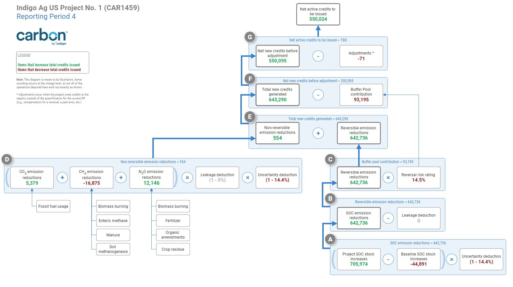

# Monitoring Report v4.2

<table data-header-hidden><thead><tr><th width="277"></th><th></th></tr></thead><tbody><tr><td><strong>Project Name</strong></td><td>Indigo U.S. Project No. 1</td></tr><tr><td><strong>Project ID</strong></td><td>CAR1459</td></tr><tr><td><strong>Document Version</strong></td><td>v4.2 (the 4th verification period)</td></tr><tr><td><strong>Document Date</strong></td><td>November 6th, 2024</td></tr><tr><td><strong>Time Period Covered</strong></td><td>June 12, 2018 to December 31, 2023</td></tr><tr><td><strong>Crediting Program</strong></td><td>Climate Action Reserve</td></tr><tr><td><strong>Protocol Version</strong></td><td>Soil Enrichment Protocol, Version 1.1</td></tr><tr><td><strong>Prepared By</strong></td><td>Indigo Ag. Inc.</td></tr><tr><td><strong>Contact</strong></td><td>
500 Rutherford Ave. Boston, MA 02129

+1 (844) 828-0240
</td></tr></tbody></table>

## Project summary 

The Indigo U.S. Project No. 1, identified in the registry system as CAR1459, (hereafter the “Project”) is a greenhouse gas (GHG) emission reduction project, developed according to the requirements of the Climate Action Reserve’s Soil Enrichment Protocol, Version 1.1, that aims to reduce net emissions of CO2, CH4, and N2O and to enhance soil organic carbon (SOC) sequestration on agricultural lands through the adoption of sustainable agricultural land management activities. Indigo has designed this soil enrichment project with a complete, consistent, transparent, accurate, and conservative quantification of GHG emissions reductions and removals. This Monitoring Report communicates the quantification results from the Project during the current reporting period as well as the overall crediting period to date.

The Project currently includes &#x31;_,_&#x30;92 enrolled growers who carry out agricultural management on &#x31;_,_&#x35;7&#x32;_,_&#x36;59 acres located in the primary agricultural regions of the United States (see the Monitoring Plan v4.2 for details). The total emissions reduced and removed by growers participating in CAR1459 over the course of the entire crediting period, up to and including the current reporting period under verification, are 939,952 tCO2e (comprised of 979,615 tCO2e and -39,663 tCO2e reversible and non-reversible emission reductions, respectively), and 142,039 tCO2e were contributed to the buffer pool. Results for the current verification are summarized in Table 1.

_Table 1: Summary results for the 4th verification of CAR1459_

| Non-Reversible Emission Reductions (ERNonRev) | Reversible Emission Reductions (ERRev) | uffer Pool Buffer Pool Total Credits Contribution Contribution Generated in (fraction) (credits) RP4 | Adjustments (see Sec 4) | Net Active Credits to be Issued |
| --------------------------------------------- | -------------------------------------- | ---------------------------------------------------------------------------------------------------- | ----------------------- | ------------------------------- |
| 554                                           | 642,736                                | 0.145 93,195 643,290                                                                                 | 71                      | 550,024                         |

The states included in this reporting period are as follows: Alabama, Arkansas, Colorado, Delaware, Georgia, Illinois, Indiana, Iowa, Kansas, Kentucky, Louisiana, Michigan, Minnesota, Mississippi, Missouri, Nebraska, New York, North Carolina, North Dakota, Ohio, Oklahoma, Pennsylvania, South Carolina, South Dakota, Tennessee, Texas, Virginia, and Wisconsin.

Table 2 summarizes the project data before any adjustments are made outside of the quantification of the current reporting period (e.g., deductions made to compensate for reversals of previously-issued credits). If there are no adjustments, then these figures will match those entered into the Climate Action Reserve’s registry system for the current reporting period. These results are consistent with the results found in this document and the data submission package. Any adjustments are discussed in Section 4.

_Table 2: Project Data for the Current Verification_

**Credits**

| **Vintage** | Reversible          | Irreversible       | **Total Credits Generated** |
| ----------- | ------------------- | ------------------ | --------------------------- |
| 2018        | 573                 | 26                 | 599                         |
| 2019        | &#x34;_,_&#x35;56   | −127               | &#x34;_,_&#x34;29           |
| 2020        | 1&#x35;_,_&#x30;69  | 13                 | 1&#x35;_,_&#x30;82          |
| 2021        | 4&#x33;_,_&#x38;81  | −532               | 4&#x33;_,_&#x33;49          |
| 2022        | 21&#x31;_,_&#x30;34 | &#x32;_,_&#x38;11  | 21&#x33;_,_&#x38;45         |
| 2023        | 36&#x37;_,_&#x36;23 | −&#x31;_,_&#x36;37 | 36&#x35;_,_&#x39;86         |

This document summarizes the Project’s quantification results based on the equations listed in Section 5.4 Results of Quantification in the Monitoring Plan v4.2 and Section 5 of the Soil Enrichment Protocol, Version 1.1. The full details of the project results are contained in the data submission package provided to the verifier, which contains the data and parameters that were necessary to enable credit generation for this Project. For any additional details or inquiries, please contact the Indigo team directly as listed below.

_Table 3: Project developer contact information_

| **Organization name** | Indigo                                                                             | Indigo                                                                             |
| --------------------- | ---------------------------------------------------------------------------------- | ---------------------------------------------------------------------------------- |
| **Contact names**     | Max DuBuisson                                                                      | Ryan Pape                                                                          |
| **Title**             | Head of Impact and Integrity                                                       | Sustainability MRV Manager                                                         |
| **Address**           | 
Indigo Ag. Inc.

500 Rutherford Ave.

Boston, Massachusetts 02129
 | 
Indigo Ag. Inc.

500 Rutherford Ave.

Boston, Massachusetts 02129
 |
| **Telephone**         | (844) 828-0240                                                                     | (844) 828-0240                                                                     |
| **Email**             | mdubuisson@indigoag.com                                                            | rpape@indigoag.com                                                                 |

## Project activities 

As detailed in Chapter 3 of the Monitoring Plan v4.2, project activities are changes in agricultural land management that are expected to increase SOC storage and reduce emissions of CO2, CH4, and/or N2O over the crediting period of a field (activities are listed in Table 4 below). The net impacts of project activities are quantified through the combination of soil sampling, modeling, and default equations, resulting in incentive payments to participating growers based on their fields’ performance during the reporting period. These impacts are quantified through the Soil Enrichment Protocol, Version 1.1 if the respective field met the eligibility requirements outlined in Section 2.2 and Section 3 of the SEP v1.1.

Project growers must adopt one or more of the practice changes detailed in Table 4 for each individual field they enroll into the Project.

Table 4: List of Project Activities eligible in current reporting period

| **Practice category**          | **Practice**                                                                                                                                                                                                                             |
| ------------------------------ | ---------------------------------------------------------------------------------------------------------------------------------------------------------------------------------------------------------------------------------------- |
| Crop planting and harvesting   | 
New cover crop adoption

Adding a legume species to existing cover crop Longer duration of cover crops through delayed termination

Longer duration of cover crops through earlier planting

New crops in rotation
 |
| Tillage and residue management | 
Tillage reduction through number of passes

Tillage reduction through delayed tilling

Tillage type change to lessen disturbance
                                                                                        |
| Nitrogen application           | 
Change in nitrogen application method

Change in nitrogen application timing

Addition of nitrogen stabilizer or inhibitor
                                                                                              |

## Variances, Guidance, and Modifications 

Indigo strives to maintain conformance with all requirements of the Soil Enrichment Protocol, Version 1.1 (SEP v1.1) during each reporting period. However, the project may encounter situations where protocol guidance is not clear, or experience implementation issues, whether scientific, meteorological, human, or technological, which require some form of guidance, clarification, and/or protocol variance. To provide full transparency into this process, this section explains any approved variances and/or registry guidance relevant to the current period under verification. Further, modifications that have been made to the documentation, quantification or infrastructure supporting the Project are reported below.

### Approved Variances 

Indigo has not sought approval from the Climate Action Reserve (CAR) for a variance under the SEP v1.1 for this verification period.

### Registry Guidance 

During the normal course of project development it is often necessary for Indigo to request guidance from CAR to clarify protocol language or provide interpretations to accommodate Project circumstances that are not obviously addressed by the SEP v1.1. Any written guidance relevant to this verification period is detailed in IndigoCarbon

US-1 2023 0067a (as referenced in Section 3.11 Variances, Guidance and Modifications of the Monitoring Plan v4.2).

### Reporting Modifications 

Lessons learned, guidance received, and/or advancements (both scientific and technological) may result in modifications to the Project documentation, quantification or infrastructure as compared to prior verification periods. This continuous improvement is desirable, ensuring the Project aligns with the current best practices and successfully generates verified carbon credits under the Soil Enrichment Protocol, Version 1.1 in an efficient and cost-effective manner. Indigo has detailed any notable changes between the current reporting period (RP4) and the previous reporting period in Table 3.4 of the Monitoring Plan v4.2.

## Quantification Results 

Quantification for each source included in the Project (as defined in Section 4.0 GHG Assessment Boundary of the Monitoring Plan v4.2) was completed through the use of both default equations and biogeochemical modeling.

The data inputs and parameters for the equations used in quantification were collected and derived from multiple sources, namely, direct soil measurements based on the Project sampling design as well as field-level management data from every field within the scope of the verification. The biogeochemical model was used for the quantification of changes to sources within the scope of the relevant model validation report at the sampled points, while non-modeled GHG sources were quantified through the default equations. All equations and parameters used to conduct quantification for this Project are listed in Section 5.4 Results of Quantification of the Monitoring Plan v4.2, while all quantification results, including leakage and uncertainty deductions, are provided in the following sections. Specifically, Tables 1, 2 and 5 display the final emissions reductions (credits) achieved by this Project and the remaining tables represent the intermediate (stratum) results following the requirements of the SEP v1.1. In the tables below, the stratum results may not sum to the total results of the Project due to rounding.\[1]

### Reporting Period Quantification Results 

Table 5 replicates Table 1.2 in Section 1.2 Summary Description of the Project of the Monitoring Plan v4.2. All results displayed in this document and the data submission package were required to achieve the total credit result listed of 643,290 .

Table 5: Project summary results for the current (4th ) reporting period

|        | **Growers**       | **Fields**         | **Area**                          | **Credits**         | **Buffer Pool**    | **Start Date** | **End Date**      |
| ------ | ----------------- | ------------------ | --------------------------------- | ------------------- | ------------------ | -------------- | ----------------- |
|        |                   |                    | (acres)                           | **Issued**          | **Contribution**   |                |                   |
|        |                   |                    |                                   | (tCO2e)             | (tCO2e)            |                |                   |
| 4th RP | &#x31;_,_&#x30;92 | 2&#x30;_,_&#x37;69 | &#x31;_,_&#x35;7&#x32;_,_&#x36;59 | 64&#x33;_,_&#x32;90 | 9&#x33;_,_&#x31;95 | June 12, 2018  | December 31, 2023 |

#### Reversible and Non-Reversible Emission Reductions 

_This section follows the equations listed in Subsection 3.1.5 Uncertainty and Leakage Deduction of the Monitoring Plan v4.2._

The results for both reversible and non-reversible emissions reductions, as indicated in SEP Equations 5.2 and 5.6, can be found in Table 6 below. The results in this table require the use of the leakage and uncertainty deductions; these results are established for the Project and can be found in Subsubsection 3.1.5 Uncertainty and Leakage Deductions.

As described in the Monitoring Plan v4.2, the results in Table 6 indicate whether a reversal occurred in the Project (as required through Equation 5.5 of the SEP v1.1). As _ERRev_ was not negative in this reporting period, Indigo was not required to compensate for any project-level reversal obligations.

Table 6: Summary table of reversible and non-reversible emission reductions across the entire project

ERRe&#x76;_,s,t_ ERNonRe&#x76;_,s,t_ ∆_C&#x4F;_&#x32; soi&#x6C;_&#x73;,t_ ∆_C&#x48;_&#x34;_s,t_ ∆_&#x4E;_&#x32;_Os,t_ ∆_C&#x4F;_&#x32; N&#x52;_&#x73;,t As,t_

|                                                                | (tCO2e)                           | (tCO2e)                           | (tCO2e)                           | (tCO2e/acre) (tCO2e/acre) (tCO2e/acre)          | (acres)            |                    |                                   |
| -------------------------------------------------------------- | --------------------------------- | --------------------------------- | --------------------------------- | ----------------------------------------------- | ------------------ | ------------------ | --------------------------------- |
| **Stratum A**                                                  | 2&#x31;_,_&#x39;2&#x39;_._&#x38;  | −&#x34;_,_&#x31;1&#x30;_._&#x38;  | 2&#x31;_,_&#x39;2&#x39;_._&#x38;  | −&#x30;_._&#x30;65                              | −&#x30;_._&#x30;25 | −&#x30;_._&#x30;01 | 5&#x32;_,_&#x35;3&#x36;_._&#x35;  |
| **Stratum B**                                                  | 9&#x31;_,_&#x38;8&#x33;_._&#x34;  | −1&#x30;_,_&#x31;3&#x31;_._&#x38; | 9&#x31;_,_&#x38;8&#x33;_._&#x34;  | −&#x30;_._&#x30;25                              | −&#x30;_._&#x30;37 | −&#x30;_._&#x30;01 | 19&#x30;_,_&#x35;3&#x31;_._&#x33; |
| **Stratum C**                                                  | &#x37;_,_&#x32;1&#x34;_._&#x32;   | 77&#x33;_._&#x38;                 | &#x37;_,_&#x32;1&#x34;_._&#x32;   |                                                 |                    |                    |                                   |
| **Stratum D**                                                  | 2&#x34;_,_&#x35;6&#x32;_._&#x38;  | −4&#x32;_._&#x38;                 | 2&#x34;_,_&#x35;6&#x32;_._&#x38;  |                                                 |                    |                    |                                   |
| **Stratum E**                                                  | 10&#x34;_,_&#x36;3&#x37;_._&#x39; | −96&#x30;_._&#x39;                | 10&#x34;_,_&#x36;3&#x37;_._&#x39; | −&#x30;_._&#x30;15                              | &#x30;_._&#x30;08  | &#x33;_._&#x37;55  | 16&#x34;_,_&#x31;4&#x33;_._&#x31; |
| **Stratum F**                                                  | 24&#x34;_,_&#x38;8&#x33;_._&#x32; | 1&#x31;_,_&#x39;7&#x33;_._&#x38;  | 24&#x34;_,_&#x38;8&#x33;_._&#x32; | −&#x30;_._&#x30;03 | &#x30;_._&#x30;17  | &#x30;_._&#x30;07  | 67&#x30;_,_&#x31;0&#x39;_._&#x39; |
| 
<strong>Stratum G</strong>

<strong>Total</strong>
 | 14&#x37;_,_&#x36;2&#x37;_._&#x31; | &#x33;_,_&#x30;5&#x34;_._&#x37;   | 14&#x37;_,_&#x36;2&#x37;_._&#x31; | −&#x30;_._&#x30;08                              | &#x30;_._&#x30;14  | &#x30;_._&#x30;02  | 41&#x35;_,_&#x38;1&#x31;_._&#x33; |

#### Soil Organic Carbon Stock Change 

_This section follows the equations listed in Subsection 5.4.2 Soil Organic Carbon Stock Change of the Monitoring Plan v4.2._

The results for the soil organic carbon stock change, as indicated in SEP Equation 5.3, can be found in Table 7 below. The results in this table require stratum areas (as listed in Table 6) and use a key parameter: the uncertainty deduction, which is established for the Project and can be found in Subsubsection 3.1.5 Uncertainty and Leakage Deductions. Note that soil organic carbon was quantified through the use of biogeochemical modeling with the DayCent-CR model. The first column of table 7 shows the quantity that appears inside the sum in Equation 5.3 of the SEP v1.1:

_._ (MR-1)

To attribute SOC emission reductions to fields for the purposes of allocating credits to growers (for calculating payments and tracking reversals), Indigo developed an emulator of DayCent-CR that could be applied both to fields that were selected for soil sampling (and thus had point-level DayCent-CR results) as well as fields that were not selected for soil sampling (and thus did not have DayCent-CR results) as allowed by SEP v1.1. Specifically, Indigo fit a gradient-boosting decision tree model that uses practice changes to predict DayCent-CR SOC emission reductions.

Table 7: Summary of the soil organic carbon stock change for the Project

|               | ∆_C&#x4F;_&#x32; soi&#x6C;_&#x73;,t_ | ∆_SOCs,t_        | ∆_SO&#x43;_&#x62;s&#x6C;_,s,t_ |
| ------------- | ------------------------------------ | ---------------- | ------------------------------ |
|               | (tCO2e)                              | (tCO2e/acre)     | (tCO2e/acre)                   |
| **Stratum A** | 2&#x31;_,_&#x39;2&#x39;_._&#x38;     | &#x30;_._&#x35;4 | &#x30;_._&#x30;5               |
| **Stratum B** | 9&#x31;_,_&#x38;8&#x33;_._&#x34;     | &#x30;_._&#x36;0 | &#x30;_._&#x30;4               |
| **Stratum C** | &#x37;_,_&#x32;1&#x34;_._&#x32;      | &#x30;_._&#x37;2 | &#x30;_._&#x33;8               |
| **Stratum D** | 2&#x34;_,_&#x35;6&#x32;_._&#x38;     | &#x30;_._&#x33;4 | −&#x30;_._&#x31;9              |
| **Stratum E** | 10&#x34;_,_&#x36;3&#x37;_._&#x39;    | &#x30;_._&#x34;7 | −&#x30;_._&#x32;8              |
| **Stratum F** | 24&#x34;_,_&#x38;8&#x33;_._&#x32;    | &#x30;_._&#x34;7 | &#x30;_._&#x30;4               |
| **Stratum G** | 14&#x37;_,_&#x36;2&#x37;_._&#x31;    | &#x30;_._&#x33;3 | −&#x30;_._&#x30;9              |

For consistency, Indigo used emulator predictions of SOC emission reductions for all fields in the Project to make field attributions. This emulator is updated with each verification based on the quantification results of the relevant time period.

To compute field attributions, attributions to management zones and cultivation cycles were scaled to sum to the “design-based estimate” of the total SOC emission reductions that was quantified using the sample design and DayCent-CR predictions at sample points. These attributions were pro-rated to calendar years and summed at the annual level to compute vintage-level credit totals. Indigo rounded these vintage-level totals by rounding down to the nearest integer (i.e., the “floor” operation), per guidance from CAR. The final vintage-level credit results are reflected in Table 2, while the buffer pool contribution is reported here only at the project level, in Table 1. Finally, the management zone and cultivation cycle attributions were scaled a second time so that they sum to the vintage credit totals, and these attributions were then used to generate field attributions. The right-hand column of Table 8 shows the stratum-level totals of those attributions. As a result of rounding credits down at the vintage level, the total of the right-hand column of Table 8 is slightly smaller than the total of the left-hand column, which is erring on conservatism. Note that the variance of the total SOC emissions reduction, and thus the uncertainty deduction, was calculated with the statistical sample design estimates and not the field attributions.

Table 8: Two notions of emissions reduction of SOC after applying the uncertainty deduction: The design-based estimates following Eq. (MR-1) and Eq. 5.3 of the SEP estimate the stratum-level averages using model runs at sample points. Meanwhile, the result of subsequent transformations (attributing emissions reduction to zones and cultivation cycles, rounding the vintage-level totals down to the nearest integer, and scaling the zone-cycle–level totals to equal those rounded vintage totals) produces slightly different results when aggregated to the stratum level (second column). The totals differ slightly because rounding was applied in calculating vintage-level credits, which affects the second column but not the first.

Two notions of emissions reduction of SOC after uncertainty deduction

| Design-based estimate of ∆_C&#x4F;_&#x32; soi&#x6C;_&#x73;,t_                                                                                                                                                                                                        | attribution of SOC em. red. × (1 − _UNCt_)                       |
| -------------------------------------------------------------------------------------------------------------------------------------------------------------------------------------------------------------------------------------------------------------------- | ---------------------------------------------------------------- |
| 
<strong>Stratum A</strong>

<strong>Stratum B</strong>

<strong>Stratum C</strong>

<strong>Stratum D</strong>

<strong>Stratum E</strong>

<strong>Stratum F</strong>

<strong>Stratum G</strong>

<strong>Total</strong>
 |  |

#### Methane Emission Reductions 

_This section follows the equations listed in section 5.4.3 of the Monitoring Plan v4.2._

Table 9: Summary of the methane emission reductions for the Project

|               | ∆_C&#x48;_&#x34;_s,t_             | ∆_C&#x48;_&#x34; m&#x64;_&#x73;,t_ | ∆_C&#x48;_&#x34; en&#x74;_&#x73;,t_ | ∆_C&#x48;_&#x34; b&#x62;_&#x73;,t_ |
| ------------- | --------------------------------- | ---------------------------------- | ----------------------------------- | ---------------------------------- |
|               | (tCO2e/acre)                      | (tCO2e/acre)                       | (tCO2e/acre)                        | (tCO2e/acre)                       |
| **Stratum A** | −&#x30;_._&#x30;6&#x35;_,_&#x33;  | −&#x30;_._&#x30;0&#x31;_,_&#x34;5  | −&#x30;_._&#x30;6&#x33;_,_&#x38;    | &#x30;_._&#x30;                    |
| **Stratum B** | −&#x30;_._&#x30;2&#x34;_,_&#x36;  | −&#x30;_._&#x30;0&#x30;_,_&#x35;58 | −&#x30;_._&#x30;2&#x34;_,_&#x31;    | &#x32;_._&#x35;0 × 10−5            |
| **Stratum C** | −&#x30;_._&#x30;0&#x37;_,_&#x36;9 | −&#x30;_._&#x30;0&#x30;_,_&#x31;60 | −&#x30;_._&#x30;0&#x37;_,_&#x35;3   | &#x30;_._&#x30;                    |
| **Stratum D** | −&#x30;_._&#x30;1&#x32;_,_&#x30;  | −&#x30;_._&#x30;0&#x30;_,_&#x33;46 | −&#x30;_._&#x30;1&#x32;_,_&#x33;    | &#x30;_._&#x30;0&#x30;_,_&#x36;79  |
| **Stratum E** | −&#x30;_._&#x30;1&#x35;_,_&#x33;  | −&#x30;_._&#x30;0&#x30;_,_&#x33;25 | −&#x30;_._&#x30;1&#x34;_,_&#x39;    | −&#x30;_._&#x30;0&#x30;_,_&#x31;59 |
| **Stratum F** | −&#x30;_._&#x30;0&#x33;_,_&#x30;7 | −&#x36;_._&#x34;2 × 10−5           | −&#x30;_._&#x30;0&#x33;_,_&#x30;4   | &#x33;_._&#x33;0 × 10−5            |
| **Stratum G** | −&#x30;_._&#x30;0&#x38;_,_&#x30;2 | −&#x30;_._&#x30;0&#x30;_,_&#x31;38 | −&#x30;_._&#x30;0&#x37;_,_&#x32;5   | −&#x30;_._&#x30;0&#x30;_,_&#x36;28 |

The results for methane emission reductions, as indicated in SEP Equation 5.7, can be found in Table 9. Note that methane emissions reductions were quantified through the use of default equations for this reporting period.

#### Nitrous Oxide Emission Reductions 

_This section follows the equations listed in Section 5.4.4 Nitrous Oxide Emission Reductions of the Monitoring Plan v4.2._

The results for nitrous oxide emission reductions, as indicated in SEP Equation 5.16, can be found in Table 10 below. Direct nitrous oxide emissions reductions were quantified through the use of DayCent-CR (with default equations 5.20 and 5.25 in the SEP used in every management zone outside DayCent-CR’s validation domain for direct N2O and at sample points when model QC checks failed). Indirect nitrous oxide emissions reductions were quantified through the use of default equations.

Table 10: Summary of the nitrous oxide emission reductions for the Project

|               | ∆_&#x4E;_&#x32;_Os,t_            | ∆_&#x4E;_&#x32;_O_ inpu&#x74;_&#x73;,t_ | ∆_&#x4E;_&#x32;_O_ b&#x62;_&#x73;,t_ |
| ------------- | -------------------------------- | --------------------------------------- | ------------------------------------ |
|               | (tCO2e/acre)                     | (tCO2e/acre)                            | (tCO2e/acre)                         |
| **Stratum A** | −&#x30;_._&#x30;2&#x35;_,_&#x34; | −&#x30;_._&#x30;2&#x35;_,_&#x34;        | &#x30;_._&#x30;                      |
| **Stratum B** | −&#x30;_._&#x30;3&#x36;_,_&#x39; | −&#x30;_._&#x30;3&#x36;_,_&#x39;        | &#x36;_._&#x31;6 × 10−6              |
| **Stratum C** | &#x30;_._&#x30;4&#x30;_,_&#x31;  | &#x30;_._&#x30;4&#x30;_,_&#x31;         | &#x30;_._&#x30;                      |
| **Stratum D** | &#x30;_._&#x30;1&#x32;_,_&#x31;  | &#x30;_._&#x30;1&#x31;_,_&#x39;         | &#x30;_._&#x30;0&#x30;_,_&#x31;67    |
| **Stratum E** | &#x30;_._&#x30;0&#x38;_,_&#x34;7 | &#x30;_._&#x30;0&#x38;_,_&#x35;2        | −&#x35;_._&#x33;7 × 10−5             |
| **Stratum F** | &#x30;_._&#x30;1&#x37;_,_&#x33;  | &#x30;_._&#x30;1&#x37;_,_&#x32;         | &#x38;_._&#x30;7 × 10−6              |
| **Stratum G** | &#x30;_._&#x30;1&#x34;_,_&#x32;  | &#x30;_._&#x30;1&#x34;_,_&#x33;         | −&#x30;_._&#x30;0&#x30;_,_&#x31;54   |

#### Uncertainty and Leakage Deductions 

_This section follows the equations listed in section 5.5 and 5.4.6 of the Monitoring Plan v4.2._

Table 11 provides the results for the both the leakage and uncertainty deduction of the Project. These results are required by SEP Equations 5.2, 5.3 and 5.6 (as referenced above in Subsubsection 3.1.1 Reversible and Non-Reversible Emission Reductions and Subsubsection 3.1.2 Soil Organic Carbon Stock Change).

Table 11: Summary of uncertainty and leakage deductions

| Parameter | **Uncertainty deduction** (_UNCt_) | **Leakage deduction** (_LEt_) |
| --------- | ---------------------------------- | ----------------------------- |
| Value     | 1&#x34;_._&#x34;0%                 | &#x30;_._&#x30;0%             |

## Crediting Period Quantification Results 

Table 12 shows the results of the crediting period to date, including the current reporting period.

Table 12: Project summary results for all reporting periods

| **Growers**                                          | **Fields** | **Area** | **Credits** | **Buffer Pool**                                                  | **Start Date** | **End Date** |
| ---------------------------------------------------- | ---------- | -------- | ----------- | ---------------------------------------------------------------- | -------------- | ------------ |
|                                                      |            | (acres)  | **Issued**  | **Contribution**                                                 |                |              |
|                                                      |            |          | (tCO2e)     | (tCO2e)                                                          |                |              |
| 
1st

2nd

3rd

4th

Total
 |            |          | 939         |  |                |              |

## Reported Reversals and/or Other Adjustments 

### Reversals During the Current Reporting Period 

As described in Sections 3.9 and 6.6.2 of the Monitoring Plan v4.2 and in IndigoCarbon US-1 2023 0050, Indigo monitors all fields after the end of their crediting period to identify any changes to land use or land management that constitute a reversal. For avoidable reversals, Indigo will coordinate with the Climate Action Reserve for compensation per Section 5.3.2.1 of the SEP v1.1. Unavoidable reversals are compensated per Section 5.3.2.2 of the SEP v1.1.

Table 13: Summary of reversals during the 4th reporting period

**Totalfieldsaffected**

**Totalreversals**

(

CRTs

)

**Avoidable Reversals** 8 71 **Unavoidable Reversals** 0 0

8

**Total**

71

### Other Adjustments During the Current Reporting Period 

_During a given reporting period situations may arise which create an obligation for Indigo to compensate the registry for a specific volume of credits. For example, if, during the course of the current verification, it is determined that some quantity of credits in a previous period were issued in error, there would be an obligation to compensate the registry system with an equivalent number of credits. If such a situation exists during the current reporting period, it will be described in this section._

During Reporting Period 4 there was one additional obligation for compensation to the registry. As described in Monitoring Plan v4.2 Section 6.6.2, Indigo continues to monitor all fields which have been included in a prior verification but for one reason or another are not included in the current verification. These fields are considered to have entered their permanence period unless they return to the project within the allowable timeframe (and submit all required data for the entire period since the prior verification). During the current reporting period Indigo determined that there were land management changes on TBD fields that present a risk of loss of previously-credited SOC gains, resulting in a potential risk of loss of TBD. This number of credits will be deducted from the total issuance for the current reporting period prior to entering data into the registry system.

## **Appendix: Summary Quantification Flow Diagram**

Figure1:SummarydiagramofthequantificationflowforCAR1459.

1. Numerical results are rounded in Section 3 Quantification Results for display purposes. In the data submission package, no rounding is done until the end of the credit calculation process, when reversible credits, non-reversible credits, and buffer pool contribution are rounded down at the vintage level. ↑
