# Context

When soil sampling for Carbon by Indigo, all sampling locations require
a soil carbon sample.

At each carbon sampling location, an individual 30 cm carbon sample must
be collected according to the instructions outlined in this document. At
a subset of carbon sampling locations, three different sample types are
collected (figure [1](#fig:soil_sample){reference-type="ref"
reference="fig:soil_sample"}) and the sample type bolded below must be
collected according to the instructions in this document.

- **An individual 30 cm carbon sample according to the instructions
  below**

- An individual 30.48 cm bulk density sample according to the work
  instructions in `IndigoCarbon_US-1_2025_0002`

- A core that will contribute to a composite sample for pH and texture
  testing according to the work instructions in
  `IndigoCarbon_US-1_2025_0003` (applicable only to sites sampled March
  16, 2020 -- present)

<figure id="fig:soil_sample" data-latex-placement="h">

<figcaption>Indigo Carbon soil sample collection</figcaption>
</figure>

::: center
(Representative of March 16, 2020 ­ Current).
:::

# Preparation 

- Prepare sampling equipment before visiting the field. Review inventory
  checklist and make sure you have all necessary materials.

  - Take note of supplies in short inventory and request additional
    consumables from your Equipment Manager.

- All equipment can be stored in the trailer.

- Make sure you are familiar with all material in Indigo's field safety
  protocol. For this procedure you will need:

- NOTE: Safety rules and regulations of sampler's parent company should
  always supersede, when applicable, those recommended by Indigo.

  - Safety Glasses

  - Steel Toe Shoes

  - Cut-Resistant Gloves

- Navigate to the appropriate sampling location by following guidance in
  the IF app. When connected to the external GPS select the desired
  sampling point in the IF app and reduce the offset distance to that
  point a low as possible.

  - There are specific instructions in section
    [8](#obstacles-and-alternate-locations){reference-type="ref"
    reference="obstacles-and-alternate-locations"} that will guide you
    when faced with situations when you are unable to navigate to the
    prescribed point due to any reason (flood, fence, private property)
    or find that the point is in a compromised sampling location (field
    edge, access road, rock outcropping).

- Clear residue or vegetation from the soil surface where you intend to
  take a soil core. Only sample bare mineral soil and avoid residue in
  the sample (figure [2](#figure:residue_clearing){reference-type="ref"
  reference="figure:residue_clearing"}).

<figure id="figure:residue_clearing" data-latex-placement="!h">

<figcaption>Residue clearing to prepare sample core
extraction</figcaption>
</figure>

# Assessment of Soil Conditions

- Excessively wet soils

  - Do not sample in standing water of any depth.

  - If upon removal of a soil core, the hole created is refilled within
    two minutes by surrounding soil flowing back into the hole because
    the soil exhibits a fluid-like property, discard the sample and
    discontinue sampling.

- Frozen soils

  - To avoid erroneous measurements of bulk density, we do not want to
    sample frozen soils.

  - When the daily average air temperature falls below 32$^{\circ}$F,
    consult the instructions in section
    [7](#frozen-ground-procedures){reference-type="ref"
    reference="frozen-ground-procedures"} to determine if samples can be
    taken.

## Step probe sampling

- Using the step-probe, take a soil sample (one single probe) down to 30
  cm depth from a random point within 1 foot (30.48 cm) of the plot
  center (figure [3](#figure:step_probe){reference-type="ref"
  reference="figure:step_probe"})

  - You may wish to score or mark the probe with a 30cm mark to know the
    appropriate depth to take.\
    **Do not rely on measuring the soil core itself for assessing
    adequate depth, as soil compaction during sampling will bias this
    measurement.**

  <figure id="figure:step_probe" data-latex-placement="h!">
  
  <figcaption>Using a step probe to collect a 30cm soil
  sample</figcaption>
  </figure>

- Slowly remove the probe attempting to keep the sample intact and
  paying attention to any loss of soil or voids in the sample (figure
  [4](#figure:remove_intact){reference-type="ref"
  reference="figure:remove_intact"})

-  If you are unable to obtain a full 30 cm core due to rocks, wet soil,
  or loss of sample, attempt to take another sample within 1 foot
  (30.48 cm) of the original sample location.  

  - If another attempt is required, do not go beyond 30cm of depth with
    the soil probe. Any sampling attempts to take a full core sample
    should only be conducted with the 0-30cm soil profile.

  <figure id="figure:remove_intact" data-latex-placement="h!">
  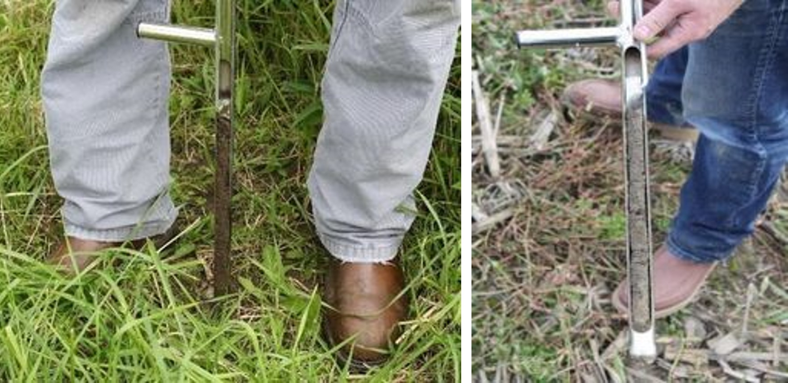
  <figcaption>Removing soil probe (left) and intact soil core
  (right)</figcaption>
  </figure>

- After three failed sampling attempts, attempt to use the Drill Auger
  Sampling procedure described in section
  [3.2](#drill-auger-sampling){reference-type="ref"
  reference="drill-auger-sampling"}.

- Extrude the soil sample into a clean plastic bucket (2 gallon) (figure
  [5](#figure:extrude_soil){reference-type="ref"
  reference="figure:extrude_soil"}).

- Use the brush to clean any remaining sample in the probe into the
  bucket (figure [6](#figure:brush_sample){reference-type="ref"
  reference="figure:brush_sample"}).

- Pour through the funnel into the Whirl-Pak bag (figure
  [7](#figure:pour_sample){reference-type="ref"
  reference="figure:pour_sample"}).

- With the 1" putty knife, scrape the inside of the bucket clean of any
  sticking sample and add to the Whirl-Pak through the funnel again.

- Close the Whirl-Pak bag by flipping the bag twice and closing the
  tabs. Double-check that the bag is closed well and completely sealed
  shut to avoid spilling during shipping (figure
  [8](#figure:close_bag){reference-type="ref"
  reference="figure:close_bag"}).

<figure id="figure:extrude_soil" data-latex-placement="h!">
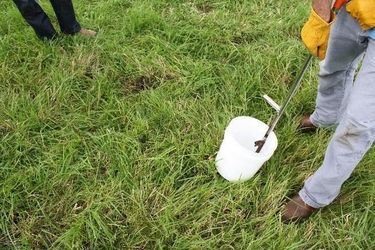
<figcaption>Extruding soil sample into clean bucket</figcaption>
</figure>

<figure id="figure:brush_sample" data-latex-placement="h!">
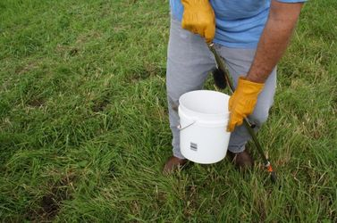
<figcaption>Brushing remaining sample into the bucket</figcaption>
</figure>

<figure id="figure:pour_sample" data-latex-placement="h!">
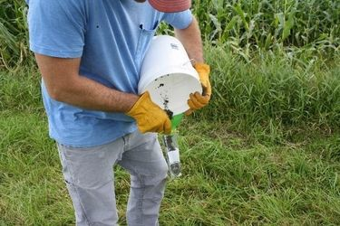
<figcaption>Pouring sample into a whirl-Pak bag</figcaption>
</figure>

<figure id="figure:close_bag" data-latex-placement="h">
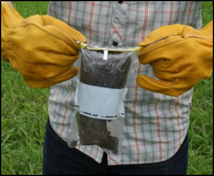
<figcaption>Closing whirl-pak bag with sample</figcaption>
</figure>

## Drill Auger Sampling

- In compacted, dry, or coarse textured soils, it may be difficult to
  sample using the step probe. In such cases, the drill auger approach
  may work better (figure [9](#figure:drill_auger){reference-type="ref"
  reference="figure:drill_auger"}).

- Load the 5 ½" x 7/16" auger into the drill. Set the clutch setting to
  the highest level, set to drill mode so auto clutch does not engage
  and select forward drilling

<!-- -->

- Mark soil auger with a Sharpie marker to indicate the relative
  position of the auger in relation to the bucket when a soil depth of
  30 cm has been reached.

- Using the "Collect-N-Go" bucket kit, take a soil sample down to 30 cm
  depth from a random location within 1 foot (30.48 cm) of the plot
  center (Figure 11). Slowly auger with a downwards motion with repeated
  retrieval of the bit as you plunge to a depth of 30 cm (should be
  marked on the auger shank) while keeping the auger perpendicular to
  the ground. Be sure that you reach the correct depth.

<!-- -->

- If needed, clean the auger of soil residue with the .5" putty knife
  into the bucket.

- Repeat the first step, 3 more times within a 1 foot (30.48 cm) radius
  of the original hole. (This should be enough material to fill the
  Whirl-Pak up to the white line). 

- ***If you encounter rocks that prevent you from reaching the full 30
  cm on any of the repeated augering extractions, you must dump the
  entire bucket start the process again***

- Use the 0.5" putty knife to clean the auger after the last core has
  been collected

- After cleaning the auger, pour the sample through the funnel into the
  Whirl-Pak bag (figure [7](#figure:pour_sample){reference-type="ref"
  reference="figure:pour_sample"})

- With the 1" putty knife, scrape the inside of the bucket to remove any
  residual sample and add to the Whirl-Pak through the funnel again.

- Close Whirl-Pak bag by flipping the bag twice and closing the tabs
  ensuring that the bag is completely sealed (figure
  [8](#figure:close_bag){reference-type="ref"
  reference="figure:close_bag"})

<figure id="figure:drill_auger" data-latex-placement="h!">
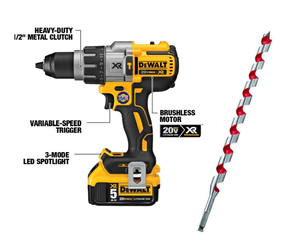
<figcaption>Drill auger used to sample in compacted, dry, or coarse
textured soils</figcaption>
</figure>

<figure id="figure:auger_action" data-latex-placement="h!">
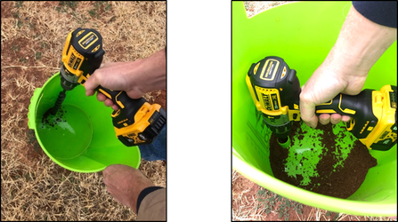
<figcaption>Collect-N-Go bucket method for soil sample
collection</figcaption>
</figure>

# Troubleshooting Carbon Sample Collection

**What to do when a full depth sample is not possible:**

- In particularly sandy, clayey, or rocky soils, collecting a full depth
  30 cm carbon sample can be challenging; however, this measurement is
  crucial for our calculation of carbon stocks.

- As mentioned above, if a full depth carbon sample cannot be reached
  using the step probe, the sampler should attempt to apply the drill
  auger method.

- If on your first attempt to collect a carbon sample you are
  unsuccessful (assuming application of the most effective method):

  - Measure the depth of the collected sample and make a note of the
    length on the bag

  - Bag the sample and set aside

  - Attempt to collect a carbon sample to full depth two additional
    times at the prescribed location.

    - **NOTE: Always save the deepest sample obtained until a deeper or
      full depth sample is collected.**

- If a full depth sample cannot be collected at the prescribed location
  after three attempts:

  - Follow the offsetting protocol listed in the "Obstacles and
    Alternate Locations" section of Field Mapping and Navigation to
    attempt to locate a sampling point in which a full depth core can be
    extracted. One attempt should be made at each new offset location to
    obtain a sample at full depth until sampling of the point is
    completed.

  <!-- -->

  - **NOTE: Carbon samples, bulk density, and pH/texture samples must be
    collected at the same location. If the carbon sample is offset, the
    bulk density and pH/texture composite samples (when prescribed) must
    be obtained from the new offset location as well.**

- If a full depth sample cannot be achieved after offsetting:

  - Mark the QR code, sampling location, and depth of the deepest sample
    collected in the appropriate sections of the IF "Soil Sampling" form
    and proceed to the next prescribed sampling location.

    - **NOTE: Whenever possible, the core contribution to the texture/pH
      composite sample should be the same depth as the carbon sample. If
      faced with a scenario where this is not achievable, the deeper of
      the two cores should be designated as the carbon sample.**

# Sample Labeling 

- Make sure there is a QR code affixed to the bag

  - Note: if bag is wet, wipe off before attempting to add sticker,
    otherwise it may fall off during shipping

- With a sharpie write the following information as it appears in Indigo
  Fields Mobile (IFM) on the white section of the Whirl-Pak on the back
  of the bag (opposite from QR code label):

Minimum recommended labeling system:

- Sample Date (month/day)

- Field Name "Unique Full Word" (3 character minimum unless entire name
  is less)

- No multi-word abbreviations

  - From the following example:

    - For the field: Craig Place 1 - use "Place 1" **not** CP1

    - For the field: K Pivot SC - use "Pivot SC" **not** KPSC

- Sample Type (C, BD, pH/TXT) -- **one code per bag**

- Sample Number

  - For carbon: C -- 1,2,3,4...

  - For bulk density: BD -- 1,2,3,4...

- **Include more info. if it helps you (e.g. grower name, farm name,
  full field name, etc.)**

  - **Minimum requirement example:**

    - For the first bulk density sample collected on the field Crabbe
      C6C on 5/13:

      - 5/13 - C6C -- BD1 (figure
        [11](#figure:label_convention){reference-type="ref"
        reference="figure:label_convention"})

  - **More info. example:**

    - For a carbon sample collected at the fifth spot label as follows.
      **Grower**: Fred **Farm**: McDonalds **Field**: Home **Sample:**
      C5

      - Fred-McDonalds-Home-C5

{#figure:label_convention
width="60%"}

<figure id="fig:map_home_views" data-latex-placement="h!">
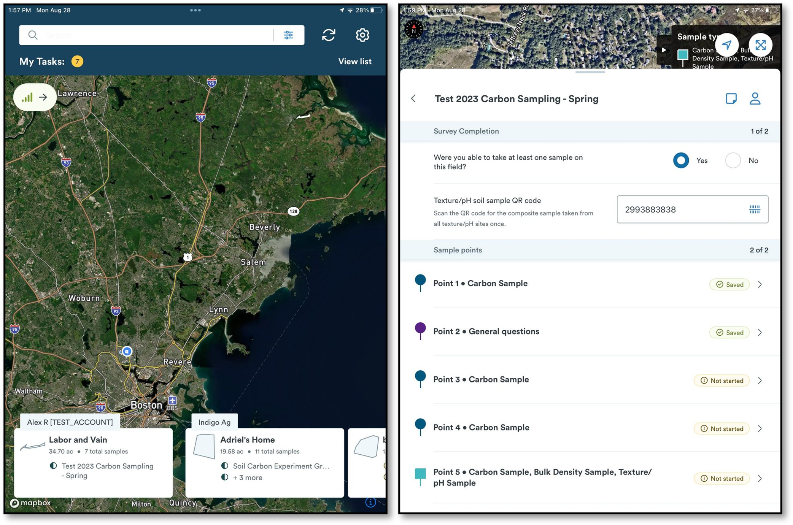
<figcaption>Using IF to record a new soil sampling event, a, left shows
regional map view, b, on right displays samples at a
location</figcaption>
</figure>

## Sample Entry into Indigo Fields

- Use Indigo Fields (figure
  [12](#fig:map_home_views){reference-type="ref"
  reference="fig:map_home_views"}) to find the task associated with the
  field you are sampling, and select the correct survey for the sampling
  activity

- Use an external GPS device (Bad Elf, Garmin, or similar) that is
  connected via Bluetooth to your iPad.

- Select the point you want to enter data on, (figure
  [12](#fig:map_home_views){reference-type="ref"
  reference="fig:map_home_views"}) answer the field-level Survey
  Completion questions.

  {#fig:sample_parameters
  width="80%"}

- Proceed through the general questions (field-level). (figure
  [13](#fig:sample_parameters){reference-type="ref"
  reference="fig:sample_parameters"})

  - For each point, there are general questions you must answer ex. are
    you able to take this sample? as well as a location verification.
    Click "Record Location" once you are near the point - the app will
    save your location and tell you how close to the point you were when
    you clicked "record".

    - Get as close to the prescribed point as possible - the app will
      record your location as well as the location that was prescribed.

    - If you are unable to sample at the prescribed location, choose a
      reason why the sample was offset from the drop-down menu. If you
      are \> 20 feet from the prescribed location, the app will force
      you to choose an option. If you are \< 20 feet, you can choose to
      enter an offset reason.

- Answer questions about location of the sample and whether the soil was
  frozen or not. If more than 3" of the soil profile is frozen, do not
  sample - mark a reason why you cannot sample the field or point.
  (figure [13](#fig:sample_parameters){reference-type="ref"
  reference="fig:sample_parameters"})

- Answer the optional tillage practice question only if tillage is
  inconsistent across the field (see section
  [6](#Inconsistent Tillage Instructions){reference-type="ref"
  reference="Inconsistent Tillage Instructions"} with more details.

  - If tillage is inconsistent across the field (eg: some portions of
    the field appear to be no-till while others appear to have been
    conventionally tilled) this information should be recorded at the
    point level for all samples.

  - If tillage is the same across the field, this question does not need
    to be answered.

- Take a photo of the sample site.

- Add any relevant notes.

<!-- -->

- Proceed through the Carbon sample questions. (figure
  [13](#fig:sample_parameters){reference-type="ref"
  reference="fig:sample_parameters"})

  - Answer if you are able to take the sample or not (if not, choose a
    reason why not)

  - Scan the QR code of the soil sample bag from this point.

  - Select the soil sampling method.

  - If the full depth was achieved (30 cm) select "yes" to "Did the
    Carbon soil sample reach the sample depth of 30 cm?"; if not, select
    "no", enter the depth reached, and select a reason why the full
    depth was not reached. (figure
    [13](#fig:sample_parameters){reference-type="ref"
    reference="fig:sample_parameters"})

<figure id="fig:save_submit" data-latex-placement="h!">
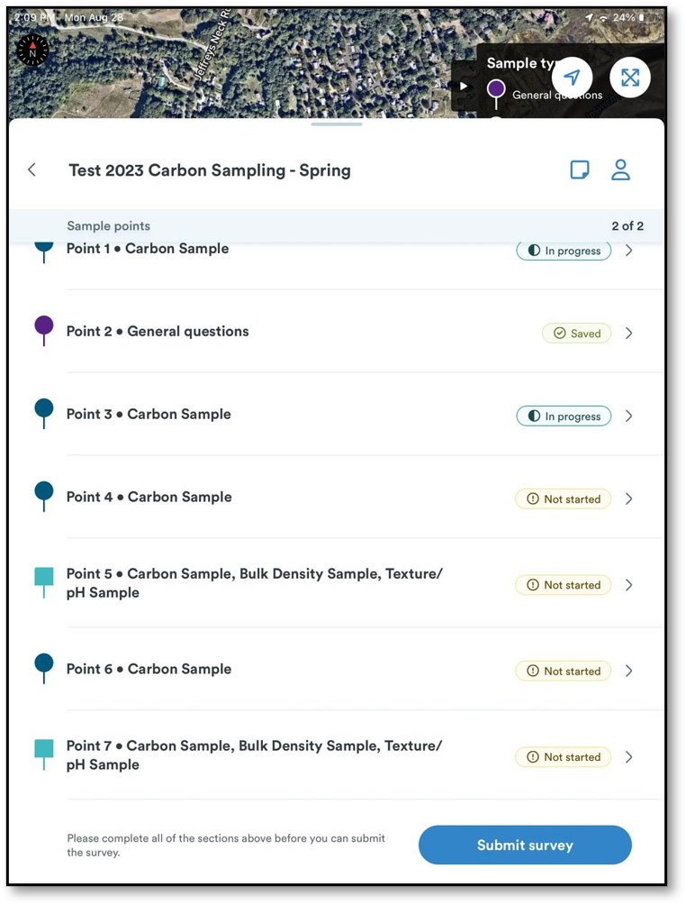
<figcaption>Status view during location sampling</figcaption>
</figure>

- Save the point, and you will return to the list of points to be
  sampled on the field.

- Proceed to enter data at each prescribed point around the field.
  (figure [12](#fig:map_home_views){reference-type="ref"
  reference="fig:map_home_views"})

- When you are done (all points should show SAVED), make sure to "Submit
  Survey" at the bottom of the screen (figure
  [14](#fig:save_submit){reference-type="ref"
  reference="fig:save_submit"}).

# Inconsistent Tillage Instructions {#Inconsistent Tillage Instructions}

- If tillage is inconsistent across the field (e.g. some portions of the
  field appear to be no-till while others appear to have been
  conventionally tilled) this information should be recorded at:

  - **Point Level** (May 12, 2020 -- September 12, 2020)

  - **Bulk Density Sample Sites** **Only** (September 13, 2020 --
    Present)

- Scroll to the bottom of the Soil Sampling form to the Point Level
  Crop/Soil Information section and fill in the type of tillage used at
  each individual sampling point using the dropdown menu (Figure
  [13](#fig:sample_parameters){reference-type="ref"
  reference="fig:sample_parameters"})

<!-- -->

- As a general guideline see figure
  [15](#fig:tillage_example){reference-type="ref"
  reference="fig:tillage_example"}: 

  - Conventional tillage will look like there have been many passes with
    a plow and there is very little crop residue remaining on the field.

  - Minimal tillage will look like there has been a single plow pass on
    the field, and some (\~30%) crop residue may remain

  - Strip tillage will have distinct strips of tilled areas and
    undisturbed areas

    - **Please remember that if the field has been strip tilled, bulk
      density samples should be pulled from within the undisturbed
      strips.**

    - Strip tillage across the entire field does not require point level
      tillage information

  - No-till will show no evidence of disturbance and near complete
    coverage with crop residue

<figure id="fig:tillage_example" data-latex-placement="h!">
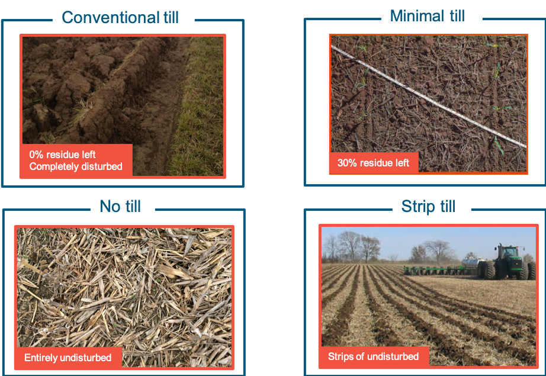
<figcaption>Typical disturbance and residue left on field with various
tillage methods</figcaption>
</figure>

# Frozen Ground Procedures

## Suggested FOS dispatching guidelines

- **When daily average air temperatures fall below 32°F (0°C) the FOS
  Dispatcher should progressively consult the parameters below**, based
  on the availability of information, to determine if a FOS should be
  dispatched to further assess soil conditions. 

- Soil Temperature Resources

  - Use Syngenta GreenCast to determine the soil temperature of the top
    0 - 4 inches (10.16 cm) of soil. **If soil temperature is less than
    28°F (\~-2°C), do not dispatch**

  - <http://www.greencastonline.com/tools/soil-temperature>

- Air Temperature Resources

  - Use only if soil temperature information is not available

  - **If the air temperature has been below 28°F (\~-2°C) consecutively
    for 7 days or more, do not dispatch**

  - National Weather Service: <https://www.weather.gov/>

- If none of the above criteria are met, sampling may be assigned and
  the FOS should follow the procedure outlined in the following section.
  Exercising good judgement in regards to FOS personal safety is always
  strongly advised. 

## In field assessment of frozen ground

**If the daily air temperature falls below 32^o^F, FOS should assess
whether the ground is frozen before proceeding with sampling**

> **Soil Surface Inspection (October 1, 2019 -- August 31, 2020)**

1.  Use the auger bit to probe the soil surface.

2.  If the surface layer of the soil is frozen to any depth (Figure
    [16](#fig:frozen){reference-type="ref" reference="fig:frozen"}),
    record Yes in the appropriate IF 2.0 field (Figure
    [13](#fig:sample_parameters){reference-type="ref"
    reference="fig:sample_parameters"}) within the Soil Sampling call
    plan asking "Is the surface of the soil frozen?"

> **Soil Profile Inspection (October 1, 2019 -- Present)**

1.  Attempt to collect a 30 cm soil core using the step probe. If
    successful, proceed to 3. If unsuccessful proceed to 2.

2.  If using the step probe proves unworkable, utilize the auger method
    outlined in the "Compacted, Dry, or Coarse Textured Soils Unable to
    Be Sampled by Soil Step Probe" section.

3.  Visually and physically inspect the profile to determine the extent
    of soil freezing (Figure [16](#fig:frozen){reference-type="ref"
    reference="fig:frozen"}). **Sampling should not be conducted if more
    than a total of 25% (\~7.5 cm) of any portion of the 30 cm soil
    profile is found to be frozen or containing frost.**

- If less than 1" (2.5 cm or \~8% ) of the soil profile is frozen (e.g.
  frost at the soil surface). Proceed as if the soil at the sample point
  is not frozen.

- If greater than or equal to 1" (2.5 cm or \~8%) but less than or equal
  to 3" (7.5 cm or \~25%) of the total soil profile is frozen, mark yes
  in the IF field Is any portion of the soil profile frozen and proceed
  with sampling using the sampling method best suited to soil
  conditions.

- **This information should be recorded at the sampling point level.**
  Within the Soil Sampling form, scroll down to the Point Level
  question: \"Is any portion of the soil profile frozen?\" (Figure
  [13](#fig:sample_parameters){reference-type="ref"
  reference="fig:sample_parameters"}).

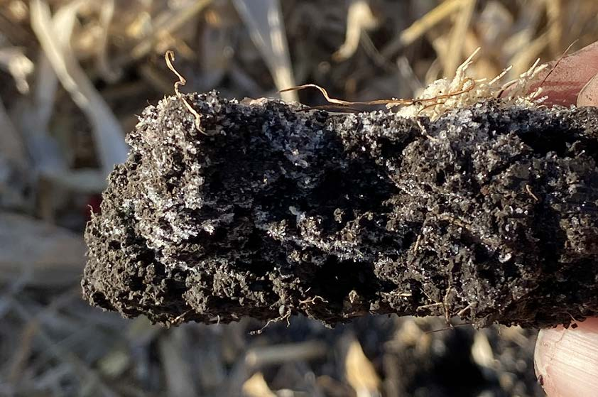{#fig:frozen}

# Obstacles and Alternate Locations 

**October 1, 2019 -- February 28, 2021**

1.  Selecting an alternative location when an obstacle is encountered:

    1.  If the obstacle is a permanent road, pond or other large,
        non-productive area of the field, the field boundary should be
        adjusted according to the directions outlined above in
        "Navigating to Field."

    2.  When you encounter a smaller, localized obstacle such as a large
        stone or rock pile, a tree, a fence line, small wet area, or
        other immovable obstacle in an area that should remain part of
        the productive field or pasture, you will need to select an
        alternative location at random as outlined below. 

    3.  To select the alternative location, travel due north 25 feet
        using a compass application on the iPad.  If you reach the field
        boundary, turn 15 degrees clockwise and repeat. If you have
        still not cleared the obstacle repeat the procedure at 50 feet
        (Figure 6).

::: center
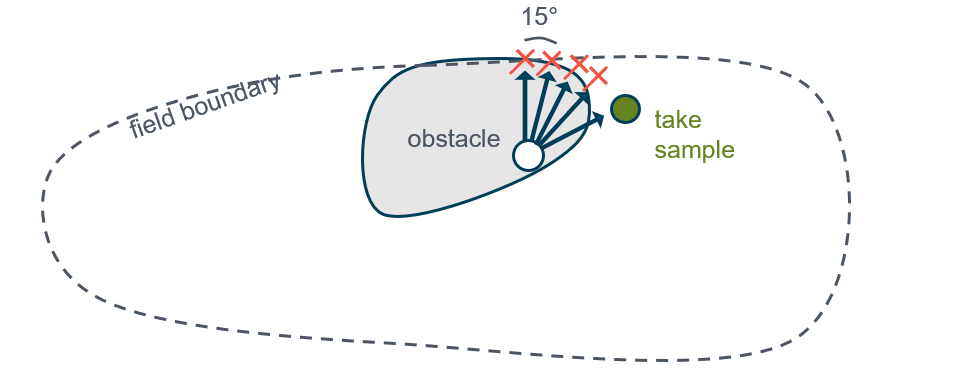{width="100%"} **Figure 6.** Sample
offsetting procedure (October 1, 2019 -- February 28, 2021)
:::

1.  After completing the sampling procedure, record a sampling event in
    Indigo fields mobile using the following steps:

    1.  Select the point location you are sampling.

    2.  Navigate to the alternate location using the procedure above.

    3.  Choose the "Record offset location" option in IF. (This will
        connect the intended location with your actual location.

    4.  Scan the barcode of the sample/samples you just extracted. 

    5.  Enter the other required information in the soil sampling event
        form as indicated in `IndigoCarbon_US-1_2025_0001` and
        `IndigoCarbon_US-1_2025_0002`

    6.  Record reason for off-setting using the 'reason for not
        retrieving soil sample' drop-down menu (Applies only to samples
        collected September 1, 2020 -- February 28, 2021)

    7.  Save the sampling event.

    8.  If you are unable to collect a sample using the offsetting
        procedure, follow the guidelines outlined in "Documenting
        Prescribed Sampling Points Unable to be Collected" below
        (Applies only to samples collected April 29, 2020 -- February
        28, 2021).

**March 1, 2021 - Present**

1.  Selecting an alternative location when an obstacle is encountered or
    a sample cannot be collected to full depth:

    1.  If the obstacle is a permanent road, pond or other large,
        non-productive area of the field, the field boundary should be
        adjusted.

    2.  When you encounter a smaller, localized obstacle such as a large
        stone or rock pile, a tree, a fence line, small wet area, other
        immovable obstacle or a sample cannot be collected to full depth
        in an area that should remain part of the productive field, you
        will need to select an alternative location at random by
        proceeding to #2.

2.  To select the alternative location, travel due north 25 feet from
    the prescribed location using a compass application on the iPad.  If
    you reach the field boundary, fail to clear the obstacle, or still
    cannot collect a sample to full depth, turn 90 degrees clockwise and
    repeat (Figure 7).

::: center
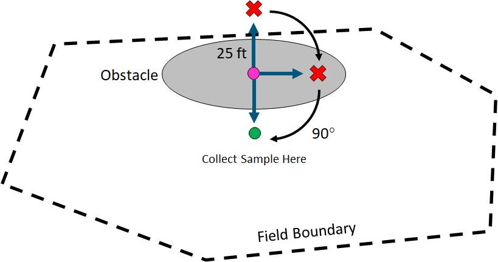{width="6.5in" height="3.42064in"}

**Figure 7.** Sample offsetting procedure (March 1, 2021 -- Present)
:::

1.  After completing the sampling procedure, record a sampling event in
    Indigo Fields using the following steps:

    1.  Select the prescribed point location you are sampling.

    2.  Stand at the alternate location selected using the procedure
        above.

    3.  Choose the "Record offset location" option in IF to connect the
        intended location with your actual location.

    4.  Scan the barcode of the sample/samples you just extracted. 

    5.  Enter the other required information in the soil sampling event
        form as indicated in `IndigoCarbon_US-1_2025_0001` and
        `IndigoCarbon_US-1_2025_0002`

    6.  Record reason for off-setting using the 'reason for offsetting
        soil sample' drop-down menu

    7.  Save the sampling form.

2.  If you make a complete 360° revolution around the prescribed point
    and have still not cleared the obstacle or collected a sample to
    full depth:

    1.  If a sample cannot be collected at all:

        1.  Follow the guidelines outlined in "Documenting Prescribed
            Sampling Points Unable to be Collected"

    2.  If a sample can be collected, but not to full depth:

        1.  Retain and record the deepest sample achieved as indicated
            in `IndigoCarbon_US-1_2025_0001` and
            `IndigoCarbon_US-1_2025_0002`. If the sample was collected
            in an offset location, follow the instructions outlined in
            #2 above.

        2.  **NOTE: Whenever possible, the core contribution to the
            texture/pH composite sample should be the same depth as the
            carbon sample. If faced with a scenario where this is not
            achievable, the deeper of the two cores should be designated
            as the carbon sample.**

# Documenting Prescribed Sampling Points Unable to be Collected 

::: Large
**(April 29, 2020 -- Present)**[]{#april-29-2020-present
label="april-29-2020-present"}
:::

\
If you are unable to collect a sample, follow the guidelines outlined
below:

1.  Sample as many points as possible under the current SOP guidelines

2.  Enter "ERROR" (all letter capitalized) into the QR code entry field
    of the Indigo Fields call plan

3.  Select the appropriate explanation from the "Reason for not
    retrieving soil sample" dropdown menu according to the following:

- **Established crop** -- Sample point is in an area of active crop
  growth and is inaccessible.

  - When possible, return to the field to collect this sample once
    accessible.

  <!-- -->

  - When possible, return to the field to collect this sample.

- **Livestock in area temporarily** -- Livestock are currently occupying
  the sampling area. FOS access is restricted.

  - When possible, return to the field to collect this sample once
    accessible.

- **Permanently un-sampleable** **and unable to offset** -- This
  designation is only appropriate when the offsetting protocols
  absolutely cannot be executed successfully

- **Point outside of boundary** -- Sample point is located outside of
  the specified field boundary.

  - Report to Indigo Fields support team.

- **Seasonal delay** -- A major event, such as flooding, has rendered
  the sample point inaccessible for the remainder of the sampling
  season. The point likely cannot be sampled within the same spring or
  fall sampling campaign as the rest of the field.

  - When possible, return to the field to collect this sample once
    accessible.

- **Short-term weather delay** -- Sample point is not able to be
  collected along with the remaining points on the day of sampling but
  likely will become available within 14 calendar days.

  - When possible, return to the field to collect this sample once
    accessible.

- **Unable to sample to full depth and depth was not adequate** -
  Methods used to relocate point failed.

  - Report to Indigo Fields support team

- **Point not in planting area** - Point falls in an area of the field
  not actively cropped.

  - Relocate point using procedure described earlier in this document,
    if boundary needs to be edited, report to Indigo Fields support
    team.

- **Soil is frozen** - Indicates that soil was frozen to a level greater
  than permissible in this protocol.

  - Return to sample when conditions permit.

- **Soil too compacted, multiple tries attempted** - Attempts to get a
  full depth sample using point relocation methods described earlier in
  this document failed due to extreme compaction.

  - Report to Indigo Fields support team.

- **Field was being managed (combine, chemical application, irrigation,
  etc.**

  - Plan to return when conditions permit and are safe.

- **Field inaccessible (locked gate, road too muddy)**

  - Return to sample later if possible or report to Indigo Fields
    support team.

- **Equipment Failure**

  - Return to sample once equipment can be repaired.

- **Standing Water** - moisture levels exceed acceptable levels
  described in this document.

  - Return to sample once field has dried out.

# **Summary of Changes**

+--------------+---+---+
| ::: minipage |   |   |
| **Section**  |   |   |
| :::          |   |   |
+:=============+:==+:==+
|              |   |   |
+--------------+---+---+
